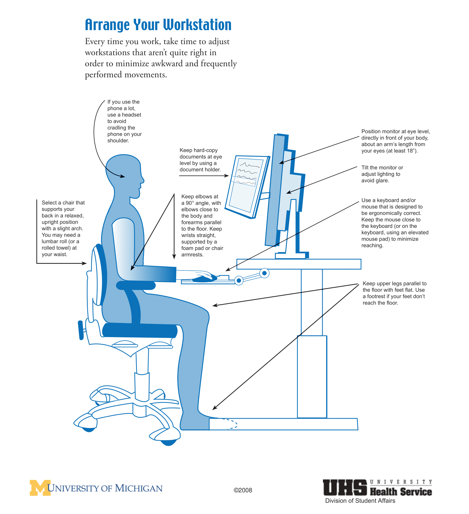

# حفظ سلامتی در کار طولانی با کامپیوتر

    
## تنظیم میز کار

    هر کجا که کار می‌کنید، نکات ذکر شده تو تصویر زیر را رعایت کنید. 
    ([پوستر با کیفیت‌تر عکس زیر با فرمت PDF](./Resources/ergo.pdf))

    

## ارگونومی در استفاده از لپتاپ

    با وجود اینکه اکثر ما برای کار کردن از لپتاپ استفاده می‌کنیم، لپتاپا طراحی ارگونومیک ندارن. 
    فاصله مانیتور و کیبرد لپتاپ خیلی کمه و به همین دلیل نمی‌توان حالت درست را رعایت کرد. 
    برای استفاده طولانی مدت از لپتاپ، پیشنهاد می‌کنم از موس و کیبرد جدا استفاده کنید تا در حین تایپ کردن  
    آرنجتان زاویه °90 داشته باشد.
    همچنین برای اینکه مانیتور لپتاپ در ارتفاع مناسبی قرار بگیره، از پایه لپتاپ (یا جعبه، کتاب و ...) استفاده کنید.

## استراحت و تحرک

    توصیه می‌شود هر 10 دقیقه یک استراحت کوتاه (10 تا 20 ثانیه) و هر 30 دقیقه 
    یک استراحت بلندتر (2 تا 5 دقیقه) داشته باشید. در استراحت‌های کوتاه می‌توانید نرمش‌های کوتاه که در بخش بعد 
    هستند را انجام بدید و در استراحت‌های بلند بهتره که بلند بشید و کمی قدم بزنید.

    از آنجایی که مقید بودن به این زمان‌های استراحت کاری بس دشواره، بهتون پیشنهاد می‌کنم از برنامه‌های 
    Break Reminder 
    استفاده کنید. برنامه‌های زیادی برای این منظور وجود دارن. 
    [Stretchly](https://github.com/hovancik/stretchly) 
    یک نمونه از این برنامه‌هاست که متن‌باز هست و برای هر سه سیستم‌عامل دسکتاپ وجود داره.
    
## استفاده از فیلتر نور آبی
    نور آبی که از صفحه نمایش‌ها ساطع میشه ممکنه باعث بهم ریختن ساعت خواب شما بشه. 
    خوشبختانه سیستم‌عامل‌ها برای جلوگیری از این امر قابلیتی در نظر گرفتن که تو ساعات مشخص نور آبی صفحه را فیلتر میکنن. 
    پیشنهاد میکنم این قابلیت را از چند ساعت قبل از خوابتون فعال کنید.

