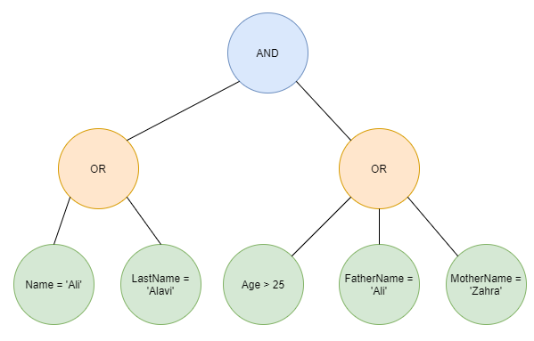

# پروژه

## مقدمه
تا این جا با مفهوم
ETL
آشنا شده‌اید. در این مستند به مفاهیمی که در نرم‌افزار
[Talend](https://talend.com)
مشاهده کردید با معادل‌های زیر اشاره خواهد شد:
- پردازش‌
(Processor)
- سناریو
(Pipeline)

 در این فاز از شما می‌خواهیم تا یک نرم‌افزار
ETL
پیاده‌سازی کنید. در ادامه به بیان نیازمندی‌ها می‌پردازیم.

## کلیات
روزانه مقادیری داده در قالب جدول‌های
SQL
و یا فایل‌های
[CSV](https://en.wikipedia.org/wiki/Comma-separated_values)
به دست ما می‌رسد که نیاز است روی آن‌ها پردازش‌هایی انجام شود و نتیجه‌ی به دست آمده در جداول دیگر و یا فایل‌های
CSV
ذخیره شود.

جداول یا فایل‌های ورودی و خروجی لزوماً فرمت و ستون‌های یکسانی ندارند و بر حسب نیاز ممکن است ستون‌های متفاوتی داشته باشند.

کاربری که از نرم‌افزار استفاده می‌کند دانش کدنویسی ندارد و صرفاً با مفاهیم جدول و ستون و پردازش‌ها آشناست. کاربر باید بتواند سناریوی دلخواه خود را با استفاده از رابط کاربری ارائه‌شده طراحی کند و آن را با نام دلخواه خود ذخیره کند تا در صورت لزوم بعداً بتواند آن‌ها را مشاهده و یا ویرایش نماید. هم‌چنین باید بتواند طراحی خود را در قالب فایل
[YML](https://en.wikipedia.org/wiki/YAML)
خروجی بگیرد و یا فایل
YML
خود را به عنوان سناریو در نرم‌افزار بارگذاری کند.

نکته‌ی مهم: علاوه بر اجرای کل سناریو، هر یک از

[پردازش‌های مقصد](#پردازش‌های-مقصد)
باید امکان اجرا داشته باشند.

کاربر باید بتواند اجرای سناریو را کنسل نماید.

کاربر باید بتواند در هنگام اجرا وضعیت اجرای هر یک از پردازش‌ها رامشاهده کند این که اجرای پردازش تمام شده یا هنوز در حال اجراست یا با خطا مواجه شده یا اصلاً هنوز دستور اجرایی نیامده و یا این که توسط کاربر کنسل شده است.

## پردازش‌های ورودی
این دسته از پردازش‌ها به کاربر این امکان را می‌دهد تا داده‌ی ورودی خود را به نرم‌افزار وارد کند.

### خواندن از جدول
این پردازش به کاربر این امکان را می‌دهد تا به یک پایگاه داده‌ی
SQL Server
وصل شود و یکی از جدول‌ها آن را انتخاب نماید و داده‌های آن را دریافت نماید تا بتوان در پردازش‌های دیگر از آن داده‌ها استفاده کرد. توجه شود که کاربر باید بتواند پایگاه داده‌ی
SQL Server
مورد نظر خود را با تعیین آدرس سرور و نام کاربری و کلمه‌ی عبور تعیین کند. سپس بتواند نام پایگاه‌های داده و جداول موجود را مشاهده و جدول مورد نظر را انتخاب کند.

### خواندن از فایل CSV
با این پردازش می‌توان محتوای یک فایل 
CSV
را دریافت کرد و در ادامه بتوان از آن داده در پردازش‌های دیگر استفاده کرد. کاربر می‌تواند کاراکتر جداکننده‌ی ستون و کاراکتر جداکننده‌ی سطر و هم‌چنین وجود عنوان ستون‌ها در اولین سطر را تعیین کند.

### پردازش‌های میانی
این پردازش‌ها یک یا چند ساختار جدولی به عنوان ورودی دریافت می‌کنند و یک یا چند ساختار جدولی برای استفاده در سایر پردازش‌ها خروجی می‌دهند.

### فیلتر ستونی
در این پردازش می‌توان روی داده‌های یک ساختار جدولی فیلتر اعمال کرد. به این صورت که می‌توان روی هر ستون شروطی گذاشت که سطرهایی که در آن شروط صدق می‌کنند به عنوان خروجی تولید شوند. شرط‌ها می‌توانند روی ستون‌های مختلف اعمال شوند و روی هر ستون هم ممکن است چندین شرط تعریف شود. ارتباط منطقی شرط‌ها می‌تواند
AND
یا
OR
باشد. در نتیجه کاربر می‌تواند درختی از شرط‌ها را تعریف کند که در آن هر یک از برگ‌ها یک شرط روی یک ستون را نمایش می‌دهد و سایر رأس‌ها بیانگر
AND
یا
OR
هستند. در شکل زیر می‌توانید یک نمونه از این درخت را مشاهده کنید.

شرط‌های قابل اعمال:

- برای همه‌ی انواع داده:
    - برابر باشد با

- برای ستون‌های عددی، تاریخ و تاریخ-زمان:
    - کوچکتر باشد از
    - بزرگ‌تر باشد از

### Join
این پردازش دو ساختار جدولی به عنوان ورودی دریافت می‌کند و یک ساختار جدولی به عنوان خروجی می‌دهد که حاصل
Join
شدن آن دو جدول است. کاربر یک ستون از هر یک از دو جدول انتخاب می‌کند و هم‌چنین می‌تواند یکی از انواع
Join
را از جمله
Inner Join
و
Outer Join
و ... را به عنوان نحوه‌ی
Join
شدن دو جدول انتخاب کند.

### Aggregation
در این پردازش یک ساختار جدولی به عنوان ورودی گرفته می‌شود و یک ساختار جدولی هم خروجی آن است. کاربر می‌تواند یکی از انواع
Aggregation
را انتخاب کند و تعدادی از ستون‌ها را هم برای گروه‌بندی انتخاب کند.

Aggregationهای
زیر مورد نیاز است:
- COUNT
- SUM
- AVERAGE
- MIN
- MAX

## پردازش‌های مقصد
این پردازش‌ها به کاربر این امکان را می‌دهند که بتواند داده‌ی پردازش شده را در یک مقصد بنویسد.

### SQL Server
این پردازش به کاربر این امکان را می‌دهد که بتواند نتایج سناریو را در پایگاه‌داده‌ی
SQL Server
بریزد. واضح است که در این پردازش کاربر می‌تواند آدرس سرور و نام کاربری و رمز عبور یک پایگاه داده را وارد کند. پس از این کار می‌تواند نام پایگاه‌های داده و جداول آن را مشاهده و جدول مقصد را انتخاب کند. هم‌چنین در صورت لزوم باید بتواند جدول جدید با نام دلخواه تعریف کند و آن را به عنوان مقصد انتخاب نماید.

### پیش نمایش
کاربر نیاز دارد که پس از هر یک از پردازش‌ها بتواند با استفاده از این پردازش، تعداد محدودی از سطرهای داده که نتیجه‌ی اجرای سناریو تا آن‌جای کار است را مشاهده کند.

راهنمایی فنی: می‌توانید از
[Temp Table](https://codingsight.com/introduction-to-temporary-tables-in-sql-server)ها
استفاده کنید.

### CSV
کاربر می‌تواند نتایج اجرای پردازش‌های خود را در قالب فایل
CSV
دریافت کند. کاربر می‌تواند کاراکتر جداکننده‌ی سطرها و کاراکتر جداکننده‌ی ستون‌ها و هم‌چنین ذخیره یا عدم ذخیره‌ی عنوان ستون‌ها را تعیین کند.

## نکات پیاده‌سازی
برای این که کار بچه‌های فرانت‌اند و بچه‌های مهندسی نرم‌افزار معطل یکدیگر نماند ابتدای کار یک طراحی اولیه از نحوه‌ی تعامل بین
فرانت‌اند و بک‌اند در بیاورید و
APIها
و این که چه زمانی باید فراخوانی شوند را تعیین کنید.

بچه‌های مهندسی نرم‌افزار ابتدا یک نرم‌افزار تحت کنسول پیاده‌سازی کنند که یک فایل
YML
سناریو را دریافت کند و آن را ذخیره کند سپس بتوانند آن را اجرا نمایند.

