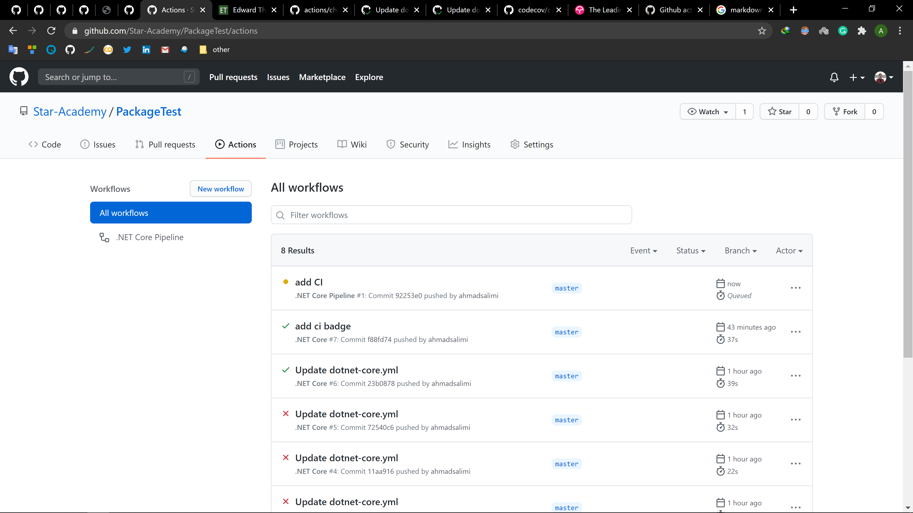
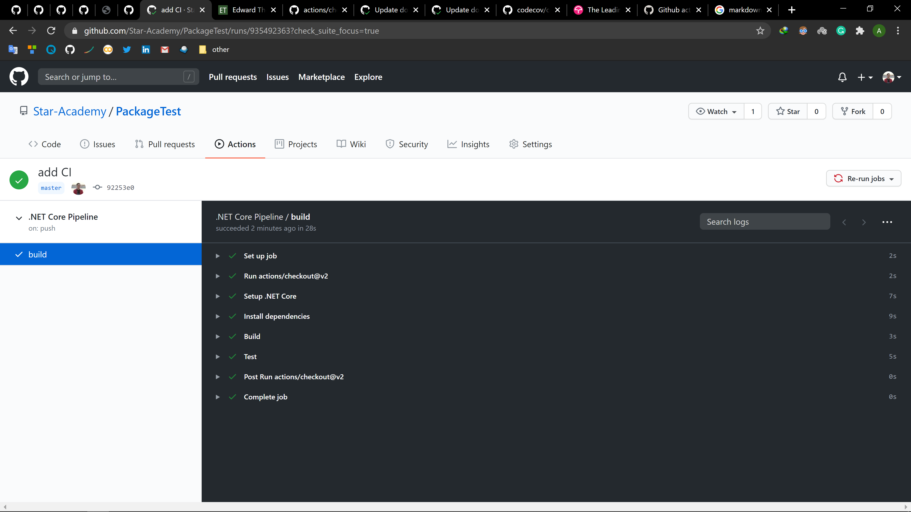
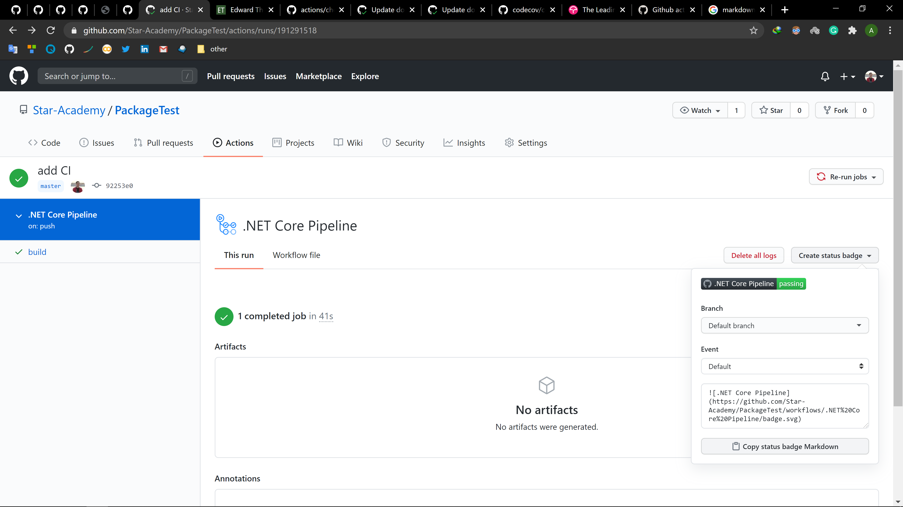
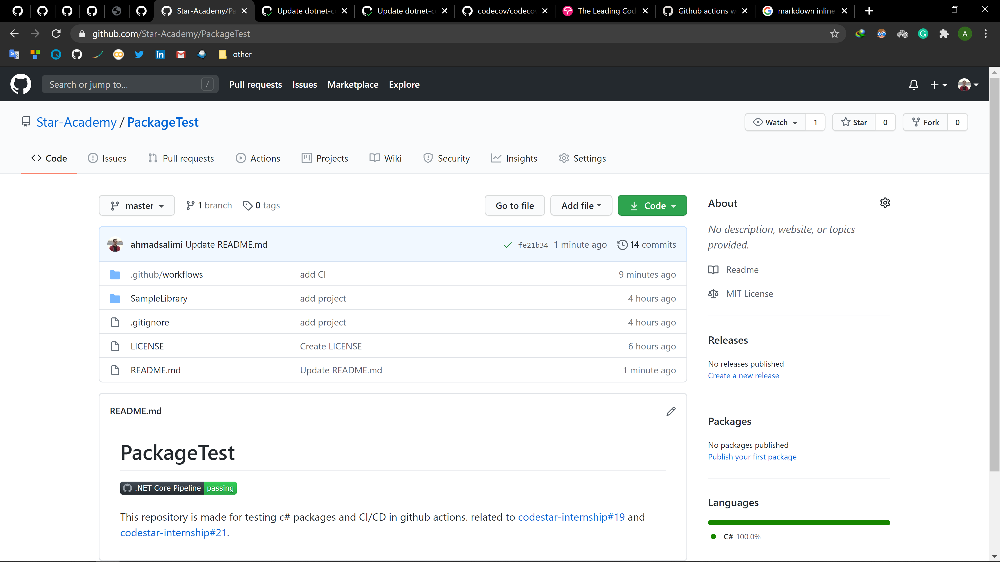
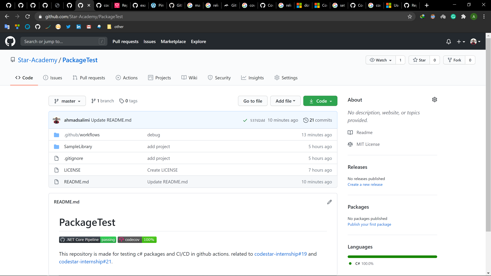

<div dir="rtl" align='justify'>

[لیست تسک‌های مرتبط با این فاز به صورت issue template](./issue-template-Phase06.md)

#  فاز شش: CI/CD

در این فاز با مفهوم CI/CD
و اهمیت استفاده از آن آشنا خواهید شد. همچنین پروژهٔ خود را به CI
مجهز می‌کنید.

1. CI/CD چیست و چرا اهمیت دارد:

    در این مرحله، در مورد مفهوم CI/CD
    و اهمیت آن مطالعه کنید. در این بخش، مطالعه‌ی لینک‌های زیر پیشنهاد می‌شود.

    <div dir="ltr">

    - [What is CI/CD?](https://medium.com/tilicholabs/what-is-ci-cd-c7c047b80e6b)
    - [What’s the Point of CI Anyway?](https://medium.com/swlh/whats-the-point-of-ci-anyway-ac3f9eaa244c)
    - [The Journey to CI/CD](https://medium.com/driven-by-code/the-journey-to-ci-cd-b1872927c36b)

    </div>

1. آشنایی با GithHub Actions و اضافه کردن CI/CD Pipeline به ریپازیتوری:

    یکی از ابزار CI/CD
    مطرح، GitHub Actions
    است که به کمک آن، می‌توانید یک Pipeline
    شامل عملیات build،
    اجرای unit test
    ها و همچنین انتشار package
    و دیگر عملیاتی که در دستهٔ CI/CD
    می‌گنجد را به ریپازیتوری گیت‌هاب خود اضافه کنید. برای این کار مراحل زیر را دنبال کنید:

    1. فایل زیر را در دایرکتوری اصلی ریپازیتوری خود بسازید:

        <div dir="ltr">

        ```
        .github/workflows/pipeline.yml
        ```

        </div>
    1. برای pipeline خود یک نام تعریف کنید: (به فایل `workflow.yml` اضافه کنید.)

        <div dir="ltr">

        ```yml
        name: .NET Core Pipeline
        ```

        </div>

    1. مشخص می‌کنیم که pipeline در هنگام push و pull request روی master اجرا شود.

        <div dir="ltr">

        ```yml
        on:
          push:
            branches: [ master ]
          pull_request:
            branches: [ master ]
        ```

        </div>

    
    1. مراحل Pipeline را به ترتیب تعریف می‌کنیم. در ابتدا مشخص می‌کنیم که pipeline روی آخرین ورژن ubuntu اجرا شود: (می‌توان آن را تغییر داد)

        <div dir="ltr">

        ```yml
        jobs:
          build:
            runs-on: ubuntu-latest
        ```

        </div>
    
    1. در این مرحله مشخص کنید که CI از agent ای به نام `actions/checkout@v2` استفاده کند: (برای مطالعه بیشتر [این](https://www.edwardthomson.com/blog/) لینک را بخوانید.)

        <div dir="ltr">

        ```yml
            steps:
            - uses: actions/checkout@v2
        ```

        </div>
    
    1. در این مرحله مشخص می‌کنیم که .Net core 3.1 نصب شود.

        <div dir="ltr">

        ```yml
            - name: Setup .NET Core
              uses: actions/setup-dotnet@v1
              with:
                dotnet-version: 3.1.301
        ```

        </div>
    
    1. سپس dependency های پروژه restore شوند:‌ (دقت کنید که به جای `<path to solution>` آدرس فولدر solution خود را مشخص کنید.)

        <div dir="ltr">

        ```yml
            - name: Install dependencies
              run: dotnet restore
              working-directory: <path to solution>
        ```

        </div>
    
    1. solution را build کنید.

        <div dir="ltr">

        ```yml
            - name: Build
              run: dotnet build --configuration Release --no-restore
              working-directory: <path to solution>
        ```

        </div>
    
    1. تست‌ها را run کنید.

        <div dir="ltr">

        ```yml
            - name: Test
              run: dotnet test --no-restore --verbosity normal --collect:"XPlat Code Coverage"
              working-directory: <path to solution>
        ```

        </div>
    
        تبریک! CI
        شما آمده‌است. فایل با commit
        کرده و روی master
        پوش کنید.

        در ریپازیتوری خود وارد منوی Actions
        شوید؛ همانطور که مشاهده می‌کنید، اولین اجرای Pipeline
        شما در حال انجام است:

        

        آن را باز کرده و وارد بخش build
        شوید:

        

    1. افزودن badge وضعیت CI به README:

        از این قسمت دکمهٔ Copy status badge Markdown
        را انتخاب کرده و متن کپی‌شده را به README
        ریپازیتوری خود اضافه کنید.

        

        می‌توانید وضعیت Pipeline
        را در هر لحظه مشاهده کنید:

        
    
    1. افزودن مشاهده وضعیت code coverage:

        با اکانت GitHub
        خود در سایت codecov.io
        وارد شوید. سپس به این آدرس بروید:

        <div dir="ltr">

        ```
        https://codecov.io/gh/Star-Academy/<your-repo-name>
        ```

        </div>
    
    1. بخش زیر را به فایل `workflow.yml` اضافه کنید:

        <div dir="ltr">

        ```yml
            - name: Publish code coverage reports to codecove.io
              uses: codecov/codecov-action@v1
              with:
                token: ${{ secrets.CODECOV_TOKEN }}
                files: ./**/coverage.cobertura.xml
                fail_ci_if_error: true
        ```

        </div>
    
    1. یک‌باز دیگر صفحهٔ زیر را باز کنید:

        <div dir="ltr">

        ```
        https://codecov.io/gh/Star-Academy/<your-repo-name>
        ```

        </div>

        وارد بخش Setting
        شده و از سمت چپ، گزینه‌ی Badge
        را انتخاب کنید. در صفحه‌ای که باز می‌شود، Markdown
        را کپی کرده و در README
        ریپازیتوری خود قرار دهید. اکنون مشاهده خواهید کرد که در هر لحظه، وضعیت code coverage
        شما نیز نمایش داده می‌شود:

        


</div>
