<div dir="rtl" align='justify'>

[لیست تسک‌های مرتبط با این فاز به صورت issue template](issue-template-Phase07.md)

# فاز هفت: SQL

در این فاز با یک پایگاه داده رابطه‌ای، نحوه‌ی کار کردن با آن و
query
های آن آشنا می‌شوید.

1. مقدمه

    پایگاه داده یا 
    Database 
    مجموعه‌ای از داده‌ها است که به صورت ساختارمند درون کامپیوتر نگهداری می‌شوند. 
    سامانه مدیریت پایگاه داده یا 
    DBMS(Database Management System)
    نرم‌افزاری است که با کاربر نهایی، برنامه‌ها کاربردی و خود پایگاه داده برای ذخیره و بازیابی داده تعامل میکند.
    DBMS
    های مختلفی برای کابردهای متفاوت وجود دارند که پرکاربردترین
    DBMS
    ها، 
    DBMS
    های رابطه‌ای یا همان
    RDBMS(Relaional Database Management System)
    ها هستند. در این 
    DBMS
    ها داده‌ها به صورت سازمانمند در جداول ذخیره می‌شوند و مقادیر موجود در هر جدول با یکدیگر ارتباط دارند. به همین خاطر به آن رابطه‌ای با 
    relational 
    گفته می‌شود.
    
    از آنجایی که اکثر 
    RDBMS
    ها از زبان پرسمان سازمان‌یافته یا 
    SQL(Structured Query Language)
    استفاده می‌کنند، با آشنایی با یکی از این 
    RDBMS
    ها می‌توانید با صرف زمان کم نحوه استفاده از یک 
    RDBMS 
    جدید را فرابگیرید. همچنین 
    SQL 
    جزو استاندارد 
    ANSI 
    و 
    ISO 
    می‌باشد.
    
    RDBMS
    های فراوانی وجود دارند که بسته به نیاز از آن‌ها استفاده می‌شود.
    MySQL, SQL Server, PostgreSQL, SQLite, ...
    نمونه‌های از 
    RDBMS
    های معروف هستند. در این فاز با 
    SQL Server
     که محصول شرکت 
     Microsoft 
     است، کار می‌کنید.

1. آشنایی با مفاهیم اولیه

    - SSMS و ADS

        هر دو نرم‌افزارهایی برای مدیریت دیتابیس هستند. 
        SSMS (SQL Server Management Studio) 
        اولین بار سال 2005 توسط مایکروسافت منتشر شد. 
        SSMS 
        امکانات مدیریت زیادی در اختیار ما قرار می‌دهد و در اکثر محیط‌های عملیاتی از آن استفاده می‌شود. 
        ADS (Azure Data Studio)
        نیز توسط مایکروسافت در سال 2018 به صورت 
        Open Source 
        برای سیستم‌عامل‌های متفاوت عرضه شد. امکانات مدیریتی 
        ADS 
        کمتر است اما در مقابل محیط بهتری برای نوشتن و اجرای 
        Query 
        ارائه می‌دهد. در اینجا ما از 
        ADS 
        استفاده می‌کنیم.
        

    - Database در SQL Server
    
        یک 
        Database 
        در 
        SQL Server 
        مجموعه‌ای از چند شئ از نوع جدول
        (Table)
        ، رویه ذخیره شده
        (Stored Procedure)
        ، تابع
        (Function)
        ، نما
        (View)
        و ... است. اگر این عبارات برایتان ناآشنا است نگران نباشید! در ادامه با آن‌ها آشنا می‌شوید. فعلا در این حد بدانید که داده‌ها در 
        SQL Server 
        باید در یک 
        Database 
        وجود داشته باشند.


1. نصب و راه‌اندازی SQL Server و SSMS

    1. ابتدا یک نسخه از 
    SQL Server
    را با توجه به سیستم عامل خود دانلود کنید. پیشنهاد می‌شود نسخه 
    SQL Server 2019 Developer
    را از 
    [سایت مایکروسافت](https://www.microsoft.com/en-us/sql-server/sql-server-downloads)
    دانلود و نصب کنید. این نسخه تمامی ویژگی‌های نسخه 
    Enterprise 
    را به صورت رایگان در اختیارمان قرار میدهد ولی فقط مجوز استفاده در محیط توسعه و تست را دارد.

    1. با توجه به نسخه دانلود شده به نصب بپردازید. تمام تنظیمات خواسته شده را در حالت پیشفرض قرار دهید. همچنین در قسمت 
    Feature Selection 
    انتخاب 
    Database Engine Service 
    برای کار ما کافی است. به تنظیمات زیر هم توجه کنید.

        <div dir="ltr"></div>
        <div dir="ltr"></div>

    1. حال نوبت به نصب ابزار مدیریت 
    SQL Server 
    است. 
    SSMS (SQL Server Management Studio) 
    یکی از ابزارهای قدیمی برای این کار است که تنها برای ویندوز موجود است و در محیط‌های محصول اکثرا از آن استفاده می‌شود. 

    1. حال 
    ADS (Azure Data Studio)
    که ابزاری رایگان برای پیکربندی، مدیریت و اداره کردن تمامی اجزا 
    SQL Server 
    است را از 
    [سایت مایکروسافت](https://docs.microsoft.com/en-us/sql/azure-data-studio/download-azure-data-studio)
    دانلود و نصب کنید.

    1. پس از نصب و اجرای 
    ADS 
    برای وصل شدن به 
    SQL Server 
    باید یک 
    Conncection 
    بسازید. همانند شکل زیر می‌توانید در صفحه شروع این کار را انجام دهید.
            <div dir="ltr">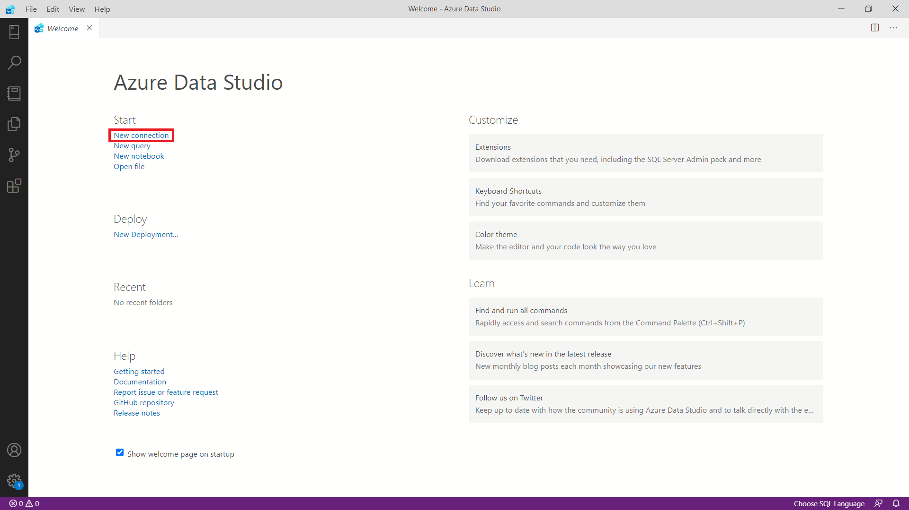</div>
    برای متصل شدن به 
    SQL Server 
    باید آدرس کامپیوتری را که 
    SQL Server 
    بر روی آن در حال اجرا هست را در بخش 
    Server 
    وارد کنیم. در اینجا اگر 
    SQL Server 
    را بر روی کامپیوتر خودتان نصب کرده‌اید،  
    `localhost`
    را به عنوان 
    Server 
    وارد کنید.

        <div dir="ltr">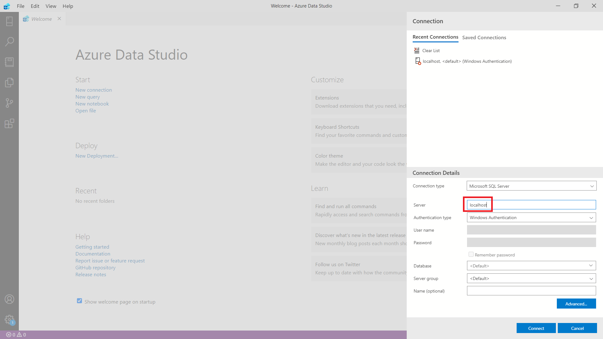</div>

    1. پس از آنکه به 
    SQL Server 
    متصل شدید، صفحه‌ی مربوط به 
    Connection 
    نمایان می‌شود که وضعیت سرور را نشان می‌دهد. در این صفحه با انتخاب گزینه 
    Query 
    می‌توانید دستوراتی را به زبان 
    SQL 
    به سرور بفرستید و پاسخ خود را دریافت کنید.
            <div dir="ltr">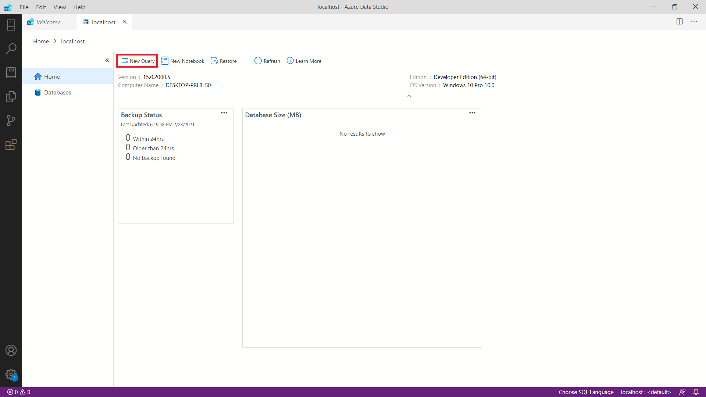</div>
    در این صفحه جدید دستورات خود را بنویسید و با کلید 
    F5 
    یا کلیک بر روی دکمه اجرا، آن‌ها را اجرا کنید. سعی کنید از اینجا به بعد هر دستوری که در داک مشاهده می‌کنید را برای خودتان اجرا کنید. 

        <div dir="ltr">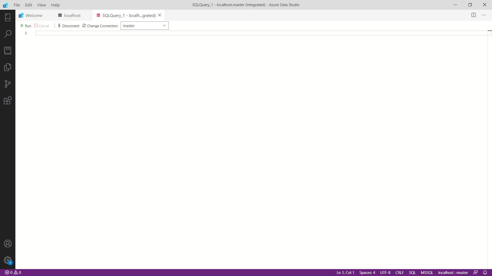</div>

1. ایجاد و حذف Database

    همانظور که در تعاریف دیدم برای کار با داده باید حداقل یک 
    Database 
    ایجاد کنیم. 

    <div dir="ltr">

    ```
    CREATE DATABASE database_name;
    ```
    </div>

    برای مثال:

    <div dir="ltr">

    ```
    CREATE DATABASE StarAcademy;
    ```
    </div>

    با اجرای این دستور، دیتابیس ساخته می‌شود و با 
    Refresh 
    کردن 
    Connections
    دیتابیس 
    StarAcademy
    مشاهده می‌شود.
    
    پس از اجرا کردن هر دستور 
    ADS 
    پیغامی متناسب با موفقیت و یا عدم موفقیت 
    Query 
    اجرا شده چاپ می‌کند. در صورت مواجه شدن با خطا، پیغام مربوط به خطا نیز چاپ می‌شود که به رفع خطا کمک می‌کند.

    <div dir="ltr"></div>

    برای حذف یک دیتابیس نیز از دستور زیر استفاده می‌شود.

    <div dir="ltr">

    ```
    DROP DATABASE database_name;
    ```
    </div>

1. Data Type

    Data Type 
    نوع داده‌ای است که هر ستون در جدول یا متغییر می‌تواند ذخیره کند. 
    Data Type
    های 
    SQL Server 
    در هفت دسته کلی قرار میگیرند که عبارتند از:
    
    - Exact numeric
    - Approximate numberic
    - Date and time
    - Character strings
    - Unicode character strings
    - Binary strings
    - Other data types

    اعضای هر یک از این دسته‌ها را با جزئیات می‌توانید در 
    [سایت مایکروسافت](https://docs.microsoft.com/en-us/sql/t-sql/data-types/data-types-transact-sql)
    ببینید. پرکاربردترین 
    Data Type
    ها نیز در جدول زیر قابل مشاهده هستند.

    <div dir="ltr">

    | Data Type | توضیحات | Range/Limit | Storage Size |
    | :---: | :---: | :---: | :---: |
    | int | It stores whole numbers in the range given | -2^31 to −2^31-1 | 8 bytes |
    | varchar(n) | This is a character string with variable width | 8000 chars | n + 2 bytes |
    | nvarchar(n) | It is a unicode string of variable width | 4000 chars | 2*n + 2 bytes |
    | datetime | Used for specifying a date and time. It has an accuracy of 3.33 milliseconds. | 1753/1/1 to 9999/12/31 | 8 bytes |
    | decimal | Used for scale and fixed precision numbers | −10^38+1 to 10^38−1 | 5 to 17 bytes |
    | float(n) | Used for a floating precision number | −1.79E+308 to 1.79E+308 | Depends on the value of n |
    | bit | It can take 0, 1, or NULL values. | 0 to 1 | 1 byte/8bit column |
    </div>

1. جدول 

    جدول یا 
    Table 
    شئ‌ای است که داده‌ها را به صورت سطر 
    (Row) 
    و ستون 
    (Column)
    ذخیره می‌کند.

    برای ساختن جدول از دستور زیر استفاده می‌کنیم.

    <div dir="ltr">

    ```
    CREATE TABLE tableName
    ( 
        column_1 datatype [ NULL | NOT NULL ],
        column_2 datatype [ NULL | NOT NULL ],
        ...
    );
    ```
    </div>

    برای مثال جدول دانشجو را به صورت زیر می‌سازیم. با نوشتن 
    NOT NULL 
     بعد از تعریف هر ستون، دادن مقدار به آن ستون در هنگام افزودن داده الزامی می‌شود. (در واقع مقدار آن ستون نمی‌تواند NULL باشد)
    
    <div dir="ltr">

    ```
    CREATE TABLE Student
    (
        StudentNumber VARCHAR(8) NOT NULL,
        Grade FLOAT(2),
        FirstName NVARCHAR(20) NOT NULL,
        LastName NVARCHAR(20) NOT NULL,
        IsMale BIT NOT NULL,
        DateOfBirth DATETIME NOT NULL,
        LeftUnitsCount INT NOT NULL
    );
    ```
    </div>

    پس از ساختن جدول می‌توانیم با دستور زیر داده‌ی مورد نظر را در جدول قرار دهیم.

    <div dir="ltr">

    ```
    INSERT INTO tableName
    (column_1, column_2, ... )
    VALUES
    (expression_1, expression_2, ... ),
    (expression_1, expression_2, ... ),
    ...;
    ```
    </div>

    برای مثال با دستور زیر داده متناظر به جدول اضافه می‌شود.

     <div dir="ltr">

    ```
    INSERT INTO Student(FirstName, LastName, DateOfBirth, IsMale, LeftUnitsCount, StudentNumber)
    VALUES('Ava', 'Ahmadi', 'Feb 15, 2002', 0, 140, '99100200');
    ```
    </div>

    همچنین با حفظ ترتیب ستون‌ها، می‌توان بدون نیاز به مشخص کردن نام هر ستون داده را اضافه کرد. مانند دستور زیر.

    <div dir="ltr">

    ```
    INSERT into Student values
    (
        '98100200',
        13.234,
        N'علی',
        N'احمدی',
        1,
        '1/22/2001',
        92
    );
    ```
    </div>

    همانطور که میبینید، برای مشخص کردن یک رشته به عنوان رشته 
    Unicode
    (در اینجا نام و نام خانوادگی که فارسی نوشته شده است) از پیشوند
    N
    استفاده می‌شود.

    پس قرار دادن داده‌ها در جدول، با کوئری زیر می‌توانیم داده ذخیره شده در جدول را دریافت کنیم.

    <div dir="ltr">

    ```
    SELECT column1, column2, ...
    FROM tableName
    [WHERE condition];
    ```
    </div>

    برای مثال برای دریافت داده تمام دانشجویانی که اضافه کرده‌ایم، دستور زیر را اجرا می‌کنیم.

    <div dir="ltr">

    ```
    SELECT *
    FROM Student;
    ```
    </div>

    هانطور که مشاهده می‌کنید، به جای نام ستون‌ها از "*" استفاده شده است. که به معنی همه ستون‌ها می‌باشد. در واقع این دستور با دستور زیر معادل است. 

    <div dir="ltr">

    ```
    SELECT StudentNumber, Grade, FirstName, LastName, IsMale, DateOfBirth, LeftUnitsCount
    FROM Student;
    ```
    </div>

    با اجرای دستور بالا، 
    ADS 
    داده‌ها را مانند شکل زیر به صورت جدول در 
    Results Tab
     نمایش می‌دهد.

    با استفاده از 
    Operator
    ها در عبارتی که با 
    Where 
    شروع می‌شود، می‌توانیم شروط و محدودیت‌هایی بر روی داده دریافت شده قرار دهیم. برای مثال دستور زیر افرادی که جنسیت آن‌ها مرد و معدلشان بین 10 تا 15 است را نمایش می‌دهد.

    <div dir="ltr">

    ```
    SELECT *
    FROM Student
    WHERE IsMale = 1 AND 10 < Grade AND Grade < 15;
    ```
    </div>

    همان 
    Query 
    بالا را به صورت زیر هم می‌توان نوشت.

    <div dir="ltr">

    ```
    SELECT *
    FROM Student
    WHERE IsMale = 1 AND Grade BETWEEN 10 AND 15;
    ```
    </div>

    در هر دو صورت خروجی به شکل زیر خواهد بود.

    <div dir="ltr">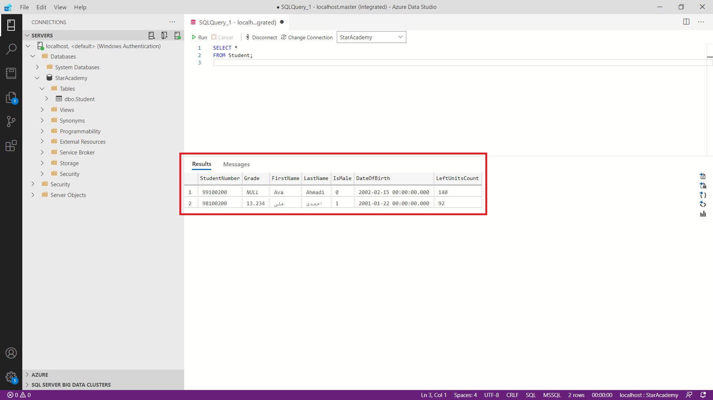</div>

    در جدول زیر 
    Operator
    های موجود را مشاهده می‌کنید. همچنین مانند مثال بالا می‌تواند تعداد از 
    Cluase
    ها را با یکدیگر 
    `AND`
    یا 
    `OR`
    کنید.

    <div dir="ltr">

    | Operator | توضیحات | Example |
    | :---: | :---: | :---: |
    | = | Equal | StudentNumber = '98100200'|
    | >, >= | Greater than, Greater than equal | Grade > 15, Grade >= 15 |
    | <, <= | Less than, Less than equal | Grade < 12, Grade <= 12 |
    | <> or != | Not equal | IsMale <> 1 or IsMale != 1 |
    | BETWEEN | Between a certain range | Grade BETWEEN 14 AND 17 |
    | LIKE | Search for a pattern | StudentNumber LIKE '98%' |
    | IN | To specify multiple possible values for a column | LastName IN ('Ahmadi', N'احمدی') |

    </div>

    پس از ساختن جدول، با دستورات زیر می‌توانیم ستون‌های آن را ویرایش کنیم. 

    <div dir="ltr">

    ```
    ALTER TABLE tableName ADD column1 datatype, column2 datatype, ...;
    ALTER TABLE tableName DROP COLUMN column1, column2, ...;
    ALTER TABLE tableName ALTER COLUMN column1 datatype, column2 datatype, ...;
    ```
    </div>

    با دستور زیر می‌توانیم یک جدول را حذف کنیم.
    
    <div dir="ltr">

    ```
    DROP TABLE tableName;
    ```
    </div>

    همچنین برای حذف داده‌های درون یک جدول و حفظ ساختار جدول از دستور زیر استفاده می‌کنیم.
    
    <div dir="ltr">

    ```
    DELETE TABLE tableName;
    ```
    </div>

1. کلیدها

    - Primary Key

        Primary Key 
        یک ستون یا ترکیبی از ستون‌ها است که یک داده را به صورت منحصر بفرد مشخص می‌کند. قوانین زیر بر 
        Primary Key
        حاکم هستند : 

        1. هر جدول فقط می‌تواند یک Primary Key داشته باشد.
        1. تمامی مقادیر موجود برای Primary Key منحصر بفرد هستند.
        1. DBMS اجازه‌ی اضافه کردن داده‌ای که Primary Key آن از قبل موجود است را نمی‌دهد.
        1. Primary Key نمی‌تواند NULL باشد.

        برای ساختن Primary Key می‌توانیم جدولی که از قبل موجود است را با دستور زیر تغییر دهیم.

        <div dir="ltr">

        ```
        ALTER TABLE tableName
        ADD CONSTRAINT constraintName PRIMARY KEY (column_1, column_2, ..., column_n);
        ```
        </div>

        برای مثال جدول Student موجود را به این صورت تغییر می‌دهیم : 

        <div dir="ltr">

        ``` 
        ALTER TABLE Student
        ADD CONSTRAINT studentPK PRIMARY KEY (StudentNumber);
        ```
        </div>

        اضافه شدن کلید جدید را می‌توان در پنل سمت چپ هم مشاهده کرد.

        <div dir="ltr">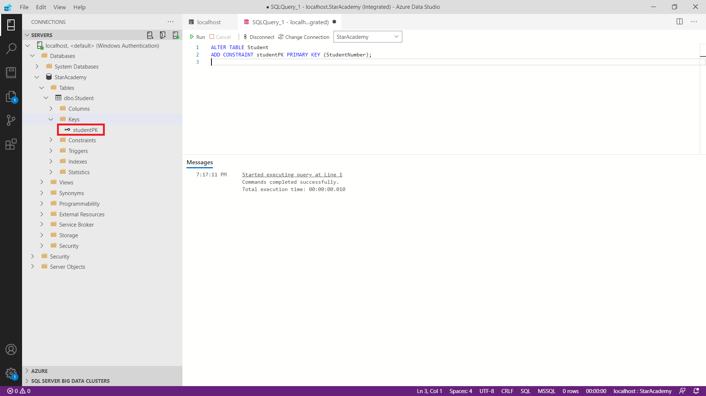</div>

        در واقع 
        Constraint 
        برای مشخص کردن قانون برای داده‌های جدول استفاده می‌شود. عبارت 
        NOT NULL 
        که قبلا با آن در ساختن جدول آشنا شدید نیز یک 
        Constraint 
        است. حال در اینجا دریافتید که 
        Primary Key 
        هم  
        Constraint 
        است.

        همچنین می‌توان جدول Student را از نوع و به شکل زیر ایجاد کرد : 

        <div dir="ltr">

        ``` 
        CREATE TABLE Student2
        (
            StudentNumber VARCHAR(8) NOT NULL PRIMARY KEY,
            Grade FLOAT(2),
            FirstName NVARCHAR(20) NOT NULL,
            LastName NVARCHAR(20) NOT NULL,
            IsMale BIT NOT NULL,
            DateOfBirth DATETIME NOT NULL,
            LeftUnitsCount INT NOT NULL
        );
        ```
        </div>

    - Foreign Key
        Foreign Key 
        کلیدی برای ارتباط جداول است. در واقع 
        Foreign Key 
        ستونی است که به 
        Primary Key 
        سایر جداول همان پایگاه داده ارجاع می‌دهد. قوانین 
        Foreign Key 
        عبارتند از : 

        1. Foreign Key می‌تواند NULL باشد.
        1. جدولی که Foreign Key دارد را فرزند(Child)، و جدولی که به آن ارجاع داده می‌شود را والد(Parent) می‌نامیم.

        برای ایجاد یک 
        Foreign Key
        در هنگام ایجاد جدول یا پس از ایجاد آن، یک 
        Constraint 
        اضافه می‌کنیم. 

        برای مثال جدولی جدید برای ثبت‌نام در هر درس می‌سازیم. در این جدول نام درس و شماره دانشجویی فرد ثبت‌نام شده را به صورت 
        Foreign Key 
        نگه می‌داریم. برای ساختن این جدول از دستور زیر استفاده می‌کنیم.

        <div dir="ltr">

        ``` 
        CREATE TABLE Enrollment
        (
            CourseName NVARCHAR(20),
            ParticipantStudentNumber VARCHAR(8),
            CONSTRAINT studentNumberFK FOREIGN KEY (ParticipantStudentNumber)
            REFERENCES Student(StudentNumber)
        );
        ```
        </div>

        حال رفتار 
        Foreign Key 
        را با افزودن 3 داده جدید بررسی می‌کنیم.

        <div dir="ltr">

        ``` 
        INSERT INTO Enrollment VALUES
        ('Data Structures', '98100200');

        INSERT INTO Enrollment VALUES
        ('Advance Programming', NULL);

        INSERT INTO Enrollment VALUES
        ('Advance Programming', '97100200');
        ```
        </div>

        <div dir="ltr">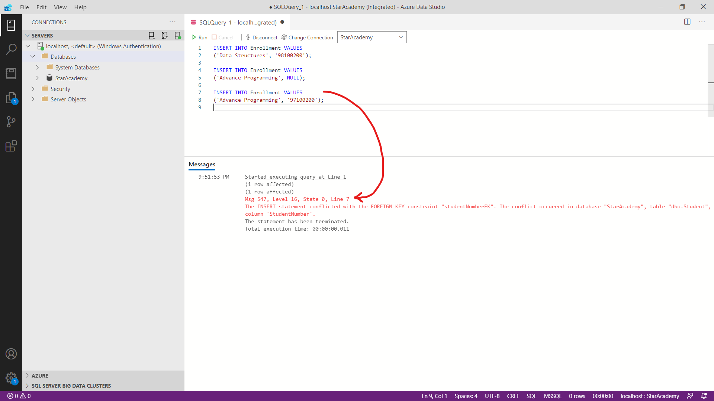</div>

        همانطور که در تصویر مشاهده می‌کنید، دستور اول که مقدار 
        Foreign Key
        آن در جدول 
        Student 
        موجود بود و دستور دوم که 
        Foreign Key 
        در آن 
        NULL 
        بود با موفقیت اجرا شده‌اند. اما دستور سوم که 
        Foreign Key 
        آن در جدول 
        Student 
        موجود نبود با خطا مواجه شده است.

1. آشنایی با T-SQL

    **T-SQL(Transact-SQL)** 
    زبان توسعه داده شده توسط مایکروسافت است که قابلیت‌هایی مثل متغییر، مدیریت استثنا 
    (Exception)
    ، رویه‌ی ذخیره شده 
    (Stored Procedure) 
    و ... را به 
    SQL Server 
    اضافه می‌کند. دقت کنید که 
    T-SQL 
    در کنار 
    SQL 
    قرار دارد و 
    SQL Server
    از 
    SQL 
    استاندارد پشتیبانی می‌کند. برای مثال به کمک لینک‌های زیر، می‌توانید با متغییرها و عبارات شرطی آشنا شوید. نیاز نیست این مبحث را عمیق بخوانید.

    - [SQL Variables: Basics and usage](https://www.sqlshack.com/sql-variables-basics-and-usage/)
    - [SQL Server IF ELSE](https://www.sqlservertutorial.net/sql-server-stored-procedures/sql-server-if-else/)

1. Joins

    Join
    ها از مهم‌ترین دستورات 
    SQL 
    تلقی می‌شوند. با استفاده از 
    Join
    ها می‌توانیم داده را از چند جدول به کمک 
    Key 
    و با یک دستور دریافت کنیم. در 
    SQL 
    هفت نوع 
    Join 
    وجود دارد که مشاهده عملکرد هر یک از آن‌ها در نمودار 
    Venn 
    راحت‌تر است. پس شکل زیر را به دقت بررسی کنید.

    <div dir="ltr">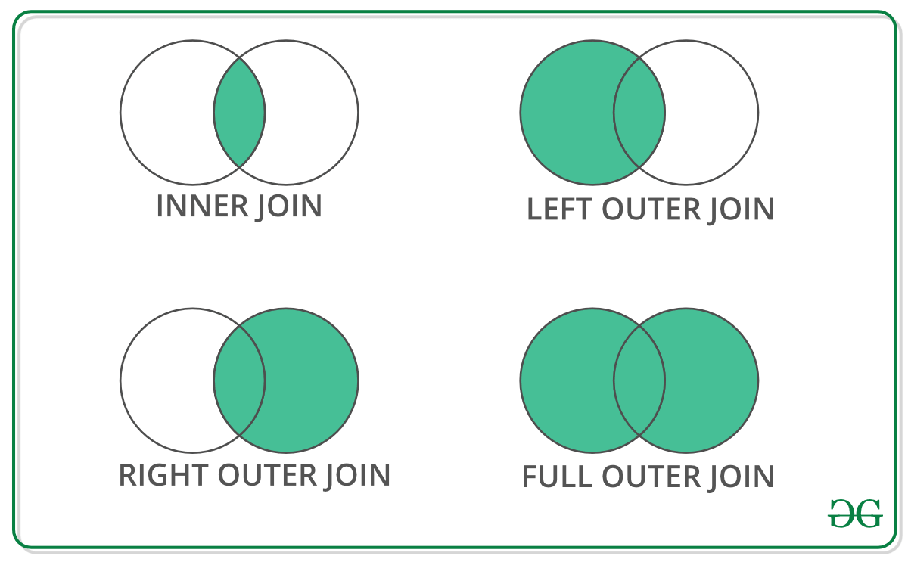</div>

    حال نمونه‌ی هر 
    Join 
    را در دستورات زیر مشاهده می‌کنید. مقادیر اولیه جدول 
    Enrollment (Child)
    و 
    Student (Parent)
    نیر در ابتدا نشان داده شده است.

    <div dir="ltr">
    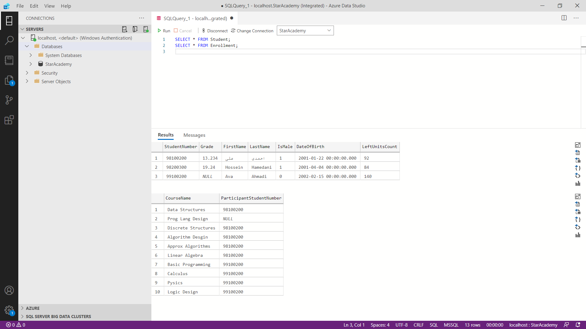

    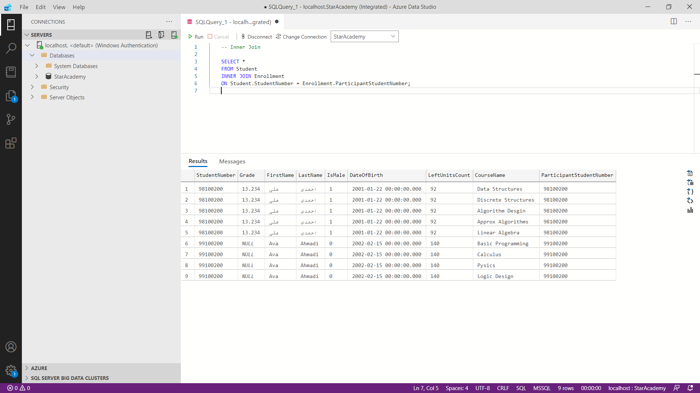

    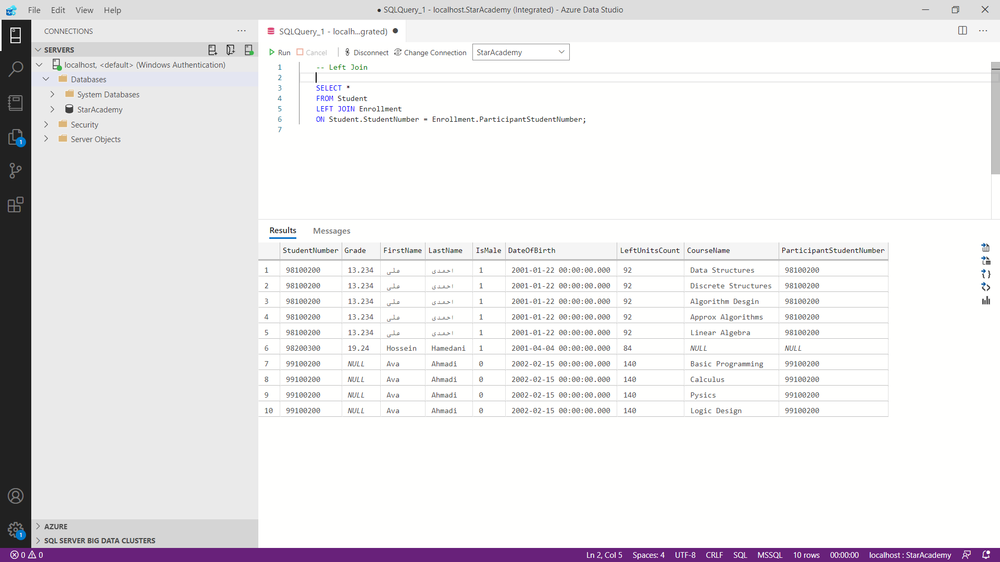

    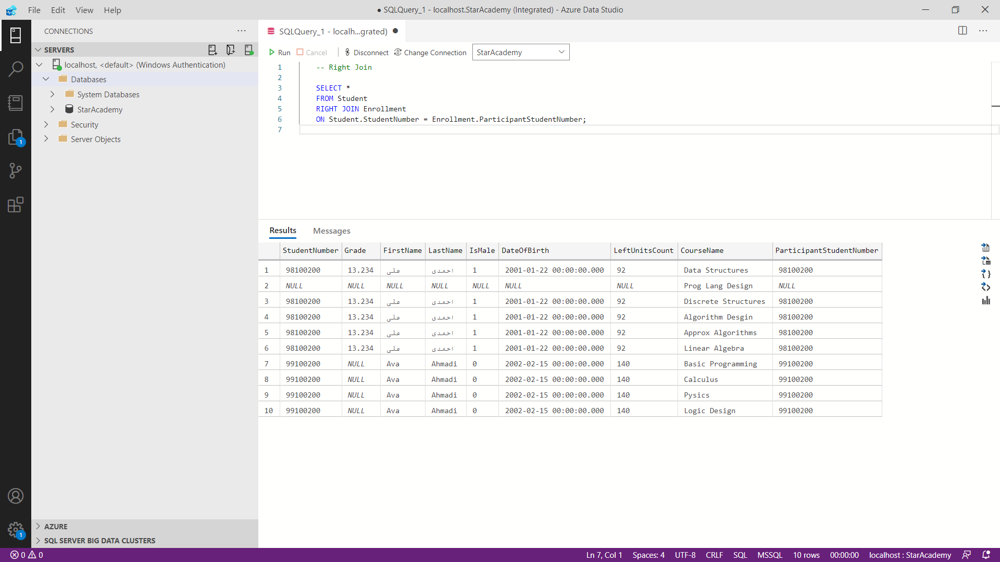

    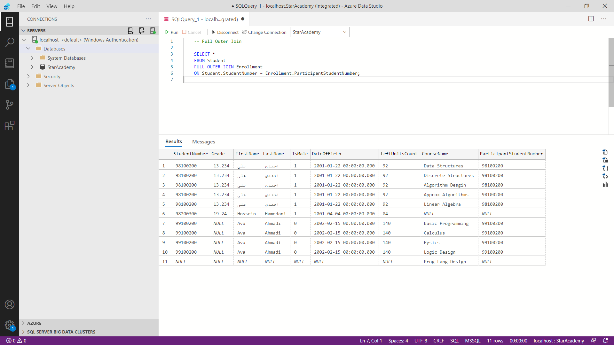
    </div>

1. تابع‌ها

    SQL 
    توابع زیادی برای انجام محاسبات بر روی داده‌ها دارد که به صورت کلی در دو دسته قرار می‌گیرند.
    1. Aggregate Functions : ورودی تابع مقادیر موجود در جدول می‌باشد. چند نمونه از این توابع رو در زیر مشاهده می‌کنید.
        - [AVG](http://www-db.deis.unibo.it/courses/TW/DOCS/w3schools/sql/sql_func_avg.asp.html)
        - [COUNT](http://www-db.deis.unibo.it/courses/TW/DOCS/w3schools/sql/sql_func_count.asp.html)
        - [MIN](http://www-db.deis.unibo.it/courses/TW/DOCS/w3schools/sql/sql_func_min.asp.html)

    1. Scalar Functions : ورودی تابع در زمان صدا زدن به آن داده می‌شود. چند نمونه از این توابع نیز در ادامه آمده است.
        - [ROUND](http://www-db.deis.unibo.it/courses/TW/DOCS/w3schools/sql/sql_func_round.asp.html)
        - [SUBSTRING](https://www.guru99.com/sql-server-substring.html)

    **GROUP BY**

    <div dir="ltr">

    ``` 
    SELECT column_name, aggregate_function(column_name)
    FROM table_name
    WHERE column_name operator value
    GROUP BY column_name; 
    ```
    </div>

    با استفاده از دستور 
    GROUP BY
    می‌توان ستون‌ها را دسته بندی کرد. این دستور با 
    Aggregate Funcitons 
    به کار می‌رود. برای مثال دستور زیر تعداد آقایان و خانم‌ها را خروجی می‌دهد.

    <div dir="ltr">

    ``` 
    SELECT IsMale, COUNT(IsMale) FROM Student GROUP BY IsMale;
    ```
    </div>

    دستور زیر تعداد دروس ثبت‌نام شده هز دانشجو را نشان می‌دهد.

    <div dir="ltr">

    ``` 
    SELECT ParticipantStudentNumber, COUNT(ParticipantStudentNumber)
    FROM Enrollment 
    GROUP BY ParticipantStudentNumber;
    ```
    </div>
1. ویدیو

اگر فرصت داشته باشید دیدن ویدیو های دوره آموزشی زیر پیشنهاد میشود.

- [SQL And Database Design A-Z: Learn MS SQL Server + PostgreSQL](https://download.ir/sql-and-database-design-a-z-learn-ms-sql-server-postgresql/)

    
</div>
