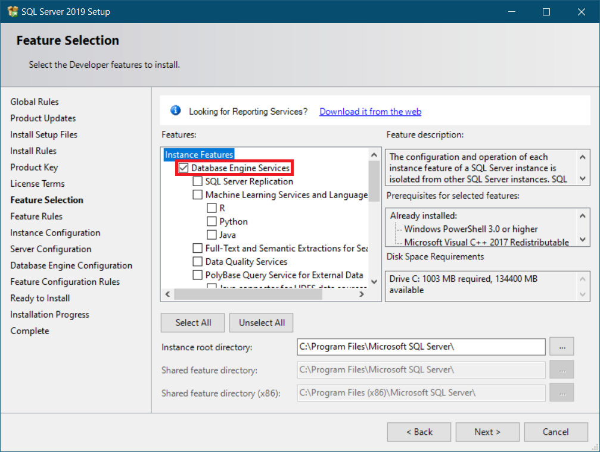
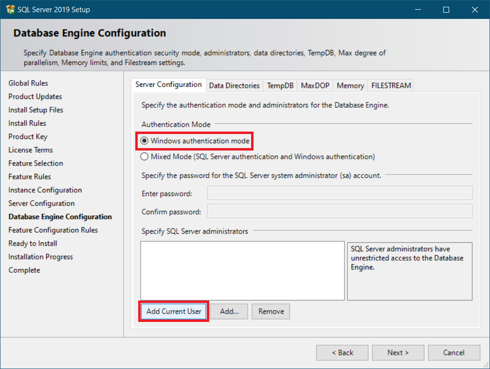
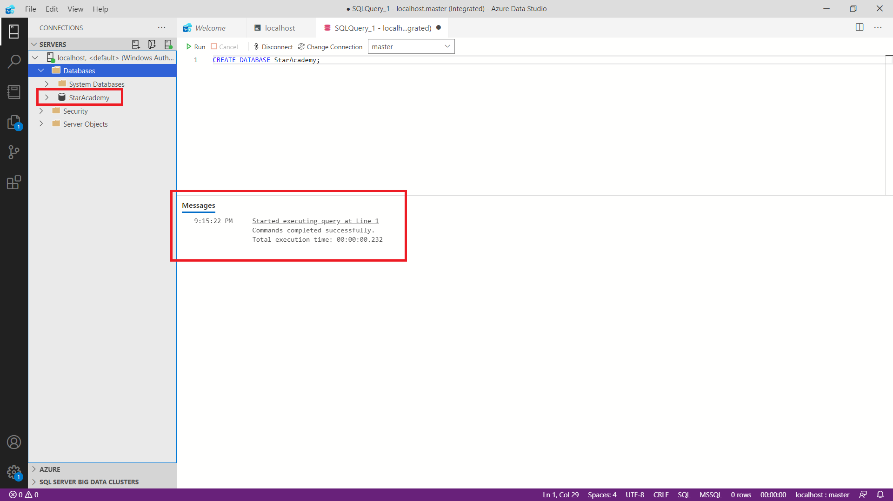

<div dir="rtl" align='justify'>

[لیست تسک‌های مرتبط با این فاز به صورت issue template](issue-template-Phase07.md)

# فاز هفت: SQL

در این فاز با یک پایگاه داده رابطه‌ای، نحوه‌ی کار کردن با آن و
query
های آن آشنا می‌شوید.

1. مقدمه

    پایگاه داده یا 
    Database 
    مجموعه‌ای از داده‌ها است که به صورت ساختارمند درون کامپیوتر نگهداری می‌شوند. 
    سامانه مدیریت پایگاه داده یا 
    DBMS(Database Management System)
    نرم‌افزاری است که با کاربر نهایی، برنامه‌ها کاربردی و خود پایگاه داده برای ذخیره و بازیابی داده تعامل میکند.
    DBMS
    های مختلفی برای کابردهای متفاوت وجود دارند که پرکاربردترین
    DBMS
    ها، 
    DBMS
    های رابطه‌ای یا همان
    RDBMS(Relaional Database Management System)
    ها هستند. در این 
    DBMS
    ها داده‌ها به صورت سازمانمند در جداول ذخیره می‌شوند و مقادیر موجود در هر جدول با یکدیگر ارتباط دارند. به همین خاطر به آن رابطه‌ای با 
    relational 
    گفته می‌شود.
    
    از آنجایی که اکثر 
    RDBMS
    ها از زبان پرسمان سازمان‌یافته یا 
    SQL(Structured Query Language)
    استفاده می‌کنند، با آشنایی با یکی از این 
    RDBMS
    ها می‌توانید با صرف زمان کم نحوه استفاده از یک 
    RDBMS 
    جدید را فرابگیرید. همچنین 
    SQL 
    جزو استاندارد 
    ANSI 
    و 
    ISO 
    می‌باشد.
    
    RDBMS
    های فراوانی وجود دارند که بسته به نیاز از آن‌ها استفاده می‌شود.
    MySQL, SQL Server, PostgreSQL, SQLite, ...
    نمونه‌های از 
    RDBMS
    های معروف هستند. در این فاز با 
    SQL Server
     که محصول شرکت 
     Microsoft 
     است، کار می‌کنید.

1. آشنایی با مفاهیم اولیه

    - Instance
    - SSMS
    - Database در SQL Server
    
        یک 
        Database 
        در 
        SQL Server 
        مجموعه‌ای از چند شئ از نوع جدول
        (Table)
        ، رویه ذخیره شده
        (Stored Procedure)
        ، تابع
        (Function)
        ، نما
        (View)
        و ... است. اگر این عبارات برایتان ناآشنا است نگران نباشید! در ادامه با آن‌ها آشنا می‌شوید. فعلا در این حد بدانید که داده‌ها در 
        SQL Server 
        باید در یک 
        Database 
        وجود داشته باشند.


1. نصب و راه‌اندازی SQL Server و SSMS

    1. ابتدا یک نسخه از 
    SQL Server
    را با توجه به سیستم عامل خود دانلود کنید. پیشنهاد می‌شود نسخه 
    SQL Server 2019 Developer
    را از 
    [سایت مایکروسافت](https://www.microsoft.com/en-us/sql-server/sql-server-downloads)
    دانلود و نصب کنید. این نسخه تمامی ویژگی‌های نسخه 
    Enterprise 
    را به صورت رایگان در اختیارمان قرار میدهد ولی فقط مجوز استفاده در محیط توسعه و تست را دارد.

    1. با توجه به نسخه دانلود شده به نصب بپردازید. تمام تنظیمات خواسته شده را در حالت پیشفرض قرار دهید. همچنین در قسمت 
    Feature Selection 
    انتخاب 
    Database Engine Service 
    برای کار ما کافی است.

    
    
    

    1. حال 

    1. حال 
    SSMS (SQL Server Management Studio)
    که ابزاری رایگان برای پیکربندی، مدیریت و اداره کردن تمامی اجزا 
    SQL Server 
    است را از 
    [سایت مایکروسافت](https://docs.microsoft.com/en-us/sql/ssms/)
    دانلود و نصب کنید.


1. ایجاد و حذف Database

    همانظور که در تعاریف دیدم برای کار با داده باید حداقل یک 
    Database 
    ایجاد کنیم. 
    <div dir="ltr">

    ```
    CREATE DATABASE database_name;
    ```
    </div>
    برای مثال:
    <div dir="ltr">

    ```
    CREATE DATABASE StarAcademy;
    ```
    </div>
    با اجرای این دستور، دیتابیس ساخته می‌شود و با 
    Refresh 
    کردن 
    Connections
    دیتابیس 
    StarAcademy
    مشاهده می‌شود.
    
    پس از اجرا کردن هر دستور 
    ADS 
    پیغامی متناسب با موفقیت و یا عدم موفقیت 
    Query 
    اجرا شده چاپ می‌کند. در صورت مواجه شدن با خطا، پیغام مربوط به خطا نیز چاپ می‌شود که به رفع خطا کمک می‌کند.

    
    برای حذف یک دیتابیس نیز از دستور زیر استفاده می‌شود.
    <div dir="ltr">

    ```
    DROP DATABASE database_name;
    ```
    </div>

1. Data Type

    Data Type 
    نوع داده‌ای است که هر ستون در جدول یا متغییر می‌تواند ذخیره کند. 
    Data Type
    های 
    SQL Server 
    در هفت دسته کلی قرار میگیرند که عبارتند از:
    
    - Exact numeric
    - Approximate numberic
    - Date and time
    - Character strings
    - Unicode character strings
    - Binary strings
    - Other data types

    اعضای هر یک از این دسته‌ها را با جزئیات می‌توانید در 
    [سایت مایکروسافت](https://docs.microsoft.com/en-us/sql/t-sql/data-types/data-types-transact-sql)
    ببینید. پرکاربردترین 
    Data Type
    ها نیز در جدول زیر قابل مشاهده هستند.
    <div dir="ltr">

    | Data Type | توضیحات | Range/Limit | Storage Size |
    | :---: | :---: | :---: | :---: |
    | int | It stores whole numbers in the range given | -2^31 to −2^31-1 | 8 bytes |
    | varchar | This is a character string with variable width | 8000 chars | n + 2 bytes |
    | nvarchar | It is a unicode string of variable width | 4000 chars | 2*n + 2 bytes |
    | datetime | Used for specifying a date and time. It has an accuracy of 3.33 milliseconds. | 1753/1/1 to 9999/12/31 | 8 bytes |
    | decimal | Used for scale and fixed precision numbers | −10^38+1 to 10^381−1 | 5 to 17 bytes |
    | float(n) | Used for a floating precision number | −1.79E+308 to 1.79E+308 | Depends on the value of n |
    | bit | It can take 0, 1, or NULL values. | 0 to 1 | 1 byte/8bit column |
    </div>

    


1. جدول 


1. کلیدها


1. آشنایی با T-SQL

    **T-SQL(Transact-SQL)** 
    زبان توسعه داده شده توسط ماکروسافت است که قابلیت‌هایی مثل متغییر، مدیریت استثنا 
    (Exception)
    ، رویه‌ی ذخیره شده 
    (Stored Procedure) 
    و ... را به 
    SQL Server 
    اضافه می‌کند. دقت کنید که 
    T-SQL 
    در کنار 
    SQL 
    قرار دارد و 
    SQL Server
    به صورت کامل از 
    SQL 
    استاندارد پشتیبانی می‌کند. در ادامه با برخی از ویژگی‌های T-SQL آشنا می‌شوید.


1. تابع‌ها


1. Joins


1. ساختن کاربر و مدیریت دسترسی‌ها


</div>
