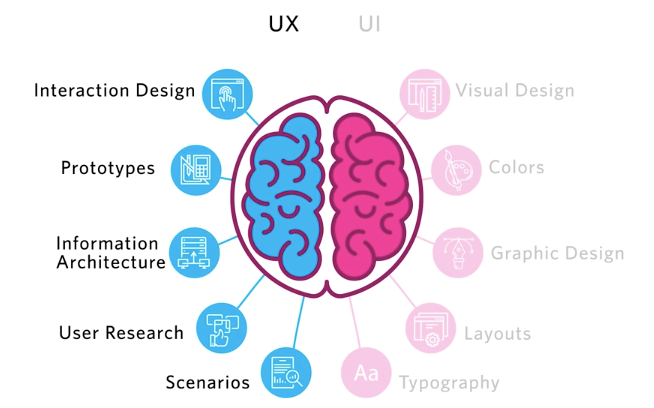
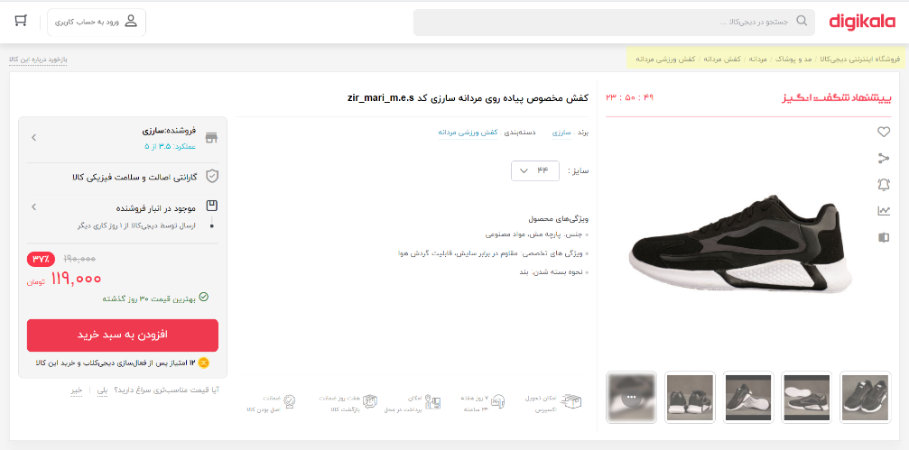
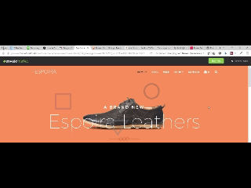
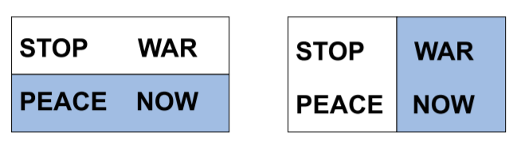
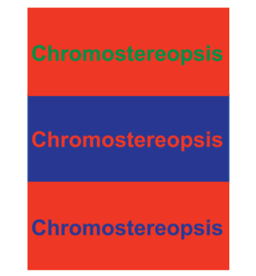
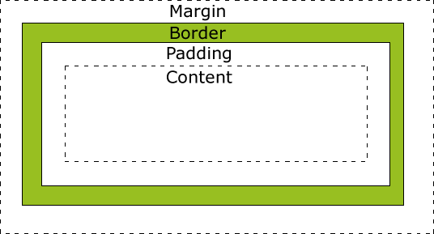

```HTML

```

------------------------------------------------------------------------------------------------------

<h3 dir="rtl">UI/UX</h3>
‌<p dir="rtl">
    در این بخش هدف آشنایی با طراحی صفحات وبسایت است. در ابتدا در مورد نحوه‌ی طراحی و مسائلی از قبیل UI/UX صحبت
    می-شود و سپس به زبان‌های طراحی صفحات وب از قبیل HTML, CSS, JavaScript پرداخته می‌شود و در انتها نیز یکی از
    محبوب‌ترین فریمورک‌های حال حاضر دنیا یعنی انگولار معرفی خواهد شد.
</p>
‌<p dir="rtl">
    UI به معنای User Interface یا طراحی کاربری است. در UI به طراحی قسمتی که کاربر آن را می‌بیند پرداخته می‌شود و
    بیشتر جنبه‌های گرافیکی یک سایت را دربرمی‌گیرد. UX به معنای User Experience یا تجربه‌ی کاربری است. در UX به
    احساسات و نحوه‌ی تعامل کاربر پرداخته می‌شود و نحوه‌ی رفتار افراد شناسایی می‌شود تا بتوان بهترین گزینه‌ها را
    انتخاب کرد.
</p>
‌<p dir="rtl">
    برای درک بهتر تفاوت این دو قسمت به تصویر زیر توجه کنید. UI سمت راست مغز را بیشتر درگیر می‌کند زیرا شامل خلاقیت و
    هنر می‌شود حال آن که UX سمت چپ مغز را بیشتر درگیر می‌کند، زیرا شامل منطق و آنالیز یک سایت خواهد بود.
    
    <br>
</p>
‌<p dir="rtl">
    برای طراحی UX باید به موارد زیر توجه کنیم:
<ul dir="rtl">
    <li>
        Context یا شرایط. همیشه باید شرایط کاربر در نظر گرفته شود. مثلا اگر برای یک محیط بارانی، دوربین طراحی
        می‌کنید باید به فکر رطوبت باشید.
    </li>
    <li>
        افراد نباید با ورود به سایت دچار فکر شوند و همه چیز باید مشخص و واضح باشد.
    </li>
</ul>
</p>
‌<p dir="rtl">
    با ورود به سایت، کاربر باید بتواند به 3 سوال جواب دهد :
<ol dir="rtl">
    <li>
        کجا هستم؟ برای رفع این سوال معمولا از منو در بالای صفحه استفاده می‌شود که کاربر متوجه شود در کجای سایت قرار
        دارد. کار دیگری که انجام می‌شود، وجود breadcrumb است که در تصویر زیر به رنگ زرد رنگ هایلایت شده و قابل
        مشاهده است.
        <br>
        
        <br>
    </li>
    <li>
        از کجا شروع کنم؟ برای این منظور برخی سایت‌ها، آموزش‌هایی دارند که به صورت فیلم در ابتدای سایت قرار می‌گیرد.
        برخی سایت‌ها نیز مانند تصویر زیر، بلافاصله پس از ورود، دکمه از کجا شروع کنم قرار می‌دهند تا کاربر دچار
        سردرگمی نشود.
        <br>
        
        <br>
    </li>
    <li>
        جای ... کجاست؟ برای این منظور نیز بالای سایت از navigation menu استفاده می‌شود. یکی دیگر از کارهای مهم برای
        این منظور، استفاده از جستجو در سایت است، که به کمک آن، می‌توانید قسمت موردنظر را جستجو کنید.
    </li>
</ol>
</p>
‌<p dir="rtl">
    افراد با ورود به سایت معمولا سایت را اسکن می‌کنند، به این معنی که خیلی سریع قسمت‌های مختلف را نگاه می‌کنند و
    نمی‌خوانند پس بهتر است طراحی برای اسکن کردن باشد نه خواندن. از این رو اگر طراحی شما تودرتو باشد که کاربر متوجه
    قسمت‌بندی‌های مختلف سایت بشود، خیلی مفید خواهد بود.
</p>
‌<p dir="rtl">
    تعامل کاربر با سیستم باید مشخص باشد. برای مثال دکمه‌ها باید کاملا مشخص باشند که قابلیت کلیک دارند یا خیر و زمانی
    که کلیک صورت گرفت، باید تغییرات صفحه ملموس باشد. دید انسان دو قسمت را شامل می‌شود، central vision یا مرکز نگاه و
    peripheral vision یا اطراف نگاه. مرکز نگاه قسمتی است که شما برای دیدن جزئیات از آن استفاده می‌کنید و اطراف آن
    تارتر دیده می‌شود. اطراف نگاه با دیدن انیمیشن فعال می‌شود. برای مثال تصویر زیر را در نظر بگیرید. پس از زدن دکمه
    جستجو، یک قسمتی در بالا باز می‌شود که اصل آن، input مربوط به جستجو است. چون این input از مرکز نگاه کاربر دور
    است، به راحتی قابل دیدن نخواهد بود.
    <br>
    
    <br>
</p>
‌<p dir="rtl">
    در انتها نیز برای مفاهیم UX، یکی از بهترین کتاب‌ها، کتاب Don’t Make Me Think از Steve Krug است که مطالعه‌ی آن
    می‌تواند بسیار مفید باشد.
</p>
‌<p dir="rtl">
    برای UI نیز مهم است به موارد زیر حتما توجه شود:
<ul dir="rtl">
    <li>
        رنگ‌بندی و قرار دادن نوشته‌ها در قسمت‌های مختلف موجب تغییر دید کاربر می‌شود. از این موارد به خوبی استفاده
        کنید.
        <br>
        
        <br>
    </li>
    <li>
        فونت یکی از ابزارهای زیباسازی سایت است که باید به خوبی از آن استفاده شود.
    </li>
    <li>
        مغز انسان همواره دنبال یک الگو در یک مجموعه می‌گردد. بنابراین استفاده از الگوهای سایت‌های پربازدید، می‌تواند
        بسیار حائز اهمیت باشد.
    </li>
    <li>
        رنگ قرمز و ابی در کنار هم، هرگز استفاده نشود.
        <br>
        
        <br>
    </li>
    <li>
        برای پیدا کردن رنگ‌های مناسب، توصیه می‌شود عکس‌های زیادی ببینید. یکی از بهترین سایت‌ها در این زمینه‌، <a
            href="https://unsplash.com/">unsplash</a> است که عکس‌های رایگان و زیبایی در اختیار شما قرار می‌دهد و
        می‌توانید عکس‌ها را ببینید و رنگ‌هایی که در کنار هم هستند و ترکیب زیبایی دارند انتخاب کنید.
    </li>
    <li>
        از الگوهای طراحی UI استفاده کنید. چندین سایت در این زمینه وجود دارد، از جمله <a
            href="https://www.pttrns.com/">pttrns</a>، <a href="https://ui-patterns.com/">ui-patterns</a>، <a
            href="https://www.mobile-patterns.com/">mobile-patterns</a>، <a
            href="https://dribbble.com/">dribbble</a> و ... توصیه می‌شود پیش از طراحی این سایت‌ها را نیز مشاهده
        کنید.
    </li>
</ul>
</p>
‌<p dir="rtl">
    برای اطلاعات بیشتر در زمینه UI می‌توانید به کتاب 100 Things Every Designer Needs to Know about People مراجعه
    کنید. همین طور بازی سایت <a href="https://cantunsee.space/">can't unsee</a> نیز می‌تواند در این زمینه مفید باشد.
</p>
<h3 dir="rtl">HTML</h3>
‌<p dir="rtl">
    برای طراحی یک سایت، ابتدا با استفاده از قوانین کلی که در بالا بیان شد، نمای کلی سایت را طراحی می‌شود و سپس به
    کمک زبان-های HTML, CSS, JavaScript پیاده‌سازی آن صفحه شروع می‌شود.
</p>
‌<p dir="rtl">
    HTML مخفف Hyper Text Markup Language است و یک زبان نشانه‌گذاری است، نه برنامه‌نویسی. هر فایل HTML به فرمت زیر
    است.
</p>

```HTML
<!DOCTYPE html>
<html>

<head>
</head>

<body>
    Hello World!
</body>

</html>
```

‌<p dir="rtl">
    قسمت اول Doctype مشخص می‌کند که مرورگر باید این فایل را به صورت HTML5 ترجمه کند.
</p>
‌<p dir="rtl">
    به هر یک از متن‌هایی که داخل <…> قرار می‌گیرد، Tag گفته می‌شود. برخی مواقع تگ‌ها مقادیری در داخل خود دارند، مثلا
    </p>

```HTML

```

<p dir="rtl>
، به قسمت src داخل تگ img، attribute یا مشخصه گفته
        می‌شود. تگ مربوط به HTML
        شروع نشانه‌گذاری-های HTML را مشخص می‌کند. در تگ head اطلاعات اضافی آن صفحه بیان می‌شود و در تگ body، سایر
        تگ‌های نمایشی آن صفحه مشخص می‌شود.

</p>
‌<p dir="rtl">
    تگ‌های موجود در head:
‌<ul dir="rtl">
    <li>title: یکی از تگ‌های موجود در head، تگ title است که مشخص می‌کند، در تب مرورگر چه متنی نمایش داده شود.</li>
    <li>meta: از این تگ برای اطلاعات صفحه که قابل رویت در ماشین‌ها باشد استفاده می‌شود. مثلا `<meta charset=”utf-8”>` برای موتور‌های جستجوگر که به صورت ماشینی، صفحات را مرور می‌کنند، مشخص می‌کند که کاراکترهای utf-8 در
        این صفحه وجود دارد. سایر تگ‌های متا را می‌توانید در <a
            href="https://www.w3schools.com/tags/tag_meta.asp">اینجا</a> مشاهده کنید.</li>
    <li>script: این تگ، برای لود کردن فایل‌های جاوااسکریپت در صفحه استفاده می‌شود که جلوتر، بیشتر به توضیحات آن
        پرداخته می‌شود.</li>
    <li>link: از این تگ برای لینک کردن چندین مستند به هم استفاده می‌شود. معمولا برای لود کردن فایل‌های CSS استفاده
        می‌شود که در ادامه بیشتر توضیح داده می‌شود.</li>
</ul>
</p>
‌<p dir="rtl">
    تگ‌های مهم Body:
‌<ul dir="rtl">
    <li>
        div: از این تگ برای تقسیم‌بندی صفحه HTML استفاده می‌شود و یکی از پرکاربردترین تگ‌های HTML است.
    </li>
    <li>
h1, h2, … , h6: این تگ‌ها برای هدربندی یک قسمت استفاده می‌شود. برای مثال اگر شما 
<span dir="ltr" style="text-align: left">

```HTML
<h1>Header<h1>
```
</span>

<p dir="rtl">
 داشته باشید، این قسمت بسیار بزرگتر از متن‌های دیگر نمایش داده می‌شود. (<a
            href="https://www.w3schools.com/tags/tryit.asp?filename=tryhtml_headers">مثال</a>)
            </p>
    </li>
    <li>
        p: این تگ برای ایجاد یک پاراگراف جدید مورداستفاده قرار می‌گیرد. (<a
            href="https://www.w3schools.com/tags/tryit.asp?filename=tryhtml_paragraphs1">مثال</a>)
    </li>
    <li>
        span: برای ایجاد یک قسمت جدید در صفحه استفاده می‌شود. مانند div است ولی تفاوت‌هایی دارد که در قسمت CSS به آن
        پرداخته می‌شود.
    </li>
    <li>
        a: از این تگ برای لینک دادن در صفحه استفاده می‌شود. برای مثال اگر `<a
                href=www.google.com> google </a>` وجود داشته باشد، کاربر با کلیک رو آن به صفحه گوگل خواهد رفت.
        آدرس صفحه داخل مشخصه href قرار می‌گیرد. (<a
            href="https://www.w3schools.com/tags/tryit.asp?filename=tryhtml_link_test">مثال</a>)
    </li>
    <li>
        ul, ol, li: از تگ‌های ul و ol برای ایجاد لیست استفاده می‌شود. اگر از ul استفاده شود، لیست دارای شماره نیست
        (unordered list) ولی اگر از ol استفاده شود، شماره از 1 شروع شده و جلو می‌رود. تگ‌های li نیز شامل ایتم‌های
        لیست می‌شود. (<a href="https://www.w3schools.com/tags/tryit.asp?filename=tryhtml_list_test">مثال</a>)
    </li>
    <li>
        b, i: از تگ b برای bold کردن متن و از تگ i برای italic کردن متن استفاده می‌شود.
    </li>
    <li>
        br: برای ایجاد یک خط فاصله، از این تگ استفاده می‌شود. (<a
            href="https://www.w3schools.com/tags/tryit.asp?filename=tryhtml_br">مثال</a>)
    </li>
    <li>
        hr: برای این که یک خط داخل صفحه کشیده شود، از این تگ استفاده می‌شود.: (<a
            href="https://www.w3schools.com/tags/tryit.asp?filename=tryhtml_hr_test">مثال</a>)
    </li>
    <li>
        img: از این تگ برای اضافه کردن image در صفحه استفاده می‌شود. آدرس عکس داخل مشخصه src قرار می‌گیرد. (<a
            href="https://www.w3schools.com/tags/tryit.asp?filename=tryhtml_image_test">مثال</a>)
    </li>
    <br>
    این تگ‌ها جزو مهم‌ترین تگ‌های HTML است ولی تعداد تگ‌های HTML بسیار بیشتر از این‌هاست. برای اطلاعات بیشتر در این
    باره می‌توانید به <a href="https://www.w3schools.com/tags/">اینجا</a> مراجعه کنید.
    </p>
    <h3 dir="rtl">CSS</h3>
    ‌<p dir="rtl">
        همانطور که بیان شد، HTML یک زبان نشانه‌گذاری است و چیز دیگری در آن مشخص نمی‌شود. برای این که شکل و ظاهر این
        نشانه-گذاری‌ها تغییر کند، از CSS یا Cascading Style Sheets استفاده می‌شود. برای لینک دادن استایل‌های CSS به
        HTML به دو طریق می‌توان عمل کرد:
    ‌<ol dir="rtl">
        <li>
            داخلی یا Internal: در این روش، در تگ head، تگ ` <style></style>` ایجاد شده و به صورت داخلی، کدهای مربوط به استایل را داخل این تگ، قرار داده می‌شود.
        </li>
        <li>
            خارجی یا External: در این روش، فایل CSS ایجاد کرده و سپس به کمک تگ `<link rel="stylesheet" href="styles.css">` ، فایل را در صفحه لود می‌شود.
        </li>
    </ol>
    </p>
    ‌<p dir="rtl">
        <b>Selector</b>:
        برای استایل دادن به قسمت‌های مختلف، باید از سلکتورها استفاده شود. چندین سلکتور داریم که به شرح زیر است:
    ‌<ul dir="rtl">
        <li>
            <b>Tag selector</b>: به تمامی تگ‌های html، یک سری استایل داده می‌شود.
        </li>
        <li>
            <b>Class selector</b>: بعضی مواقع ممکن است از یک تگ (برای مثال div) چندین مورد در صفحه داشته باشیم که
            برای یکی، استایل x و برای دیگری استایل y مدنظر باشد. در این صورت از کلاس استفاده می‌شود. به تگ، class
            attribute اضافه می‌شود و نام کلاس را به همراه نقطه در فایل css قرار می‌دهیم. برای مثال .class1
        </li>
        <li>
            <b>Id selector</b>: اگر یک تگ خاص در صفحه باشد، که فقط یک بار در صفحه می‌تواند قرار گیرد و امکان ندارد
            چند تا از آن در صفحه باشد، به آن تگ id attribute اضافه می‌شود و به کمک # و id آن تگ در css می‌توان آن را
            انتخاب کرد. برای مثال #id1.
        </li>
        <li>
            <b>Attribute selector</b>: برای این منظور از [] استفاده می‌شود و attribute مدنظر داخل آن نوشته‌ می‌شود.
            مثلا [href=”google.com”] به این معنی است که تمام تگ‌هایی که دارای مشخصه href با مقدار google.com است را
            سلکت کند.
        </li>
        <li>
            <b>All(*)</b>: اگر یک استایل به همه تگ‌های html داده شود از سلکتور * استفاده می‌شود.
        </li>
        این سلکتورها به صورت ترکیبی نیز می‌تواند مورد استفاده قرار گیرد. برای مثال div, .class1, #id1 و با کاما از
        هم جدا می‌شوند و به این معنی است که مجموعه‌ی این‌ها با هم سلکت شوند.
        برای آشنایی بیشتر با سلکتور‌ها از <a href="https://www.w3schools.com/cssref/css_selectors.asp">اینجا</a> و
        <a href="https://www.w3schools.com/cssref/trysel.asp">اینجا</a> می‌توانید استفاده کنید.
    </ul>
    </p>
    ‌<p dir="rtl">
        برخی استایل‌هایی که می‌توان به کمک CSS داد به شرح زیر است:
    ‌<ul dir="rtl">
        <li>
            <b>border</b>: برای ایجاد border برای قسمت‌های مختلف از این استایل استفاده می‌شود. حالت‌های مختلف border
            وجود
            دارد و می‌توان به آن رنگ، ضخامت و نحوه‌ی نمایش داد. برای مثال: border: 1px solid #eee; به این معنا است
            که برای این قسمت یک border با ضخامت 1px، رنگ #eee و همینطور به صورت ممتد قرار داده شود. این مقادیر به
            صورت جدا نیز می‌تواند مورد استفاده قرار گیرد. برای مثال استفاده از استایل border-color و border-width و
            ... (<a href="https://www.w3schools.com/css/tryit.asp?filename=trycss_border-color1">مثال</a>)
        </li>
        <li>
            <b>background</b>: برای background دادن به یک تگ استفاده می‌شود. این مقدار می‌تواند یک رنگ ساده باشد و
            یا آدرس
            یک عکس باشد و یا ترکیب آن‌ها باشد. برای مثال background: dodgerblue; به معنی رنگ آبی برای پس‌زمینه است
            در حالی که background: url(test.png) به معنای قرار گرفتن عکس برای پس‌زمینه است. ترکیب این دو یعنی رنگ را
            آبی قرار بده و عکس را وسط آن بگذار. برای حالت‌هایی است که عکس transparent باشد. (<a
                href="https://www.w3schools.com/cssref/tryit.asp?filename=trycss_background">مثال</a>)
        </li>
        <li>
            <b>margin, padding</b>: این دو استایل بسیار کاربردی است. margin به معنای فاصله یک تگ از محیط اطراف است و
            padding به معنای فاصله یک تگ از داخل خودش است. برای مشخص شدن بهتر به تصویر زیر توجه کنید. Margin و
            padding با مقادیر مختلفی می‌تواند مورد استفاده قرار گیرد. اگر یک مقدار به آن‌ها داده شود، یعنی بالا،
            راست، چپ و پایین همه این مقدار را داشته باشند. (مثلا margin: 5px) اگر 2 مقدار داشته باشد مثلا margin:
            5px 10px; به این معنی است که از بالا و پایین 5 پیکسل فاصله و از راست و چپ 10 پیکسل فاصله داشته باشد. اگر
            3 مقدار داشته باشد مثلا margin: 5px 10px 15px; به این معنی است که از بالا 5 پیکسل، راست و چپ 10 پیکسل و
            پایین 15 پیکسل فاصله و در نهایت اگر 4 مقدار داشته باشد، مقادیر به ترتیب فاصله‌های بالا، راست، چپ و پایین
            را مشخص می‌کند. به کمک استایل‌های margin-right, margin-left, margin-top, margin-bottom نیز می‌توان
            مقادیر margin را به صورت جدا تعریف کرد. (<a href="https://www.w3schools.com/cssref/tryit.asp?filename=trycss_margin و
                https://www.w3schools.com/cssref/tryit.asp?filename=trycss_padding">مثال</a>)
            <br>
            
            <br>
        </li>
        <li>
            <b>width, height</b>: این دو استایل نیز مشخص هستند و برای اندازه دادن به طول و عرض یک تگ مورد استفاده
            قرار
            می-گیرند.
        </li>
        <li>
            <b>display</b>: یکی از استایل‌هایی که نیاز به توضیحات زیادی دارد، display است. این استایل می‌تواند 4
            مقدار زیر
            را داشته باشد:
            ‌<ol dir="rtl">
                <li>
                    none: به معنای این که آن تگ اصلا نمایش داده نشود.
                </li>
                <li>
                    Inline: به معنای این که این تگ تا جایی که نیاز دارد جا اشغال می‌کند. برای این نوع تگ‌ها width و
                    height
                    اثر نخواهد داشت. پیش‌تر بیان شد که span با div یک سری تفاوت‌هایی دارد که تفاوت عمده‌ی آن‌ها در
                    نوع
                    display است. span به صورت پیش‌فرض از نوع inline است.
                </li>
                <li>
                    block: این مقدار به معنای این است که این تگ، کل صفحه را دربرمی‌گیرد. در حالت block می‌توان
                    width, height
                    برای آن قرار داد ولی به صورت پیش‌فرض کل صفحه را خواهد گرفت. Div به صورت پیش‌فرض از نوع block
                    است.
                </li>
                <li>
                    inline-block: این مقدار به معنای ترکیب inline و block است.
                </li>
            </ol>
            انواع دیگری نیز برای display وجود دارد که برای آشنایی بیشتر می‌توانید <a
                href="https://www.w3schools.com/cssref/pr_class_display.asp">اینجا</a> را مطالعه کنید.
        </li>
        <li>
            <b>float</b>: نشان می‌دهد که یک تگ در کجا قرار گیرد. برای مثال float: right; به معنای قرار گرفتن آن
            سلکتور
            در
            سمت راست است.
        </li>
        <li>
            <b>text-align</b>: نوشته شما از کجا شروع شود. مقادیر آن right, left و center می‌تواند باشد.
        </li>
        <li>
            <b>font-family</b>: از این استایل برای تغییر فونت می‌توانید استفاده کنید. font-family: arial; به معنای
            این است
            که فونت آن سلکتور Arial باشد.
        </li>
        <li>
            <b>@font-face</b>: برای ایجاد یک فونت جدید از این استایل استفاده می‌کنید. نمونه‌ی آن به شکل زیر است:
    <span dir="ltr" style="text-align:left">

```CSS
@font-face {
    font-family: myFirstFont;
    src: url(sansation_light.woff);
}
```
 </span>
            در src آدرس یک فایل فونت را قرار می‌دهید و در font-family به آن یه نام اختصاص می‌دهید. از این پس اگر در
            استایل font-family از این نام استفاده کنید، متن موردنظر شما این فونت را خواهد داشت.
        </li>
    </ul>
    </p>
    ‌<p dir="rtl">
        در css نحوه‌ی نام‌گذاری به صورت kebab-case است به این معنی که کلمات با حروف کوچک شروع شده و اگر کلمه‌ی دیگری
        وجود داشت با – از قبلی جدا می‌شود. برای مثال list-wrapper.
    </p>
    ‌<p dir="rtl">
        برای این که طراحی شما روی دستگاه‌های مختلف به خوبی نمایش داده شود، از @media استفاده می‌شود. در این حالت
        مشخص می-کنید که برای صفحات کوچکتر از مثلا 500px به چه شکلی استایل‌ها اعمال شود. برای توضیحات بیشتر در این
        زمینه به <a href="https://www.w3schools.com/cssref/css3_pr_mediaquery.asp">اینجا</a> مراجه کنید.
    </p>
    ‌<p dir="rtl">
        به طور کلی نیز برای اطلاعات بیشتر در زمینه css و propertyهای موجود در آن به <a
            href="https://www.w3schools.com/css/default.asp">اینجا</a> مراجعه کنید.
    </p>
    <h3 dir="rtl">JavaScript</h3>
    ‌<p dir="rtl">
        تا به این جا فقط در رابطه با ظاهر سایت صحبت شد و صحبتی از logic مربوط به آن صورت نگرفت. زبان برنامه‌نویسی که
        برای ایجاد logic در سایت مورد استفاده قرار می‌گیرد، زبان جاوااسکریت است. فرض کنید سایتی وجود دارد که
        در آن میزان بدهی شما را نشان می‌دهد. اگر میزان بدهی از 10 هزار تومان بیشتر شد باید به رنگ قرمز نمایش داده
        شود. این اتفاق به کمک css و HTML به چه شکلی می‌تواند انجام گیرد؟ این جا جاوااسکریپت به کار خواهد آمد. برای
        لود کردن جاوااسکریپت هم مانند css دو روش وجود دارد:
    ‌<ol dir="rtl">
        <li>
            Internal یا داخلی: در داخل تگ head، تگ
`<script></script>` قرار داده می‌شود و کدهای جاوااسکریپت در داخل آن به صورت داخلی قرار می‌گیرد.
        </li>
        <li>
            External یا خارجی: کدهای جاوااسکریپت در فایل‌هایی به فرمت js قرار می‌گیرد و سپس به کمک تگ
`<script src=”test.js”></script>` در صفحه لود می‌شود.برای تمیزی کد و جدا کردن دغدغه‌ها بهتر است از این روش همیشه استفاده شود.
        </li>
    </ol>
    </p>
    ‌<p dir="rtl">
        نام‌گذاری‌ها در جاوااسکریپت مانند زبان جاوا به صورت camel case است.
    </p>
    ‌<p dir="rtl">
        <b>Variables</b>:
        متغیرها در جاوااسکریپت به 3 صورت قابل تعریف هستند. var، let و const. از این سه کلمه‌ی کلیدی برای ایجاد متغیر
        استفاده می-شود. متغیرها در جاوااسکریپت، تایپ ندارند و شما می‌توانید هر مقداری را به آن‌ها assign کنید. از
        var زمانی استفاده می‌شود که هدف تعریف آن متغیر در کل صفحه باشد. let و const فقط در داخل بلاک معنی پیدا
        می‌کنند. const به معنی آن است که متغیر قابل تغییر نیست ولی let متغیر قابل تغییر در runtime را مشخص می‌کند.
        برای مقداردهی string می‌توان از ‘ و “ استفاده کرد و تفاوتی در این دو وجود ندارد برای مثال var a = ‘ali’ با
        var a = “ali” یکی است.
    </p>
    ‌<p dir="rtl">
        <b>Array</b>:
        برای تعریف آرایه به صورت var a = [1,2,3] عمل‌ می‌شود. در داخل آرایه‌ها متدها از قبیل include, push, pop,
        indexof و ... وجود دارد که با مراجعه به <a
            href="https://www.w3schools.com/js/js_array_methods.asp">اینجا</a> می‌توانید اطلاعات بیشتری در این زمینه
        به دست آورید.
    </p>
    ‌<p dir="rtl">
        <b>Arithmetic operators</b>:
        مانند سایر زبان‌ها، جاوااسکریپت نیز از اپراتورهای +, ++, -, --, % و ... پشتیبانی می‌کند.
    </p>
    ‌<p dir="rtl">
        <b>Comparison operators</b>:
        برای مقایسه نیز مانند سایر زبان‌های برنامه‌نویسی، اپراتورهای ==, >, >= و ... را پشتیبانی می‌کند. تفاوتی که
        با سایر زبان‌ها در این‌جا وجود دارد، وجود اپراتور === است. همانطور که پیش‌تر بیان شد، در جاوااسکریپت، برای
        متغیر‌ها تایپ وجود ندارد و اپراتور == بدون در نظر گرفتن تایپ متغیر‌ها، مقادیر را چک می‌کند. برای مثال 2 ==
        ‘2’، مقدار true خواهد داشت. اگر برابری تایپ هم برای ما مهم باشد، از === استفاده می‌شود.
    </p>
    ‌<p dir="rtl">
        <b>function</b>:
        برای ایجاد یک تابع از function استفاده می‌شود. نحوه‌ی تعریف آن به شکل زیر است:
    </p>
<span dir="ltr">

```javascript
    function myFunction() {
        alert('hello world!');
    }                
```
</span>
<p dir="rtl>

برای صدا زدن تابع نیز از myFunction() استفاده می‌شود.
    </p>
    ‌<p dir="rtl">
        <b>Events</b>:
        یکی از مهم‌ترین قسمت‌های زبان جاوااسکریپت وجود Eventها است. برای مثال با کلیک روی یک دکمه چه اتفاقی بیفتد،
        یا بعد از لود شدن کامل صفحه چه شود و .... برای تمامی این موارد eventهایی در جاوااسکریپت طراحی شده است. در
        مشخصه‌ی تگ‌ها، مشخصه‌ای به نام onclick وجود دارد که از آن برای دریافت event مربوط به کلیک استفاده می‌شود.
        برای مثال 
        </p>

```HTML        
<button onclick=”myFunction()”>click!</button>
```

<p dir="rtl>

 به این معناست
        که پس از کلیک روی تگ button متد myFuction کال شود. eventهای دیگری مانند hover، dblClick، load و ... وجود
        دارد که در <a href="https://www.w3schools.com/js/js_events.asp">اینجا</a> و <a
            href="https://www.w3schools.com/js/js_htmldom_events.asp">اینجا</a> قابل مشاهده است.
    </p>
    ‌<p dir="rtl">
        برخی syntaxها مانند if, for, while و ... در <a href="https://www.w3schools.com/js/default.asp">اینجا</a> قابل مشاهده است.
    </p>
