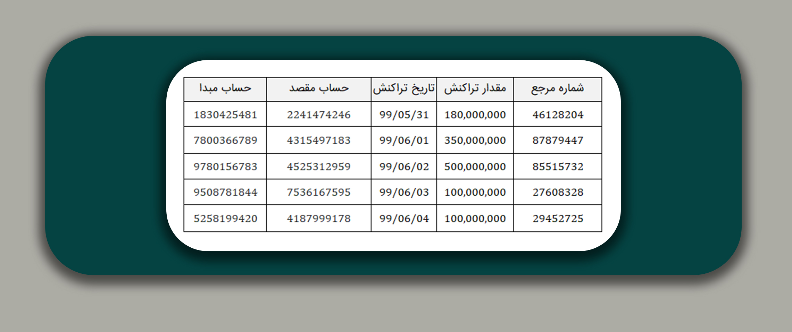

# فاز ده: مصورسازی تراکنش‌ها

در این فاز قراراست که یک فایل حاوی دیتای تراکنش‌ها را از کاربربگیریم و بتوانیم تراکنش‌ها را در چهره یک گراف به کاربر نشان‌دهیم. لطفا اگر معادلی بهتر از -مصورسازی- برای عبارت visualize می‌شناسید ما را با خبرکنید :)

  

## 1- چرا به صورت گراف تراکنش‌ها را نشان دهیم؟
وقتی تحلیل‌گر روی داد‌ه‌های یک مساله خاص تمرکز می‌کند، نیاز دارد بتواند اطلاعات را در کنار یکدیگر ببیند، روابط بینشان را درک کند و کوئری‌ها را به راحتی روی آن‌ها پیاده‌سازی کند. گراف و ویژگی‌هایش، بهترین ساختار برای رسیدن به این خواسته‌هاست.

## 2- ساختار داده و تعریف اجزای آن به عنوان بخش‌های گراف

ما در این پروژه با داده‌های فرضی تراکنش‌های بانکی سر و کار داریم. دیتابیس در ادامه به صورت یک فایل csv باید به برنامه داده‌شود. این داده‌ها شامل تعداد زیادی رکورد است. (رکورد، معادل سطر دیتابیس است.) هر رکورد دیتابیس شامل اطلاعات زیر است:

1. شماره حساب مبدا
1.  شماره حساب مقصد
1. مبلغ تراکنش
1.  تاریخ تراکنش
1. شماره مرجع تراکنش

در شکل زیر یک نمونه از دیتابیس حاوی اطلاعات تراکنش را مشاهده می‌کنید.

در این فاز از پروژه ما قرار می‌گذاریم تا به هریک از این 5 مورد بالا به طور خاصی نگاه کنیم. در دنیای پروژه ما  هرچیزی به شکل یکی از این سه مورد زیر تعریف خواهد شد.

1. نود گراف
1. لینک گراف
1. مشخصه نود و لینک موجود در گراف

در این فاز قرار داد می کنیم که حساب مبدا و مقصد به صورت نود‌های گراف و تراکنش‌ بین‌ آن‌ها به صورت لینک گراف نمایش‌داده شود. هم‌چنین مقدار تراکنش‌ها و تاریخ تاریخ تراکنش به عنوان مشخصه لینک تراکنش باشند.

چیزی که در اینجا درباره آن صبحت کردیم، یعنی طرز نگرش به پدیده‌های پروژه و تعریف آن‌ها به صورت خاص، با اصطلاح آنتولوژی شناخته می‌شود. در فازهای بعدی خیلی بیشتر با آنتولوژی آشنا خواهیم شد.

## 3- ایمپورت دیتاست
دراین فاز یک فایل csv
سبک، حاوی تعدادی تراکنش با ساختار یاد شده در اختیار شما قرار می‌گیرد که بتوانید کار خود را روی آن امتحان کنید.
می‌توانید این فایل را از لینک زیر دریافت کنید.
  
[transactionsData](https://github.com/Star-Academy/codestar-internship/blob/Phase10/Projects/Phase10-TransactionVisualizer/transactions.csv)

<a href="transactions.zip" download>Click to Download</a>

## 4- Visualize

با آموزش‌هایی که در ادامه داک آورده می‌شود، باید بتوانیم هر سطر موجود در دیتابیس را که معادل یک تراکنش بانکی است، به صورت یک دمبل نشان دهیم. با پیاده‌سازی این ویژگی، امکان فراهم‌کردن بسیاری از فیچرهای پرکاربرد و ارزشمند  فراهم می‌شود.
 
در واقع ما سعی داریم چیزی شبیه به عکس زیر را پیاده‌سازی کنیم.

لازم به ذکر است که کادر موجود در بالای لینک، نشان‌ دهنده‌ی لیست مشخصه‌هایی است که باید برای لینک آورده شود. 
 

برای مثال در عکس زیر بخشی از نرم‌افزار تحلیلی شرکت DataWalk را مشاهده می‌کنید.

در این سیستم، شرکت ترجیح داده به جای یک دایره به عنوان نود گراف از آیکون مخصوص استفاده‌کند. هم‌چنین تراکنش بین دو حساب مختلف به صورت لینک جهت‌دار آبی‌رنگ نشان داده‌شده‌است. این عکس چیزی فراتر از خواسته‌ این فاز را پیاده کرده و فقط یک تراکنش ساده نیست. هم‌چنین از کل مشخصه‌های لینک تراکنش، ترجیح داده‌اند فقط مقدار تراکنش را نشان‌دهند. هم‌چنین به‌جای نوشتن شماره حساب روی نود‌ها، اسم مالک حساب را آورده‌اند که البته در دیتابیسی که ما برای پروژه تعریف می‌کنیم، نام مالکین ذکر نشده است.
 
دست شما در پیاده‌سازی UI 
باز است و با رعایت چارچوپ اولیه، می‌توانید از شکل و رنگ‌های مختلف در طراحی المان‌ها استفاده‌کنید. 
ما با پیاده‌سازی این فاز، بعد از این که توانستیم هر رکورد را به صورت یک دمبل نشان بدهیم، آماده می‌شویم تا در آینده برنامه را مجهز به ابزارهای تحلیل کنیم.
