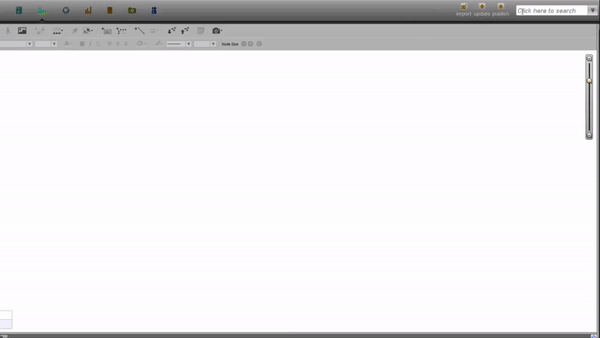

# فاز یازده: اکسپند نودها
در این فاز ما خواهیم توانست تا یک حساب را به عنوان یک نود روی بوم گراف وارد کنیم. سپس بااکسپند کردن این نود، تمامی حساب‌های دیگری که با این حساب تراکنش داشته‌اند روی صفحه نشان داده‌شوند.
 
در واقع قرار است چیزی شبیه به آن چه در زیر مشاهده می‌کنید را پیاده‌سازی کنیم.

## 1- مرور کارهای انجام شده
ما تا این قسمت از پروژه تا جای خوبی پیش رفته‌ایم،  با محیط آشنا شده‌ایم، می‌توانیم تراکنش‌ها را به صورت گرافیکی روی محور صفحه ایجاد کنیم و هر یک از آن‌ها را به وسیله دو نود و یک لینک گراف شناسایی کنیم.
با این تفاسیر کاملا آماده‌شده‌ایم تا این فاز را پیاده‌سازی کنیم.

## 2- ایمپورت دیتاست
در این فاز هم مانند فاز قبل یک فایل csv حاوی تراکنش‌های بانکی فرضی در اختیارتان قرار می‌گیرد. اما این‌یکی شامل تعداد زیادی تراکنش بانکی می‌شود و قرار است کارهای جدیدی روی آن انجام دهیم. هم‌چنین یک دیتاست دیگر حاوی اطلاعات حساب‌های موجود در تراکنش‌هاست. 
 
می‌توانید فایل را از این زیر دانلود کنید.

<a href="testData.zip" download>Click to Download</a>

## 3- نمایش یک حساب به عنوان نود گراف
در فاز قبلی ما هرتراکنش را به صورت دمبل نشان می‌دادیم. در این فاز باید بتوانیم در ابتدا یک حساب را به‌تنهایی به عنوان نود گراف روی صفحه نشان بدهیم. بدین صورت که کاربر بتواند یک شماره‌حساب را در برنامه سرچ کند و در صورت وجود آن شماره‌حساب، یک نود گراف که روی آن اسم مالک حساب نوشته شده روی صفحه ظاهر شود.
 
برنامه باید طوری باشد که اگر کاربر به تعداد دلخواه، شماره حساب سرچ کرد، در صورت وجود روی صفحه نود گراف ظاهر شود.
هم‌چنین این ویژگی‌ که با کلیک روی  نود، اطلاعات حساب نمایش‌داده شود باید وجود داشته‌باشد.

## 3-  قابلیت کلیک‌راست روی نود
بعد از این‌که کاربر یک شماره‌حساب را سرچ‌کرد و نود گراف روی صفحه نمایش‌داده شد، باید ویژگی‌ای را در نظر بگیرید که کاربر بتواند روی آن کلیک راست کند و لیست حاوی سه گزینه‌ نمایان شود.

1. پاک کردن نود
1. انتخاب کردن نود
1. اکسپند کردن نود

پاک کردن نود از روی بوم گراف که بدیهی است. با انتخاب آن، صرفا نود از روی صفحه پاک می شود. انتخاب کردن نود برای فاز‌های بعدی کاربرد مهمی دارد و فعلا با آن کاری نداریم. اکسپندکردن نود در ادامه همین داک توضیح داده خواهدشد.
 
در این زیر شما بخشی از نرم افزار شرکت پلنتیر آمریکا را مشاهد‌ه می‌کنید که کاربر بعد از جست‌وجوی یک نام، نتیجه مطلوب خود را انتخاب می‌کند و روی صفحه یک نود گراف ظاهر می‌شود. سپس با راست‌کلیک کردن روی آن نود، لیستی حاوی چند گزینه نمایان می شود.

البته در این ویدئو، چون کاربر یک نام را سرچ می‌کند زیر سرچ‌بار چندین نتیجه نمایان می‌شود. ما چون با یک حساب بانکی سر و کار داریم و شماره حساب یکتا محسوب می‌شود، یا یک نتیجه نمایان خواهد شد یا نتیجه‌ای نخواهیم داشت.

## 4-  اکسپند کردن نود
ما تا این بخش، به کاربر استفاده‌کننده از نرم‌افزار این توانایی را داده‌ایم که یک شماره حساب را سرچ‌کند، آن را به عنوان یک نود روی صفحه بیندازد، روی آن راست کلیک کند و لیستی حاوی سه گزینه نمایان شود.
 
با انتخاب گزینه expand، باید تمامی حساب‌هایی که در دیتابیس‌ما با حساب موجود روی صفحه تراکنش داشتند، به همراه لینک تراکنش‌ بین آن‌ها، روی صفحه نشان‌داده‌شود. لینک تراکنش باید جهت‌دار باشد و جهت آن از حساب مبدا به حساب مقصد باشد. هم‌چنین میزان پول تراکنش روی لینک بین آن‌ها نوشته‌شود.

## 5-  چالش‌های پیاده‌سازی اکسپند نود
به طور پیش‌فرض برای پیاده‌سازی این فیچر، باید در دیتابیس تمامی تراکنش‌هایی‌ها را که حساب موردنظر در آن‌ها حضور داشتند پیداکنیم و دمبل تراکنش‌ بین‌ آن‌ها را تشکیل‌دهیم. با این کار مثلا اگر حساب موردنظر 90 تراکنش انجام‌شده در دیتابیس داشته‌باشد، 90 دنبل روی صفحه ایجاد می‌شود که نتیجه‌ی جالبی نیست و به درد تحلیل‌گر نمی‌خورد. برای این‌کار ما باید تمامی دنبل‌هایی را که یک سرشان حساب موردنظر است، مرج(ادغام) کنیم تا چیزی شبیه تصویر اول داک به وجود بیاید.
 

به تصویر زیر دقت‌کنید.

 در پروژه ما فقط باید گراف مرج شده را به کاربر نشان بدهیم و مرحله مرج‌شدن در این تصویر برای فهم بهتر است. نتیجه‌ای که به کاربر نشان داده‌می‌شود باید شبیه گیف موجود در اول داک باشد.

اما چگونه باید مرج را پیاده‌سازی کنیم؟ (خوب است لحظاتی به این سوال فکر کنیم)
 
برای این کار کافی است نود‌هایی را که دقیقا تکرار شده‌ی نود اولیه بوده‌اند، یعنی نمایان‌گر یک حساب واحدند تبدیل به یک نود کنیم و بقیه نود‌های موجود در نتیجه جست‌ و جو را به آن متصل کنیم. برای شناسایی این که کدام نودها یکی هستند، باید آن‌ها را از طریق شماره حساب شناسایی کنیم. شماره حساب در این پروژه برای هر حساب مجزا، عدد یونیک در نظر گرفته شده‌است.

## 6-  حالت خاص
وقتی قرار است تراکنش‌های انجام‌شده توسط یک حساب را رسم‌کنیم، حالت خاصی به وجود می‌آید که حساب مورد نظر ما با یک حساب خاص، چند تراکنش داشته‌باشد. 
برای این حالت‌ها، با انگولار می‌توانید به سادگی یال‌های انحنا دار بین دو نود به راحتی ایجاد کنید تا چیزی شبیه به تصویر زیر ایجاد کنید.

# پیاده‌سازی

