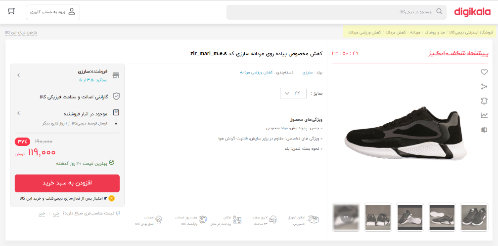
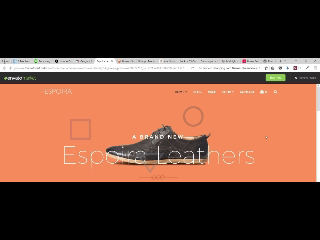

<div dir="rtl">

# فاز یازده : آشنایی با وب 

در این فاز ابتدا با فریم‌ورک `Asp.net Core` آشنا خواهید شد. سپس به سراغ مفاهیمی  همچون `UI/UX`، `Html` و `Css` خواهیم رفت و در انتها شما با `Angular` آشنا خواهید داشت. در ابتدا لازم هست با تاریخچه و دلیل محبویت وب و مزایای آن نسبت به مدل‌های قدیمی ارتباط client-server آشنا شوید که در این زمینه مطالعه‌ی [From History of Web Application Development](https://www.devsaran.com/blog/history-web-application-development) را پیشنهاد می‌کنیم.

## `Asp.net Core`

قبل از آنکه به سراغ `Asp.net Core` برویم بهتر به مفاهیم `Http` و `Rest` پرداخته شود.
</div>
<div dir="rtl">

1. `Http` چیست؟
   
   پروتکل `HTTP` مخفف عبارت `Hyper Text Transfer Protocol` است و به ارتباط میان سرویس‌دهنده (server) و سرویس‌گیرنده (client) در وب می‌پردازد.

    ارتباط بین سیستم‌های سرویس‌گیرنده و سرورها از طریق ارسال درخواست‌های http و دریافت پاسخ‌های http انجام می‌شود.
    به زبان ساده‌تر، http یک نوع قانون است که ارسال و دریافت اطلاعات بین client وserver  بر اساس آن انجام می‌شود.

    برای آشنایی بهتر با `Http` لینک‌های زیر می‌تواند به شما کمک کند.

    - [An overview of HTTP](https://developer.mozilla.org/en-US/docs/Web/HTTP/Overview)
    - [Hypertext Transfer Protocol (HTTP)](https://www.extrahop.com/resources/protocols/http/)
  
</div>
<div dir="rtl">

2. RESTful Api
   
   `API` یا `Application Programming Interface` که با رابط برنامه‌نویسی کاربردی ترجمه می‌شود یک مجموعه از قواعد و مکانیزم‌ها است که از طریق آن اپلیکیشن‌ها و یا کامپوننت‌های مختلف یک برنامه با همدیگر ارتباط برقرار می‌کنند. نام خود این مکانیزم بیانگر همه چیز است. منظور از رابط چیزی‌ست که دو شئ یا دو موجودیت مختلف را به همدیگر ربط می‌دهد. اما بیایید کمی با جزئیات بیشتر از این موضوع صحبت کنیم. API می‌تواند داده‌هایی که شما برای اپلیکیشن‌تان نیاز دارید را از طریق یک فرمت مناسب به خروجی بفرستد و یا آن‌ را برگشت دهد. فرمت JSON و XML از این دست فرمت‌ها هستند. در این مطلب ما قصد داریم روی JSON تمرکز بکنیم.


    

    برای آشنایی بیشتر با `RESTful api` مطالب زیر به شما کمک خواهد کرد.

    - [Learn REST: A RESTful Tutorial](https://www.restapitutorial.com/)
    - [RESTful API به زبان ساده چیست؟](https://roocket.ir/articles/a-beginners-tutorial-for-understanding-restful-api)
    - [What Is a REST API?](https://www.sitepoint.com/developers-rest-api/)

</div>
<div dir="rtl">

3. سلام به دنیای `Asp.net Core`
   
   `Asp.net Core` یک کتابخانه به زبان سی‌شارپ است که به وسیله آن می‌تواند یک سرور `RESTful api` راه اندازی کنید. 

   برای ساخت یک پروژه `Asp.net Core` کافی است در خط فرمان دستور زیر را وارد کنید.

    </div>
    <div dir="ltr">

   ```
    dotnet new webapi
   ```

    </div>
    <div dir="rtl">

    برای اجرا شدن اولین پروژه `Asp.net Core` خود در خط فرمان دستور زیر  را وارد کنید. 


    </div>
    <div dir="ltr">

   ```
    dotnet run
   ```

    </div>
    <div dir="rtl">

    حال برای مشاهده خروجی کار این [آدرس](https://localhost:5001/WeatherForecast) زیر را در مرورگر خود مشاهده کنید. همانگونه که مشاهده می‌کنید در خروجی یک لیست از داده‌های آب و هوایی وجود دارد که در پروژه پیش فرض Asp.net core وجود دارد.

    </div>

<div dir="rtl">

 4. Controller و Action Method
   
   در یک پروژه `ASP.NET Core` درخواست‌های رسیده به سایت یا `Web Application` توسط کنترلرها پاسخ داده می‌شوند. پس به زبان خیلی ساده ، کنترلرها به درخواست هایی که توسط کاربران ارسال می‌شود پاسخ می‌دهند. کنترلرها کلاس‌هایی هستند که در فولدر `Controllers` قرار دارند. این کلاس‌ها با کلمه Controller به اتمام می‌رسند و از کلاس `Controller` یا `ControllerBase` ارث بری می‌کنند.

   هر متدی با دسترسی عمومی (Public) در کنترلر ، به عنوان یک متد عملیاتی (Action Method) شناخته می‌شود، پس به متدهایی که درون کلاس کنترلر تعریف می‌کنیم اکشن متد گفته می‌شود. هر درخواست کاربر به اکشن متد مربوطه ارسال می‌شود و اکشن متد به درخواست کاربر پاسخ می‌دهد.

</div>

<div dir="rtl">

5. ساخت یک کنترلر ساده

    در فولدر `Controllers` خود یک فایل به نام `SimpleController` ایجاد کنید و کدهای زیر را درون آن قرار دهید.


</div>
<div dir="ltr">

```CSharp
using Microsoft.AspNetCore.Mvc;

namespace Example.Controllers
{
    [ApiController]
    [Route("[controller]/[Action]")]
    public class SimpleController : ControllerBase
    {
        [HttpGet]
        public string Get()
        {
            return "Hello world!";
        }
    }
}
```
</div>
<div dir="rtl">

  در کد بالا شما یک کنترلر به نام Simple ساختید که یک اکشن متد به نام Get دارد. مسیر دسترسی به آن را هم به صورتی تعریف شده که برای دسترسی به آن ابتدا باید نام کنترلر و سپس نام اکشن متد بیاید. برای تست کد خود در به [آدرس](https://localhost:5001/Simple/Get) بروید و خروجی را مشاهده کنید.

6. خروجی اکشتن متدها
   
   در `Asp.net Core` خروجی اکشن‌ها به سه صورت می‌تواند باشد.
   
</div>
<div dir="ltr">

   - `Specific type`
   - `IActionResult`
   - `ActionResult<T>`

</div>

<div dir="rtl">

 برای آشنایی بیشتر با این نوع خروجی‌ها می‌توانید لینک زیر را مطالعه کنید.

 - [Controller action return types in ASP.NET Core web API](https://docs.microsoft.com/en-us/aspnet/core/web-api/action-return-types?view=aspnetcore-3.1)
  
7. Routing

 برای مسیردهی در Asp.net core از دو روش می‌توان این کار را انجام داد. یکی ست کردن تنظیمات در فایل Startup.cs و دیگری استفاده از اتریبیوت Route. برای آشنایی بیشتر با این موضوع پیشنهاد می‌کنم لینک زیر را مشاهده کنید.

  - [Routing in ASP.NET Core MVC](https://code-maze.com/routing-asp-net-core-mvc/)
  - [Routing to controller actions in ASP.NET Core](https://docs.microsoft.com/en-us/aspnet/core/mvc/controllers/routing?view=aspnetcore-3.1#:~:text=In%20this%20article&text=ASP.NET%20Core%20controllers%20use,paths%20are%20matched%20to%20actions.)
  - [بررسی و فهم مسیرها](https://mizfa.com/blog/routing-core-mvc/)
   
8. Dependency Injection
   
 تزریق وابستگی یا ( Dependency Injection) فرآیندی می‌باشد که در آن وابستگی های ما به یک کلاس با استفاده از یک رابط کاربری یا همان  (Interface) حذف می شود. در `Asp.net Core` به صورت پیش فرض این امکان به ما داده شده است که بتوانیم بدون نیاز به در گیری با مورد خاصی از این ویژگی استفاده بکنیم.

   برای یادگیری و درک بهتر این موضوع بهتر است لینک‌های زیر را مطالعه کنید.

   - [ASP.NET Core - Dependency Injection](https://www.tutorialsteacher.com/core/dependency-injection-in-aspnet-core)
   - [Dependency injection in ASP.NET Core](https://docs.microsoft.com/en-us/aspnet/core/fundamentals/dependency-injection?view=aspnetcore-3.1)

9. Http Methods

 با استفاده از اتریبیوت‌های Http Methods شما می‌توانید مشخص کنید اکشن شما با استفاده از کدام Http method کال شود. برای اطلاع بیشتر می‌توانید لینک زیر را مطالعه کنید.

 - [Using HTTP Methods (GET, POST, PUT, etc.) in Web API](https://exceptionnotfound.net/using-http-methods-correctly-in-asp-net-web-api/)
 - [Attribute Routing, HTTP Request Methods & Best Practices in .NET Core Web API](https://dev.to/_patrickgod/net-core-3-1-web-api-entity-framework-jumpstart-part-2-58gp)

10. Parameter Binding
 
 در `Asp.net Core` برای بایند کردن محتویات ریکوئست Http به آرگومان‌های ورودی اکشن از Parameter Binding کمک می‌گیریم. به وسیله این مفهوم مشخص می‌کنیم داده از Body یا قسمت‌های دیگر ریکوئست خوانده شود. برای آشنایی بیشتر با این مفهوم لینک زیر را مطالعه کنید.

 - [Understand parameter binding in ASP.Net Web API](https://www.infoworld.com/article/3133728/understand-parameter-binding-in-aspnet-web-api.html)
 - [Parameter Binding in ASP.NET Web API](https://docs.microsoft.com/en-us/aspnet/web-api/overview/formats-and-model-binding/parameter-binding-in-aspnet-web-api)

11. Configuration

در `Asp.net Core` تنظیمات برنامه می‌تواند از منابع مختلفی بیاید. یکی از پرکاربرد‌ترین آن‌ها فایل است. تغییر تنظیمات ذخیره شده در فایل نیاز به `Build` مجدد ندارد. از این رو استفاده از آن متداول است. با استفاده از لینک‌های زیر با این فایل‌ها در `Asp.net Core` آشنا شوید و تفاوت فایل‌های `launchSetting.json, appsetting.json, appsetting.{Environment}.json` را درک کنید. ( `{Environment}` محیط کنونی برنامه است که مقادیر `Development, Staging, Production` را می‌تواند داشته باشد)


- [ASP.NET Core launchSettings.json file](https://dotnettutorials.net/lesson/asp-net-core-launchsettings-json-file/)
- [ASP.NET Core appsettings.json file](https://dotnettutorials.net/lesson/asp-net-core-appsettings-json-file/)

در لینک‌های بالا مطالعه بخش‌های مربوط به `Visual Studio` نیاز نیست.

</div>


<div dir="rtl">

## `Postman`


Postman یک افزونه گوگل کروم است که با استفاده از آن میشود براحتی متد های یک Web API را اجرا، تست یا بررسی کرد.

این ابزار به ما کمک میکند تا به سرعت یک درخواست HTTP ایجاد و ارسال کنیم.

ذخیره درخواست ها برای استفاده های بعدی، تجزیه و تحلیل پاسخ ها، تغییر سریع محتوای یک درخواست، احراز هویت کاربر با ارسال اطلاعات، سفارشی کردن و... از امکانات خوب این افزونه است که باعث میشود در هنگام توسعه یک API زمان بسیار زیادی را صرفه جویی کنید.

Postman ابزاری بسیار سبک بر مبنای وب است که از آن برای تست کردن سایر API ها استفاده می شود. کاربرد این ابزار زمانی مشهود است که برنامه نویس قبل از استفاده از یک مدل API آنرا با Postman بررسی کند. درخواست های API (حتی درخواست های پیچیده) را می توان با Postman به راحتی ایجاد کرد و جواب آنها را به شکل ها و فرمت های مختلف در مرورگر دریافت نمود. همین کارایی باعث می شود که برنامه نویس بداند که API مورد نظرش چگونه رفتار می کند و برنامه نویس در تصمیم گیری برای استفاده از آن راحت تر باشد.


- [Postman Tutorial for Beginners with API Testing Example](https://www.guru99.com/postman-tutorial.html)

</div>

<div dir="rtl">

## بخش اول پیاده‌سازی

در این قسمت می‌خواهیم برای پروژه‌ی جستجو که در فاز قبل کوئری را از طریق کنسول دریافت می‌کرد یک API بنویسیم. هم چنین نتایج جستجو نیز در جواب API فرستاده شود.

</div>


<div dir="rtl">

## `UI/UX`

</div>
‌<p dir="rtl">
    در این بخش هدف آشنایی با طراحی صفحات وبسایت است. در ابتدا در مورد نحوه‌ی طراحی و مسائلی از قبیل UI/UX صحبت
    می-شود و سپس به زبان‌های طراحی صفحات وب از قبیل HTML, CSS, JavaScript پرداخته می‌شود و در انتها نیز یکی از
    محبوب‌ترین فریمورک‌های حال حاضر دنیا یعنی انگولار معرفی خواهد شد.
</p>
‌<p dir="rtl">
    UI به معنای User Interface یا طراحی کاربری است. در UI به طراحی قسمتی که کاربر آن را می‌بیند پرداخته می‌شود و
    بیشتر جنبه‌های گرافیکی یک سایت را دربرمی‌گیرد. UX به معنای User Experience یا تجربه‌ی کاربری است. در UX به
    احساسات و نحوه‌ی تعامل کاربر پرداخته می‌شود و نحوه‌ی رفتار کاربر شناسایی می‌شود تا بتوان بهترین گزینه‌ها را
    انتخاب کرد.
</p>
‌<p dir="rtl">
    برای درک بهتر تفاوت این دو قسمت به تصویر زیر توجه کنید. UI سمت راست مغز را بیشتر درگیر می‌کند زیرا شامل خلاقیت و
    هنر می‌شود حال آن که UX سمت چپ مغز را بیشتر درگیر می‌کند، زیرا شامل منطق و آنالیز یک سایت خواهد بود.
    
    <br>
</p>
‌<p dir="rtl">
    برای طراحی UX باید به موارد زیر توجه کنیم:
<ul dir="rtl">
    <li>
        Context یا شرایط. همیشه باید شرایط کاربر در نظر گرفته شود. مثلا اگر برای یک محیط بارانی، دوربین طراحی
        می‌کنید باید به فکر رطوبت باشید.
    </li>
    <li>
        کاربر نباید با ورود به سایت دچار سردرگمی شوند و همه چیز باید مشخص و واضح باشد.
    </li>
</ul>
</p>
‌<p dir="rtl">
    با ورود به سایت، کاربر باید بتواند به 3 سوال جواب دهد :
<ol dir="rtl">
    <li>
        کجا هستم؟ برای رفع این سوال معمولا از منو در بالای صفحه استفاده می‌شود که کاربر متوجه شود در کجای سایت قرار
        دارد. کار دیگری که انجام می‌شود، وجود breadcrumb است که در تصویر زیر به رنگ زرد رنگ هایلایت شده و قابل
        مشاهده است.
        <br>
        
        <br>
    </li>
    <li>
        از کجا شروع کنم؟ برای این منظور برخی سایت‌ها، آموزش‌هایی دارند که به صورت فیلم در ابتدای سایت قرار می‌گیرد.
        برخی سایت‌ها نیز مانند تصویر زیر، بلافاصله پس از ورود، دکمه از کجا شروع کنم قرار می‌دهند تا کاربر دچار
        سردرگمی نشود.
        <br>
        
        <br>
    </li>
    <li>
        جای ... کجاست؟ برای این منظور نیز بالای سایت از navigation menu استفاده می‌شود. یکی دیگر از کارهای مهم برای
        این منظور، استفاده از جستجو در سایت است، که به کمک آن، می‌توانید قسمت موردنظر را جستجو کنید.
    </li>
</ol>
</p>
‌<p dir="rtl">
    کاربر با ورود به سایت معمولا سایت را اسکن می‌کنند، به این معنی که خیلی سریع قسمت‌های مختلف را نگاه می‌کنند و
    نمی‌خوانند پس بهتر است طراحی برای اسکن کردن باشد نه خواندن. از این رو اگر طراحی شما تودرتو باشد که کاربر متوجه
    قسمت‌بندی‌های مختلف سایت بشود، خیلی مفید خواهد بود.
</p>
‌<p dir="rtl">
    تعامل کاربر با سیستم باید مشخص باشد. برای مثال دکمه‌ها باید کاملا مشخص باشند که قابلیت کلیک دارند یا خیر و زمانی
    که کلیک صورت گرفت، باید تغییرات صفحه ملموس باشد. دید انسان دو قسمت را شامل می‌شود، central vision یا مرکز نگاه و
    peripheral vision یا اطراف نگاه. مرکز نگاه قسمتی است که شما برای دیدن جزئیات از آن استفاده می‌کنید و اطراف آن
    تارتر دیده می‌شود. اطراف نگاه با دیدن انیمیشن فعال می‌شود. برای مثال تصویر زیر را در نظر بگیرید. پس از زدن دکمه
    جستجو، یک قسمتی در بالا باز می‌شود که اصل آن، input مربوط به جستجو است. چون این input از مرکز نگاه کاربر دور
    است، به راحتی قابل دیدن نخواهد بود.
    <br>
    
    <br>
</p>
‌<p dir="rtl">
    در انتها نیز برای مفاهیم UX، یکی از بهترین کتاب‌ها، کتاب Don’t Make Me Think از Steve Krug است که مطالعه‌ی آن
    می‌تواند بسیار مفید باشد.
</p>
‌<p dir="rtl">
    برای UI نیز مهم است به موارد زیر حتما توجه شود:
<ul dir="rtl">
    <li>
        رنگ‌بندی و قرار دادن نوشته‌ها در قسمت‌های مختلف موجب تغییر دید کاربر می‌شود. از این موارد به خوبی استفاده
        کنید.
        <br>
        
        <br>
    </li>
    <li>
        فونت یکی از ابزارهای زیباسازی سایت است که باید به خوبی از آن استفاده شود.
    </li>
    <li>
        مغز انسان همواره دنبال یک الگو در یک مجموعه می‌گردد. بنابراین استفاده از الگوهای سایت‌های پربازدید، می‌تواند
        بسیار حائز اهمیت باشد.
    </li>
    <li>
        رنگ قرمز و ابی در کنار هم، هرگز استفاده نشود.
        <br>
        
        <br>
    </li>
    <li>
        برای پیدا کردن رنگ‌های مناسب، توصیه می‌شود عکس‌های زیادی ببینید. یکی از بهترین سایت‌ها در این زمینه‌، <a
             target="_blank" href="https://unsplash.com/">unsplash</a> است که عکس‌های رایگان و زیبایی در اختیار شما قرار می‌دهد و
        می‌توانید عکس‌ها را ببینید و رنگ‌هایی که در کنار هم هستند و ترکیب زیبایی دارند انتخاب کنید.
    </li>
    <li>
        از الگوهای طراحی UI استفاده کنید. چندین سایت در این زمینه وجود دارد، از جمله <a target="_blank"
            href="https://www.pttrns.com/">pttrns</a>، <a  target="_blank" href="https://ui-patterns.com/">ui-patterns</a>، <a
            href="https://www.mobile-patterns.com/">mobile-patterns</a>، <a  target="_blank" 
            href="https://dribbble.com/">dribbble</a> و ... توصیه می‌شود پیش از طراحی این سایت‌ها را نیز مشاهده
        کنید.
    </li>
</ul>
</p>
‌<p dir="rtl">
    برای اطلاعات بیشتر در زمینه UI می‌توانید به کتاب 100 Things Every Designer Needs to Know about People مراجعه
    کنید. همین طور بازی سایت <a target="_blank"  href="https://cantunsee.space/">can't unsee</a> نیز می‌تواند در این زمینه مفید باشد.
</p>

‌<div dir="rtl">

## HTML
</div>
‌<p dir="rtl">
    برای طراحی یک سایت، ابتدا با استفاده از قوانین کلی که در بالا بیان شد، نمای کلی سایت را طراحی می‌شود و سپس به
    کمک زبان-های HTML, CSS, JavaScript پیاده‌سازی آن صفحه شروع می‌شود.
</p>
‌<p dir="rtl">
    HTML مخفف Hyper Text Markup Language است و یک زبان نشانه‌گذاری است، نه برنامه‌نویسی. هر فایل HTML به فرمت زیر
    است.
</p>

```HTML
<!DOCTYPE html>
<html>

<head>
</head>

<body>
    Hello World!
</body>

</html>
```

‌<p dir="rtl">
    قسمت اول Doctype مشخص می‌کند که مرورگر باید این فایل را به صورت HTML5 ترجمه کند.
</p>
‌<p dir="rtl">
    به هر یک از متن‌هایی که داخل <…> قرار می‌گیرد، Tag گفته می‌شود. برخی مواقع تگ‌ها مقادیری در داخل خود دارند، مثلا
    </p>

```HTML

```

<p dir="rtl">
 به قسمت src داخل تگ img، مشخصه یا attribute گفته
        می‌شود. تگ مربوط به HTML
        شروع نشانه‌گذاری-های HTML را مشخص می‌کند. در تگ head اطلاعات اضافی آن صفحه بیان می‌شود و در تگ body، سایر
        تگ‌های نمایشی آن صفحه مشخص می‌شود.

</p>
‌<p dir="rtl">
    تگ‌های موجود در Head:
‌<ul dir="rtl">
    <li>title: یکی از تگ‌های موجود در head، تگ title است که مشخص می‌کند، در تب مرورگر چه متنی نمایش داده شود.</li>
    <li>meta: از این تگ برای اطلاعات صفحه که قابل رویت در ماشین‌ها باشد استفاده می‌شود. مثلا `<meta charset=”utf-8”>` برای موتور‌های جستجوگر که به صورت ماشینی، صفحات را مرور می‌کنند، مشخص می‌کند که کاراکترهای utf-8 در
        این صفحه وجود دارد. سایر تگ‌های متا را می‌توانید در <a target="_blank" 
            href="https://www.w3schools.com/tags/tag_meta.asp">اینجا</a> مشاهده کنید.</li>
    <li>script: این تگ، برای لود کردن فایل‌های جاوااسکریپت در صفحه استفاده می‌شود که جلوتر، بیشتر به توضیحات آن
        پرداخته می‌شود.</li>
    <li>link: از این تگ برای لینک کردن چندین مستند به هم استفاده می‌شود. معمولا برای لود کردن فایل‌های CSS استفاده
        می‌شود که در ادامه بیشتر توضیح داده می‌شود.</li>
</ul>
</p>
‌<p dir="rtl">
    تگ‌های مهم Body:
‌<ul dir="rtl">
    <li>
        div: از این تگ برای تقسیم‌بندی صفحه HTML استفاده می‌شود و یکی از پرکاربردترین تگ‌های HTML است.
    </li>
    <li>
h1, h2, … , h6: این تگ‌ها برای هدربندی یک قسمت استفاده می‌شود. برای مثال اگر شما 
    </li>
<span dir="ltr" style="text-align: left">

```HTML
<h1>Header<h1>
```
</span>

<p dir="rtl">
 داشته باشید، این قسمت بسیار بزرگتر از متن‌های دیگر نمایش داده می‌شود. (<a target="_blank" 
            href="https://www.w3schools.com/tags/tryit.asp?filename=tryhtml_headers">مثال</a>)
            </p>
    </li>
    <li>
        p: این تگ برای ایجاد یک پاراگراف جدید مورداستفاده قرار می‌گیرد. (<a target="_blank" 
            href="https://www.w3schools.com/tags/tryit.asp?filename=tryhtml_paragraphs1">مثال</a>)
    </li>
    <li>
        span: برای ایجاد یک قسمت جدید در صفحه استفاده می‌شود. مانند div است ولی تفاوت‌هایی دارد که در قسمت CSS به آن
        پرداخته می‌شود.
    </li>
    <li>
        a: از این تگ برای لینک دادن در صفحه استفاده می‌شود. برای مثال اگر 
    </li>
<span dir="ltr">

```HTML
<a href="http://www.google.com"> google </a>
```
</span>
وجود داشته باشد، کاربر با کلیک رو آن به صفحه گوگل خواهد رفت.
        آدرس صفحه داخل مشخصه href قرار می‌گیرد. (<a  target="_blank" 
            href="https://www.w3schools.com/tags/tryit.asp?filename=tryhtml_link_test">مثال</a>)
    <li>
        ul, ol, li: از تگ‌های ul و ol برای ایجاد لیست استفاده می‌شود. اگر از ul استفاده شود، لیست دارای شماره نیست
        (unordered list) ولی اگر از ol استفاده شود، شماره از 1 شروع شده و جلو می‌رود. تگ‌های li نیز شامل ایتم‌های
        لیست می‌شود. (<a target="_blank"  href="https://www.w3schools.com/tags/tryit.asp?filename=tryhtml_list_test">مثال</a>)
    </li>
    <li>
        b, i: از تگ b برای bold کردن متن و از تگ i برای italic کردن متن استفاده می‌شود.
    </li>
    <li>
        br: برای ایجاد یک خط فاصله، از این تگ استفاده می‌شود. (<a  target="_blank" 
            href="https://www.w3schools.com/tags/tryit.asp?filename=tryhtml_br">مثال</a>)
    </li>
    <li>
        hr: برای این که یک خط داخل صفحه کشیده شود، از این تگ استفاده می‌شود.: (<a  target="_blank" 
            href="https://www.w3schools.com/tags/tryit.asp?filename=tryhtml_hr_test">مثال</a>)
    </li>
    <li>
        img: از این تگ برای اضافه کردن image در صفحه استفاده می‌شود. آدرس عکس داخل مشخصه src قرار می‌گیرد. (<a  target="_blank" 
            href="https://www.w3schools.com/tags/tryit.asp?filename=tryhtml_image_test">مثال</a>)
    </li>
    <li>
        input, form, label: از این سه تگ برای ایجاد فرم استفاده می‌شود. هر input می‌تواند نوع داشته باشد. این انواع عبارت‌اند از tel, text, number و .... هر فرم نیز مشخصه‌ی action دارد که نشان می‌دهد، پس از تایید فرم، اطلاعات آن به کجا ارسال شود. از تگ label هم برای نوشتن عنوان فیلدهای ورودی مختلف در کنار آن‌ها استفاده می‌شود. (<a  target="_blank" 
            href="https://www.w3schools.com/tags/tryit.asp?filename=tryhtml_input_test">مثال</a>)
    </li>
    <br>
    این تگ‌ها جزو مهم‌ترین تگ‌های HTML است ولی تعداد تگ‌های HTML بسیار بیشتر از این‌هاست. برای اطلاعات بیشتر در این
    باره می‌توانید به <a  target="_blank"  href="https://www.w3schools.com/tags/">اینجا</a> مراجعه کنید.
    </p>
    
## CSS

‌<p dir="rtl">
    همانطور که بیان شد، HTML یک زبان نشانه‌گذاری است و چیز دیگری در آن مشخص نمی‌شود. برای این که شکل و ظاهر این
    نشانه-گذاری‌ها تغییر کند، از CSS یا Cascading Style Sheets استفاده می‌شود. برای لینک دادن استایل‌های CSS به
    HTML به سه طریق می‌توان عمل کرد:
‌<ol dir="rtl">
    <li>
        داخلی یا Internal: در این روش، در تگ head، تگ ` <style></style>` ایجاد شده و به صورت داخلی، کدهای مربوط به استایل را داخل این تگ، قرار داده می‌شود.
    </li>
    <li>
        خارجی یا External: در این روش، فایل CSS ایجاد کرده و سپس به کمک تگ `<link rel="stylesheet" href="styles.css">` ، فایل را در صفحه لود می‌شود.
    </li>
    <li>
      درون تگ یا inline: در این حالت، از طریق style که یک attribute برای تگ‌های HTML است، می‌توان استایل‌های css مختلف را اعمال کرد. از این روش بیش‌تر در حین توسعه کد برای پیش‌نمایش و مشاهده سریع تغییرات کوچک و انتخاب بهترین تغییر استفاده می‌شود. مثلا:\
    ```
    <h1 style="color:white; padding:30px;">Example</h1>
    ```
    </li>  
</ol>
</p>
‌<p dir="rtl">
    <b>Selector</b>:
    برای استایل دادن به قسمت‌های مختلف، باید از سلکتورها استفاده شود. چندین سلکتور داریم که به شرح زیر است:
‌<ul dir="rtl">
    <li>
        <b>Tag selector</b>: به تمامی تگ‌های html، یک سری استایل داده می‌شود.
    </li>
    <li>
        <b>Class selector</b>: بعضی مواقع ممکن است از یک تگ (برای مثال div) چندین مورد در صفحه داشته باشیم که
        برای یکی، استایل x و برای دیگری استایل y مدنظر باشد. در این صورت از کلاس استفاده می‌شود. به تگ، class
        attribute اضافه می‌شود و نام کلاس را به همراه نقطه در فایل css قرار می‌دهیم. برای مثال .class1
    </li>
    <li>
        <b>Id selector</b>: اگر یک تگ خاص در صفحه باشد، که فقط یک بار در صفحه می‌تواند قرار گیرد و امکان ندارد
        چند تا از آن در صفحه باشد، به آن تگ id attribute اضافه می‌شود و به کمک # و id آن تگ در css می‌توان آن را
        انتخاب کرد. برای مثال #id1.
    </li>
    <li>
        <b>Attribute selector</b>: برای این منظور از [] استفاده می‌شود و attribute مدنظر داخل آن نوشته‌ می‌شود.
        مثلا [href=”google.com”] به این معنی است که تمام تگ‌هایی که دارای مشخصه href با مقدار google.com است را
        سلکت کند.
    </li>
    <li>
        <b>All(*)</b>: اگر یک استایل به همه تگ‌های html داده شود از سلکتور * استفاده می‌شود.
    </li>
    این سلکتورها به صورت ترکیبی نیز می‌تواند مورد استفاده قرار گیرد. برای مثال div, .class1, #id1 و با کاما از
    هم جدا می‌شوند و به این معنی است که مجموعه‌ی این‌ها با هم سلکت شوند.
    برای آشنایی بیشتر با سلکتور‌ها از <a target="_blank"  href="https://www.w3schools.com/cssref/css_selectors.asp">اینجا</a> و
    <a target="_blank"  href="https://www.w3schools.com/cssref/trysel.asp">اینجا</a> می‌توانید استفاده کنید.
</ul>
</p>
‌<p dir="rtl">
    برخی استایل‌هایی که می‌توان به کمک CSS داد به شرح زیر است:
‌<ul dir="rtl">
    <li>
        <b>border</b>: برای ایجاد border برای قسمت‌های مختلف از این استایل استفاده می‌شود. حالت‌های مختلف border
        وجود
        دارد و می‌توان به آن رنگ، ضخامت و نحوه‌ی نمایش داد. برای مثال: border: 1px solid #eee; به این معنا است
        که برای این قسمت یک border با ضخامت 1px، رنگ #eee و همینطور به صورت ممتد قرار داده شود. این مقادیر به
        صورت جدا نیز می‌تواند مورد استفاده قرار گیرد. برای مثال استفاده از استایل border-color و border-width و
        ... (<a target="_blank"  href="https://www.w3schools.com/css/tryit.asp?filename=trycss_border-color1">مثال</a>)
    </li>
    <li>
        <b>background</b>: برای background دادن به یک تگ استفاده می‌شود. این مقدار می‌تواند یک رنگ ساده باشد و
        یا آدرس
        یک عکس باشد و یا ترکیب آن‌ها باشد. برای مثال background: dodgerblue; به معنی رنگ آبی برای پس‌زمینه است
        در حالی که background: url(test.png) به معنای قرار گرفتن عکس برای پس‌زمینه است. ترکیب این دو یعنی رنگ را
        آبی قرار بده و عکس را وسط آن بگذار. برای حالت‌هایی است که عکس transparent باشد. (<a target="_blank" 
            href="https://www.w3schools.com/cssref/tryit.asp?filename=trycss_background">مثال</a>)
    </li>
    <li>
        <b>margin, padding</b>: این دو استایل بسیار کاربردی است. margin به معنای فاصله یک تگ از محیط اطراف است و
        padding به معنای فاصله یک تگ از داخل خودش است. برای مشخص شدن بهتر به تصویر زیر توجه کنید. Margin و
        padding با مقادیر مختلفی می‌تواند مورد استفاده قرار گیرد. اگر یک مقدار به آن‌ها داده شود، یعنی بالا،
        راست، چپ و پایین همه این مقدار را داشته باشند. (مثلا margin: 5px) اگر 2 مقدار داشته باشد مثلا margin:
        5px 10px; به این معنی است که از بالا و پایین 5 پیکسل فاصله و از راست و چپ 10 پیکسل فاصله داشته باشد. اگر
        3 مقدار داشته باشد مثلا margin: 5px 10px 15px; به این معنی است که از بالا 5 پیکسل، راست و چپ 10 پیکسل و
        پایین 15 پیکسل فاصله و در نهایت اگر 4 مقدار داشته باشد، مقادیر به ترتیب فاصله‌های بالا، راست، چپ و پایین
        را مشخص می‌کند. به کمک استایل‌های margin-right, margin-left, margin-top, margin-bottom نیز می‌توان
        مقادیر margin را به صورت جدا تعریف کرد. (<a  target="_blank" href="https://www.w3schools.com/cssref/tryit.asp?filename=trycss_margin و
            https://www.w3schools.com/cssref/tryit.asp?filename=trycss_padding">مثال</a>)
        <br>
        
        <br>
    </li>
    <li>
        <b>width, height</b>: این دو استایل نیز مشخص هستند و برای اندازه دادن به طول و عرض یک تگ مورد استفاده
        قرار
        می-گیرند.
    </li>
    <li>
        <b>display</b>: یکی از استایل‌هایی که نیاز به توضیحات زیادی دارد، display است. این استایل می‌تواند 4
        مقدار زیر
        را داشته باشد:
        ‌<ol dir="rtl">
            <li>
                none: به معنای این که آن تگ اصلا نمایش داده نشود.
            </li>
            <li>
                Inline: به معنای این که این تگ تا جایی که نیاز دارد جا اشغال می‌کند. برای این نوع تگ‌ها width و
                height
                اثر نخواهد داشت. پیش‌تر بیان شد که span با div یک سری تفاوت‌هایی دارد که تفاوت عمده‌ی آن‌ها در
                نوع
                display است. span به صورت پیش‌فرض از نوع inline است.
            </li>
            <li>
                block: این مقدار به معنای این است که این تگ، کل صفحه را دربرمی‌گیرد. در حالت block می‌توان
                width, height
                برای آن قرار داد ولی به صورت پیش‌فرض کل صفحه را خواهد گرفت. Div به صورت پیش‌فرض از نوع block
                است.
            </li>
            <li>
                inline-block: این مقدار به معنای ترکیب inline و block است.
            </li>
        </ol>
        انواع دیگری نیز برای display وجود دارد که برای آشنایی بیشتر می‌توانید <a target="_blank" 
            href="https://www.w3schools.com/cssref/pr_class_display.asp">اینجا</a> را مطالعه کنید.
    </li>
    <li>
        <b>float</b>: نشان می‌دهد که یک تگ در کجا قرار گیرد. برای مثال float: right; به معنای قرار گرفتن آن
        سلکتور
        در
        سمت راست است.
    </li>
    <li>
        <b>text-align</b>: نوشته شما از کجا شروع شود. مقادیر آن right, left و center می‌تواند باشد.
    </li>
    <li>
        <b>font-family</b>: از این استایل برای تغییر فونت می‌توانید استفاده کنید. font-family: arial; به معنای
        این است
        که فونت آن سلکتور Arial باشد.
    </li>
    <li>
        <b>@font-face</b>: برای ایجاد یک فونت جدید از این استایل استفاده می‌کنید. نمونه‌ی آن به شکل زیر است:
    </li>
<span dir="ltr">

```css
@font-face {
    font-family: myFirstFont;
    src: url(sansation_light.woff);
}
```
</span>
        در src آدرس یک فایل فونت را قرار می‌دهید و در font-family به آن یه نام اختصاص می‌دهید. از این پس اگر در
        استایل font-family از این نام استفاده کنید، متن موردنظر شما این فونت را خواهد داشت.
</ul>
</p>
‌<p dir="rtl">
    در css نحوه‌ی نام‌گذاری به صورت kebab-case است به این معنی که کلمات با حروف کوچک شروع شده و اگر کلمه‌ی دیگری
    وجود داشت با – از قبلی جدا می‌شود. برای مثال list-wrapper.
</p>
‌<p dir="rtl">
    برای این که طراحی شما روی دستگاه‌های مختلف به خوبی نمایش داده شود، از @media استفاده می‌شود. در این حالت
    مشخص می-کنید که برای صفحات کوچکتر از مثلا 500px به چه شکلی استایل‌ها اعمال شود. برای توضیحات بیشتر در این
    زمینه به <a target="_blank"  href="https://www.w3schools.com/cssref/css3_pr_mediaquery.asp">اینجا</a> مراجه کنید.
</p>
‌<p dir="rtl">
    به طور کلی نیز برای اطلاعات بیشتر در زمینه css و propertyهای موجود در آن به <a target="_blank" 
        href="https://www.w3schools.com/css/default.asp">اینجا</a> مراجعه کنید.
</p>

## JavaScript

‌<p dir="rtl">
    تا به این جا فقط در رابطه با ظاهر سایت صحبت شد و صحبتی از logic مربوط به آن صورت نگرفت. زبان برنامه‌نویسی که
    برای ایجاد logic در سایت مورد استفاده قرار می‌گیرد، زبان جاوااسکریت است. فرض کنید سایتی وجود دارد که
    در آن میزان بدهی شما را نشان می‌دهد. اگر میزان بدهی از 10 هزار تومان بیشتر شد باید به رنگ قرمز نمایش داده
    شود. این اتفاق به کمک css و HTML به چه شکلی می‌تواند انجام گیرد؟ این جا جاوااسکریپت به کار خواهد آمد. برای
    لود کردن جاوااسکریپت هم مانند css دو روش وجود دارد:
‌<ol dir="rtl">
    <li>
        Internal یا داخلی: در داخل تگ head، تگ
`<script></script>` قرار داده می‌شود و کدهای جاوااسکریپت در داخل آن به صورت داخلی قرار می‌گیرد.
    </li>
    <li>
        External یا خارجی: کدهای جاوااسکریپت در فایل‌هایی به فرمت js قرار می‌گیرد و سپس به کمک تگ
`<script src=”test.js”></script>` در صفحه لود می‌شود.برای تمیزی کد و جدا کردن دغدغه‌ها بهتر است از این روش همیشه استفاده شود.
    </li>
</ol>
</p>
‌<p dir="rtl">
    نام‌گذاری‌ها در جاوااسکریپت مانند زبان جاوا به صورت camel case است.
</p>
‌<p dir="rtl">
    <b>Variables</b>:
    متغیرها در جاوااسکریپت به 3 صورت قابل تعریف هستند. var، let و const. از این سه کلمه‌ی کلیدی برای ایجاد متغیر
    استفاده می-شود. متغیرها در جاوااسکریپت، تایپ ندارند و شما می‌توانید هر مقداری را به آن‌ها assign کنید. از
    var زمانی استفاده می‌شود که هدف تعریف آن متغیر در کل صفحه باشد. let و const فقط در داخل بلاک معنی پیدا
    می‌کنند. const به معنی آن است که متغیر قابل تغییر نیست ولی let متغیر قابل تغییر در runtime را مشخص می‌کند.
    برای مقداردهی string می‌توان از ‘ و “ استفاده کرد و تفاوتی در این دو وجود ندارد برای مثال var a = ‘ali’ با
    var a = “ali” یکی است.
</p>
‌<p dir="rtl">
    <b>Array</b>:
    برای تعریف آرایه به صورت var a = [1,2,3] عمل‌ می‌شود. در داخل آرایه‌ها متدها از قبیل include, push, pop,
    indexof و ... وجود دارد که با مراجعه به <a target="_blank" 
        href="https://www.w3schools.com/js/js_array_methods.asp">اینجا</a> می‌توانید اطلاعات بیشتری در این زمینه
    به دست آورید.
</p>
‌<p dir="rtl">
    <b>Arithmetic operators</b>:
    مانند سایر زبان‌ها، جاوااسکریپت نیز از اپراتورهای +, ++, -, --, % و ... پشتیبانی می‌کند.
</p>
‌<p dir="rtl">
    <b>Comparison operators</b>:
    برای مقایسه نیز مانند سایر زبان‌های برنامه‌نویسی، اپراتورهای ==, >, >= و ... را پشتیبانی می‌کند. تفاوتی که
    با سایر زبان‌ها در این‌جا وجود دارد، وجود اپراتور === است. همانطور که پیش‌تر بیان شد، در جاوااسکریپت، برای
    متغیر‌ها تایپ وجود ندارد و اپراتور == بدون در نظر گرفتن تایپ متغیر‌ها، مقادیر را چک می‌کند. برای مثال 2 ==
    ‘2’، مقدار true خواهد داشت. اگر برابری تایپ هم برای ما مهم باشد، از === استفاده می‌شود.
</p>
‌<p dir="rtl">
    <b>function</b>:
    برای ایجاد یک تابع از function استفاده می‌شود. نحوه‌ی تعریف آن به شکل زیر است:
</p>
<span dir="ltr">

```javascript
    function myFunction() {
        alert('hello world!');
    }                
```
</span>
<p dir="rtl>

برای صدا زدن تابع نیز از myFunction() استفاده می‌شود.
    </p>
    ‌<p dir="rtl">
        <b>Events</b>:
        یکی از مهم‌ترین قسمت‌های زبان جاوااسکریپت وجود Eventها است. برای مثال با کلیک روی یک دکمه چه اتفاقی بیفتد،
        یا بعد از لود شدن کامل صفحه چه شود و .... برای تمامی این موارد eventهایی در جاوااسکریپت طراحی شده است. در
        مشخصه‌ی تگ‌ها، مشخصه‌ای به نام onclick وجود دارد که از آن برای دریافت event مربوط به کلیک استفاده می‌شود.
        برای مثال 
        </p>

<span dir="ltr">

```HTML        
<button onclick=”myFunction()”>click!</button>
```
</span>
<p dir="rtl">
 به این معناست
        که پس از کلیک روی تگ button متد myFuction کال شود. eventهای دیگری مانند hover، dblClick، load و ... وجود
        دارد که در <a target="_blank"  href="https://www.w3schools.com/js/js_events.asp">اینجا</a> و <a target="_blank" 
            href="https://www.w3schools.com/js/js_htmldom_events.asp">اینجا</a> قابل مشاهده است.
    </p>
    <p dir="rtl">
    <b>DOM Select</b>:
    شما از طریق جاوااسکریپت، امکان تغییر تگ‌های HTML را دارید. برای این منظور، باید تگ مورد نظر را انتخاب کنید و متن داخل آن را تغییر دهید. مثلا برای انتخاب یک تگ با id از طریق کد زیر عمل ‌می‌شود:
    </p>
    
<span dir="ltr">

```javascript
const myId = document.getElementById('my-id')
```
</span>
<p dir="rtl">
در این صورت، شی مربوط به تگ html را در اختیار خواهید داشت و برای تغییر متن آن می‌توان به شکل زیر عمل کرد.
</p>
<span dir="ltr">

```javascript
myId.innerText = "my text"
```
</span>
    <p dir="rtl">
سلکتورهای جاوااسکریپت نیز حالت‌های مختلف دارد. برای اطلاعات بیشتر در این زمینه به این <a target="_bank" href="https://www.w3schools.com/js/js_htmldom_elements.asp">لینک</a> مراجعه کنید.
    </p>
    <p dir="rtl">
    <b>AJAX</b>:
    یکی از مهم‌ترین ویژگی‌های زبان جاوااسکریپت، وجود AJAX یا Asynchronous JavaScript And XML است. از ajax برای ارسال درخواست‌های http به سرور استفاده می‌شود. انواع متدهای http از قبیل post و get نیز به این وسیله قابل ارسال است. برای ارسال یک درخواست get ساده به شکل زیر عمل می‌شود:
    </p>
<span dir="ltr">

```javascript
xhttp.open("GET", "ajax_info.txt", true);
xhttp.send();
```
</span>
<p dir="rtl">
    از این طریق، اطلاعات داخل فایل ajax_info به کمک متد Get دریافت می‌شود. برای اطلاعات بیشتر به قسمت JS AJAX موجود در <a target="_blank" href="https://www.w3schools.com/js/">اینجا</a> مراجعه کنید.
    </p>
    <p dir="rtl">
    <b>Debug</b>:
     برای دیباگ کردن کدهای جاوااسکریپت از dev tools مرورگرها استفاده می‌شود. برای باز کردن این قسمت، در صفحه مرورگر، کلیک راست کرده و گزینه Inspect یا Inspect Element (بسته به نوع مرورگر متفاوت است) می‌زنید. به این شکل قسمت dev tools باز می‌شود. در این قسمت، تبی به نام console وجود دارد که در این جا می‌توانید کدهای جاوااسکریپت را به صورت inline اجرا کنید. برای لاگ انداختن نیز می‌توان از دستور console.log استفاده کرد و سپس لاگ‌ها را در این تب مشاهده کرد. برای اطلاعات بیشتر  میتواندی این <a target="_blank"  href="https://www.youtube.com/watch?v=hJ6hr8EZ5J0">ویدئو </a> را مشاهده کنید.
    </p>
    ‌<p dir="rtl">
        برخی syntaxها مانند if, for, while و ... در <a  target="_blank" href="https://www.w3schools.com/js/default.asp">اینجا</a> قابل مشاهده است.
    </p>

## انگولار
‌<p dir="rtl">
یکی از محبوب‌ترین فریمورک‌های طراحی وب، انگولار است که توسط تیمی در گوگل، طراحی و پیاده‌سازی شده است. در این فریمورک به جای جاوااسکریپت، از زبان تایپ اسکریپت استفاده می‌کند. این زبان توسط ماکروسافت طراحی شده است و یک super set روی جاوااسکریپت است. به این معنی که تمام موارد داخل جاوااسکریپت را دارد و علاوه بر آن‌، موارد بیشتری را نیز پشتیبانی می‌کند. برای مثال در تایپ‌اسکریپت بر خلاف جاوااسکریپت، تایپ وجود دارد و شما می‌توانید برای متغیرهای خود تایپ تعیین کنید. 
</p>
‌<p dir="rtl">
همچنین در تایپ‌اسکریپت، interface و abstract class پشتیبانی می‌شود که به وسیله‌ی آن‌ها می‌توان کد تمیزتری که از اصول SOLID استفاده می‌کند، ایجاد کرد. در انگولار، کد به زبان typescript نوشته می‌شود و در انتها به زبان javascript کامپایل می‌شود، زیرا تنها زبانی که مرورگر‌ها پشتیبانی می‌کنند، زبان javascript است. 
</p>
‌<p dir="rtl">
برای این که تفاوت‌های این دو زبان را بیشتر متوجه شوید، به <a target="_blank"  href="https://www.guru99.com/typescript-vs-javascript.html">اینجا</a> مراجعه کنید. 
</p>

‌<p dir="rtl">
انگولار به همراه خود cli مخصوص خود را دارد که ایجاد پروژه، کامپوننت، ماژول و ... را برای developerها آسان‌تر می‌کند. برای شروع کار با انگولار به شکل زیر عمل می‌شود.
</p>

<h4 dir="rtl">
مرحله اول: نصب انگولار
</h4>

‌<p dir="rtl">
برای نصب انگولار و cli مربوطه در ابتدا باید node.js نصب داشته باشید. برای این منظور به سایت <a target="_blank"  href="https://nodejs.org/en/">node.js</a> مراجعه کرده و نسخه‌ای بالاتر از 12.6 را دانلود کنید. 
</p>

‌<p dir="rtl">
سپس cmd یا terminal را باز نموده و دستور زیر را جهت نصب انگولار و cli مربوطه در سیستم وارد کنید:
</p>

<pre dir="ltr">
npm i -g @angular/cli
</pre>

<p dir="rtl">
در حال حاضر آخرین نسخه‌ی انگولار، نسخه 10 است که با این دستور در سیستم شما نصب خواهد شد. 
</p>

<h4 dir="rtl">
مرحله دوم: ایجاد پروژه
</h4>

‌<p dir="rtl">
برای ایجاد پروژه، به کمک cmd یا terminal به داخل فولدر دلخواه رفته و دستور زیر را وارد کنید: 
</p>

<pre dir="ltr">
ng new my-project
</pre>

‌<p dir="rtl"> 
پس از وارد کردن این دستور چند سوال از شما پرسیده می‌شود. اولی وجود روتینگ در پروژه است که در ادامه بیشتر در مورد آن صحبت می‌شود و دومی فرمت stylesheetهای پروژه است. در قسمت اول بهتر است، yes وارد کنید و در قسمت دوم از scss استفاده کنید. scss مانند css است با این تفاوت که برخی امکانات اضافی، از قبیل ایجاد متغیر در آن وجود دارد. در انتهای این دستور یک پروژه‌ی انگولار، به نام my-project در فولدر شما ساخته می‌شود. این کار معمولا زمان‌بر است زیرا پکیج‌های زیادی را باید نصب کند. 
</p>

<h4 dir="rtl">
مرحله سوم: اجرای پروژه
</h4>

‌<p dir="rtl">
پس از ایجاد پروژه، می‌توانید با دستور زیر، پروژه را اجرا کنید و در مرورگر آن را مشاهده کنید:
</p>

<pre dir="ltr">
ng serve
</pre>

‌<p dir="rtl"> 
این دستور یک سرور مجازی روی پورت 4200 ایجاد کرده و سایت را روی آن اجرا می‌کند. به این ترتیب شما اولین پروژه‌ی انگولاری خود را ایجاد کرده‌اید. در ادامه به معرفی بخش‌های مختلف انگولار پرداخته می‌شود.
</p>

‌<p dir="rtl">
<b>Module</b>: ماژول مجموعه‌ای از کامپوننت‌ها است که با یکدیگر وابستگی نزدیکی دارند. هر پروژه انگولار حداقل یک ماژول دارد که به آن AppModule می‌گویند و در ابتدا ساخته می‌شود. در این ماژول مشخص می‌شود که کامپوننت شروع‌کننده برنامه چیست. این کامپوننت در قسمت bootstrap مشخص می‌شود. اگر در داخل یک ماژول از ماژول دیگری استفاده شود، نام آن در import می‌آید و نام تمام کامپوننت‌های داخل ماژول نیز در declarations مشخص می‌شود.
</p>

‌<p dir="rtl">
<b>Component</b>: هر پروژه‌ی انگولار از چندین کامپوننت تشکیل شده است. هر کامپوننت معماری MVVM دارد و شامل یک فایل html، یک فایل css و یک فایل ts است. اگر بالای هر کلاس ts، از دکوراتور <span dir="ltr">@Component()</span> استفاده شود، آن کلاس تبدیل به کامپوننت می‌شود. هر کامپوننت باید در داخل declarations یک ماژول تعریف شده باشد.
</p>
‌<p dir="rtl">
<b>Service</b>: برای دریافت داده و یا logicهایی که مخصوص یک کامپوننت خاص نیست، از service استفاده می‌شود. در انگولار از Dependency Injection استفاده می‌شود. نحوه‌ی عملکرد آن به این صورت است که سرویس‌های مربوط به یک ماژول در قسمت providers موجود در ماژول، مشخص می‌شود و در زمان اجرا، آن service ساخته می‌شود و به کامپوننت‌های داخل ماژول داده می‌شود. بالای هر سرویس از دکوراتور <span dir="ltr">@Injectable()</span> استفاده می‌شود. یکی از مهم‌ترین سرویس‌های موجود در انگولار، HttpClient است. از این سرویس برای ارسال درخواست‌های Get و یا Post به سرور استفاده می‌شود. برای اطلاعات بیشتر در مورد این سرویس می‌توانید به سایت <a target="_blank" href="https://angular.io/guide/http">انگولار</a> مراجعه کنید
</p>
‌<p dir="rtl">
<b>Routing</b>: اولین سوالی که در زمان ایجاد پروژه از شما شد، وجود routing در پروژه بود. برنامه‌های انگولار به صورت SPA یا Single Page Application هستند. به این شکل که شما تنها یک صفحه در سایت خود دارید و محتوا به صورت داینامیک در همان صفحه لود می‌شود. این که محتوای چه قسمتی در صفحه لود شود، به کمک Routing مشخص می‌شود. به صورت پیش‌فرض پس از ایجاد یک پروژه، routing زیر برای شما در فایل app-routing.module.ts به وجود خواهد آمد. 
</p>

<div dir="ltr">

```typescript
const routes: Routes = [];

@NgModule({
  imports: [RouterModule.forRoot(routes)],
  exports: [RouterModule]
})

```
</div>

‌<p dir="rtl"> 
در اینجا مقدار routes که یک آرایه‌ای از routeها است، خالی است. اگر مقدار زیر را در آن قرار دهیم، به این معنی خواهد بود که اگر در url، آدرس test وارد شد، کامپوننت TestComponent را در صفحه به جای router-outlet لود کن. این تگ در app.component.html وجود دارد و محل لود شدن routeها را مشخص می‌کند.
</p>

<div dir="ltr">

```typescript
const routes: Routes = [
  { path: 'test', component: TestComponent }
];
```
</div>

‌<p dir="rtl"> 
 به همین شکل برای تمامی routeها باید عمل شود. اگر در path مقدار ** وجود داشته باشد، به معنای همه routeهاست و برای ایجاد صفحه 404 استفاده می‌شود. برای اطلاعات بیشتر در زمینه routing می‌توانید به <a target="_blank"  href="https://angular.io/guide/router">اینجا</a> مراجعه کنید. 
</p>
‌<p dir="rtl"> 
<b>ایجاد یک کامپوننت جدید</b>: 
برای ایجاد یک کامپوننت جدید از دستور زیر استفاده می‌شود.
</p>
<pre dir="ltr">
ng g c my-component
</pre>
‌<p dir="rtl"> 
این دستور یک کامپوننت با نام my-component ایجاد کرده و تمام فایل‌های html, css, ts مربوط به آن را می‌سازد. می‌توان در هنگام ساخت کامپوننت، مواردی از قبیل این‌ که کامپوننت در کدام ماژول قرار گیرد یا این که route مربوط به آن چه باشد را مشخص کرد که دیگر نیاز به تنظیم کردن دستی نباشد. برای اطلاعات بیشتر در مورد آپشن‌های این دستور به <a target="_blank"  href="https://angular.io/cli/generate">اینجا</a> مراجعه کنید.
</p>
‌<p dir="rtl"> 
<b>Angular Material</b>: انگولار برای طراحی راحت‌تر developerها، تعداد زیادی کامپوننت طراحی کرده و در قالب یک پکیج در npm قرار داده است. این پکیج angular material نام دارد. در این پکیج، کامپوننت‌هایی از قبیل table، input، checkbox، form, tab و ... وجود دارد که به راحتی می‌توان از آن‌ها استفاده کرد. 
</p>
‌<p dir="rtl"> 
برای مثال می‌توانید به <a target="_blank"  href="https://material.angular.io/components/button/overview">اینجا</a> مراجعه کنید و نحوه‌ی استفاده از دکمه‌های آن را در برنامه‌ی خود ببینید. استفاده از این کامپوننت‌ها بسیار راحت است و کار شما را سریع‌تر پیش می‌برد.
</p>
‌<p dir="rtl"> 
برای اطلاعات بیشتر در زمینه انگولار به <a target="_blank"  href="https://angular.io/tutorial">نمونه‌ سایت انگولار</a> مراجعه کنید. همچنین ویدئو‌های <a target="_blank"  href="https://p30download.ir/fa/entry/71792/">udemy</a> نیز بسیار مفید است.
</p>


<div dir="rtl">

## بخش دوم پیاده‌سازی

در این بخش از پیاده‌سازی، برای api طراحی شده در بخش اول، یوآی طراحی خواهد شد. برای این منظور ابتدا با توجه به مواردی که برای UI/UX بیان شد، طراحی سایت انجام می‌گیرد و سپس به کمک زبان‌های HTML, CSS  وجاوااسکریپت پیاده‌سازی می‌شود. در انتها نیز به صورت مجدد، این پیاده‌سازی روی فریمورک Angular انجام خواهد شد.

</div>
