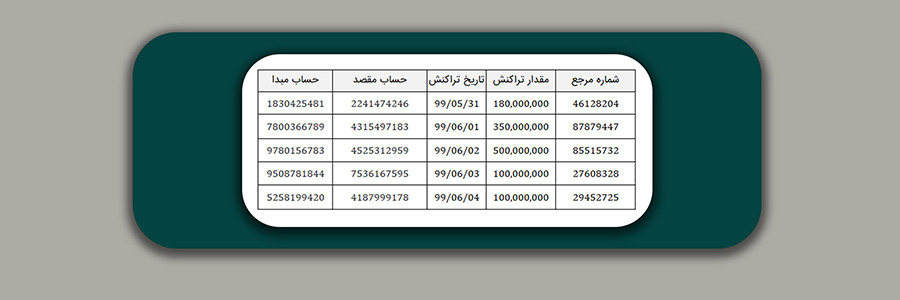
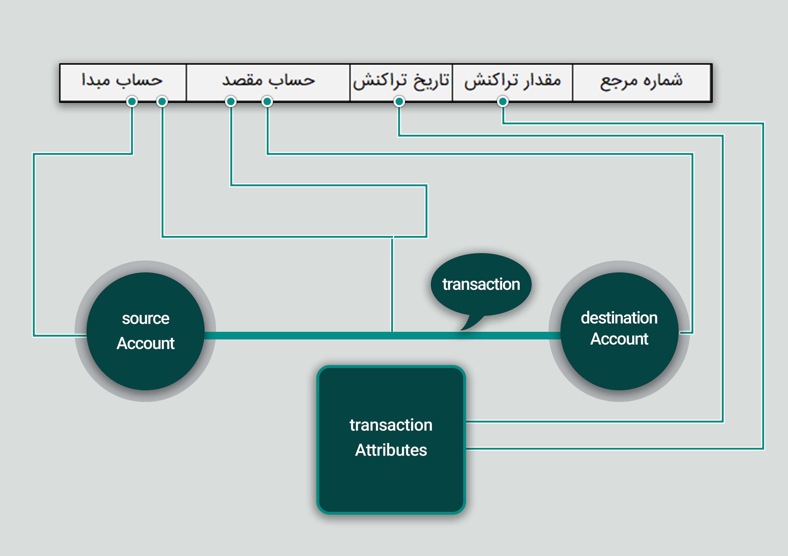

# فاز شانزده: آنتولوژی پویا و نگاشت

در این فاز با نیاز به آنتولوژی پویا و مفهوم آن آشنا می‌شوید، همچنین هدف این است که سیستم فعلی که فقط تبدیل تراکنش‌ها با فیلدهای مشخص به گراف ساده به صورت دمبل را پشتیبانی می‌کند به سامانه‌ای با مدل داده داینامیک (پویا) تبدیل شود که بتواند بسیاری از داده‌های بانکی را بر اساس نیاز ادمین سیستم پوشش دهد.

## 1- آنتولوژی چیست؟
در یک بیان ساده می‌توانیم بگوییم که آنتولوژی طرز نگاه ما به دنیای اطراف را بیان می‌کند. مثلا شما کیوآرکد زیر را در نظر بگیرید. شما در این تصویر چه می‌بینید؟

می‌توانید بگویید من یک صفحه سفید با خطوط مشکی می‌بینم. اما می‌توانید آنتولوژی خود را تغییردهید و بگویید این یک صفحه مشکی با خطوط سفید است. اجزای اصلی تشکیل‌دهنده این آنتولوژی رنگ و خط بودند و شما تصویر را به وسیله این دو تعریف‌کردید. می‌توانستید دیدگاه را کلا تغییردهید و تصویر را با تعریف اشکال موجود در آن تفسیرکنید. مثلا بگویید از تعدادی مربع و مستطیل تشکیل شده‌است.
 
تعاریف موجود در دنیای واقعی بسیار زیاد هستند (مثل رنگ، شکل، جنس، ...) و آنتولوژی‌های فراوانی را تولید می‌کنند. به‌همین علت می‌توانیم یک پدیده را به صورت‌های مختلف ببینیم و تفسیر کنیم.
 اما دنیای تعاریف پروژه ما یک دنیای نه‌ چندان‌ بزرگ است و هرچیزی را نهایتا به صورت یکی از موارد زیر تعریف می‌کنیم.
 
1. راس گراف (Node)
1. یال گراف (Link)
1. لیست مشخصه‌های متعلق به لینک یا متعلق به نود

 ما در این پروژه با دیتای تراکنش‌های مالی سر و کار داریم و قرار است با یک عینک مشترک به این داده‌ها نگاه‌کنیم. دنیای ما از سه عضوی که بالاتر اشاره کردیم ساخته‌شده، اما همین سه عضو می‌توانند آنتولوژی‌های مختلفی را تشکیل‌دهند. شما می‌توانید شماره‌حساب یک شخص را به صورت نود گراف در نظربگیرید. می‌توانید جور دیگری نگاه‌‌کنید و آن را یک لینک بدانید. هرکدام از این دیدگاه‌ها امکاناتی را در اختیار ما قرار می‌دهد که دیگری نمی‌تواند. مثلا یکی از این تفاوت‌ها در به کارگیری الگوریتم‌های گراف ظاهر می‌شود و برای هرکدام از دیدگاه‌ها بسته به نیاز می‌توان الگوریتم متفاوتی را به کار گرفت.
  
آنتولوژی یک از مفاهیم چالش‌برانگیز فلسفی دنیاست و از همان دوهزارسال پیش که ارسطو و افلاطون برای اولین بار آن را مطرح‌کردند تا به امروز مورد بحث بوده‌است.

## 2- چرا به تعریف آنتولوژی نیاز داریم؟
دوشخص را فرض‌کنید که زبان یک‌دیگر را نمی‌شناسند. آن‌ها چگونه می‌توانند با هم ارتباط بگیرند؟ یا مثلا فرض‌کنید می‌خواهید الگوریتم maxflow گراف را به کسی که اصلا نمی‌داند یال و نود چیست توضیح دهید. چگونه می‌توانید؟ درمثال‌های این‌چنینی اولین‌راه قراردادن یک سری مفاهیم مشترک و قابل‌درک برای طرفین است و بدون داشتن آن برقراری ارتباط ممکن نیست.
 
نقش کلیدی آنتولوژی در محصول ما دقیقا همین‌جا ظاهر می‌شود. آنتولوژی با ایجاد یک زبان مشخص و مشترک، یک عینک مشترک را به همه اجزای سیستم می‌دهد و دیدگاه همه را یکسان می‌کند. از مشتری‌نهایی محصول گرفته تا دولوپر و فرمولی که در پشت سیستم مشغول به کار هست به یک نحو به موجودیت‌های تشکیل‌دهنده ما نگاه می‌کنند.
 
آنتولوژی از این هم فراتر می‌رود و کمک می‌کند دو دیتابیسی  را که با هم متفاوت هستند به هم مرتبط کنیم. چون همه‌ قواعد دیدگاه دو دیتابیس مشخص شده‌ و می‌توانند به یکدیگر ترجمه‌شوند.
 
یک قبیله دورافتاده در یک جنگل را فرض‌کنید. این قبیله نمی‌تواند با مردم نقاط دیگر جهان ارتباط بگیرد. هم‌چنین ارتباط افراد قبیله بایکدیگر هم به سختی صورت می‌گیرد. بعیدمی‌دانم این قبیله در این دنیا چیز خیلی جذابی به نظر برسد.
 
اگر در سیستمی آنتولوژی تعریف نشده باشد شرایط آن مثل همین قبیله است.

## 3- آنتولوژی پویا چیست و چرا به آن نیاز داریم؟
بالاتر که در مورد آنتولوژی صحبت کردیم، توضیح دادیم که مثلا یک‌‌ شماره‌حساب را می‌توانیم نود گراف ببینیم و یا این‌که طور دیگری نگاه‌کنیم و آن را یک لینک بدانیم. مهم‌تر این که هر کدام از این دیدگاه‌ها محاسن منحصربه‌فردی دارند.
 
تا مدت‌ها وقتی برنامه‌ای را توسعه می‌دادند همان ابتدا آنتولوژی را معین ‌می‌‌کردند و تغییر آن نیاز به ساخت محصول جدیدداشت. یعنی آنتولوژی آن‌ها ثابت بود. اما امروزه دنیا برای جلوگیری از دوباره‌کاری و بهره‌مندشدن از امکانات آنتولوژی‌های مختلف، به سمتی رفته که امکان تغییر آنتولوژی را در همان محصول به مشتری بدهد. یعنی محصول را طوری بسازیم که با گرفتن اطلاعات از ادمین، سیستم آنتولوژی را تغییر دهد.

## 4- امکان تعریف آنتولوژی توسط ادمین در فایل
قبل از توضیح این قسمت، می‌خواهیم معنی دو کلمه زیر را با یکدیگر قرارداد کنیم.
  
<b>موجودیت</b>: به هر یک از عناصر اصلی تشکیل دهنده سیستمی که برایش برنامه را توسعه می‌دهیم، موجودیت می‌گویند. مثل شخص، تراکنش، بانک و ... . این کلمه معادل عبارت Entity است.
 
<b>مشخصه</b>: داده‌ها در قالب مقدار‌های مشخصه در موجودیت‌ها قرار می‌گیرند، مثلاً برای موجودیت شخص، چهار مشخصه‌ی نام و نام خانوادگی و کدملی و تاریخ تولد در نظر گرفته می‌شود که سه مورد اول از نوع متنی (string) هستند و یک مورد آخر از جنس تاریخ (date) هست.
  
برای تعیین آنتولوژی توسط کاربر، او باید یک فایل جیسون را در سیستم بارگذاری کند. در این فایل موارد زیر مشخص می‌شود.
 
*  چه چیزی نود است
* چه چیزی لینک است
*  و چه چیزی مشخصه اجزای تشکیل دهنده گراف است.بعد از این‌که نودها و لینک‌های گراف ما مشخص شد، مشخصه‌های اجزای گراف و تایپ آن مشخصه‌ها  معلوم می‌شود. در اینجا منظور از مشخصه همان attribute و منظور از تایپ،string integer و ... است.
 

برای مثال، ادمین مشخص می‌کند که تراکنش باید لینک گراف، شخص انجام‌دهنده تراکنش به عنوان نود گراف و تاریخ انجام تراکنش به عنوان مشخصه آن تراکنش باشد.در این زیر شما یک نمونه فایل جیسون را که برای تعیین آنتولوژی به کار می‌رود مشاهده می‌کنید.

  
    {
        "nodes": [
            {
                "_type": "Person",
                "attributes": [
                    {
                        "attributeName": "Name",
                        "attributeType": "string"
                    },
                    {
                        "attributeName": "FamilyName",
                        "attributeType": "string"
                    },
                    {
                        "attributeName": "NationalCode",
                        "attributeType": "string"
                    },
                    {
                        "attributeName": "Birthday",
                        "attributeType": "date"
                    }
                ]
            },
            {
                "_type": "Bank",
                "attributes": [
                    {
                        "attributeName": "Name",
                        "attributeType": "string"
                    },
                    {
                        "attributeName": "Adress",
                        "attributeType": "string"
                    }
                ]
            },
            {
                "_type": "Account",
                "attributes": [
                    {
                        "attributeName": "AccountID",
                        "attributeType": "string"
                    },
                    {
                        "attributeName": "Date",
                        "attributeType": "date"
                    }
                ]
            }
        ],
        "links": [
            {
                "_type": "Transaction",
                "fromNode": "Account",
                "toNode": "Account",
                "attributes": [
                    {
                        "attributeName": "Date",
                        "attributeType": "date"
                    },
                    {
                        "attributeName": "Amount",
                        "attributeType": "integer"
                    }
                ]
            },
            {
                "_type": "OwnerShip",
                "fromNode": "Person",
                "toNode": "Account",
                "attributes": []
            }
        ]
    }

           
در این فایل مشخص شده که نودهای گراف ما و لینک‌های گراف ما کدام یک از موجودیت‌ها هستند و هرکدام از موجودیت‌ها چه ویژگی‌هایی دارند.
  

برنامه باید طوری طراحی شود که کاربر بتواند به تعداد دلخواه برای هرکدام از اجزای گراف مشخصه تعریف کند.
هم‌چنین بدیهی است که ما بتوانیم چندین موجودیت از جنس نود و چندین موجودیت از جنس لینک داشته‌باشیم و تناقضی ندارد. 
 
با بارگذاری این فایل در سیستم، نگرش دریافت‌کننده محصول به پدیده‌های سیستم مشخص می‌شود. یعنی اگر محصول نهایی به دست مشتری رسید، او همان ابتدای کار آنتولوژی را با دادن این فایل تثبیت  می‌کند تا سیستم آماده مراحل بعدی شود.

## 5- تا به‌حال چه کارهایی انجام داده‌ایم؟
حالا بیاید چک کنیم که تا این قسمت چه داریم.
 
فرض‌کنید که ما این برنامه را برای بانک توسعه می‌دهیم. ما تاکنون مقدمات برنامه را فراهم کردیم و امکانات پیکربندی آنتولوژی را به مشتری داده‌ایم. سپس ادمین بانک با دادن فایلی جیسونی که درباره‌ آن صحبت کردیم آن عینک واحد را به تمامی اجزای سیستم داده‌است.
یعنی تا این بخش آنتولوژی و طرز نگرش ادمین بانک  به پدیده‌های سیستم مشخص شده‌است.(منظور از ادمین کسانی‌است که در بانک از برنامه ما استفاده می‌کنند)
 
تا این مرحله همه چیز انتزاعی بوده‌است و ما صرفا زبانمان را یکسان کردیم و هنوز وارد مرحله عملیاتی برنامه نشده‌ایم.
 
بانک 50 دیتابیس مختلف دارد. این دیتابیس‌ها چیزی شبیه به اکسل خودمان است. یعنی ابتدای هر ستون نام آن ستون مشخص شده‌است و در سطرهای بعدی، اطلاعات تراکنش‌ها آمده‌است. فرض‌کنید که ما می‌خواهیم با ستون تاریخ‌ تراکنش کار کنیم. در آنتولوژی ماهیت این ستون را مشخص کرده‌ایم اما یک مشکلی وجود دارد. در یک دیتابیس نام این ستون "تاریخ تراکنش" ذخیره‌ شده‌است. در دیتابیس دیگر با نام "تاریخ رویداد" ثبت شده‌است و در دیتابیس دیگری با نامی متفاوت.
برای حل این مشکل به چیزی به اسم "نگاشت" لازم داریم که در بخش بعد به آن می‌پردازیم.

## 6- نگاشت چیست و چرا به آن نیاز داریم؟
دربخش قبل، مثال 50 دیتابیس مختلف بانک را آوردیم و یک مشکل  آن را بررسی کردیم. با کارهایی که تاکنون انجام داده‌ایم، سیستم ما می‌داند تراکنش چیست ولی باید به آن بفهمانیم که کدام ستون دیتابیس اطلاعات تراکنش را نشان می‌دهد.این فهمانیدن در پروژه ما "نگاشت" نامیده می‌شود. در واقع نگاشت عملیاتی است که هرکدام از اجزای آنتولوژی ما به یکی از ستون‌های آنتولوژی نگاشت می‌شود. ما در پروژه خود زیرساخت تعریف آنتولوژی را فراهم می‌کنیم و ادمینی که با محصول نهایی کار می‌کند باید برای هر دیتابیس عملیات نگاشت را انجام دهد.

## 7- اجزای نگاشت و تعریف آن توسط ادمین در فایل
در بخش قبلی توضیح‌دادیم  لازم است که ستو‌ن‌های موجود در دیتابیس ما به اجزای آنتولوژی مپ شود. در اینجا یک نکته مهم وجود دارد.
  
<b>"هر عضوی که در نگاشت تعریف می‌شود باید در آنتولوژی وجود داشته‌باشد اما لزومی ندارد به ازای هرعضو آنتولوژی یا دیتابیس، نگاشتی وجود داشته‌باشد."</b>
  
به یک مثال ساده برای دیتابیس تراکنش‌ها توجه بفرمایید.

مثالی که در زیربخش 4 ارائه شد، آنتولوژی سیستم فرضی ما را مشخص کرده‌بود. در عکس بالا هم یکی از دیتابیس‌هایی را که قراراست در سیستم ما به کار گرفته‌شود مشاهده می‌کنید. حالا نوبت آن را رسیده که ادمین در یک فایل json. دیگر، نگاشت سیستم را طبق قواعدی که توضیح دادیم مشخص کند
او در این  فایل مشخص می‌کند که قرار است از کدام ستون‌های دیتابیس استفاده‌کند و این ستون‌ها به کدام‌یک از اجزای آنتولوژی ما مپ می‌شوند.
 
در این زیر یک نمونه فایل json را مشاهده می کنید که ادمین برای تعیین نگاشت به سیستم می‌دهد. فرض‌کنید در این سیستم از همان دیتابیسی که در بالا عکسش را مشاهده‌ می‌کنید، استفاده خواهد شد.
  

با دادن این فایل موارد زیر مشخص می‌شود:

* ادمین قصد دارد از کدام‌یک از اطلاعات دیتابیس استفاده‌کند.
* این اطلاعات به چه شکلی روی بوم گراف ظاهر خواهند شد.
* primary key مورد استفاده برای نودهای گراف چه خواهد بود.

    {
        "nodes": [
            {
                "_type": "MappingSourceAccount",
                "attributeMapping": [
                    {
                        "attributeName": "AccountID",
                        "columnName": "excelColumn1"
                    }
                ]
            },
            {
                "_target": "MappingDestinationAccount",
                "mappingattributes": [
                    {
                        "attributeName": "AccountID",
                        "columnName": "excelColumn2"
                    }
                ]
            }
        ],
        "links": [
            {
                "_type": "MappingTransaction",
                "fromNode": "SourceAccount",
                "toNode": "DestinationAccount",
                "attributeMapping": [
                    {
                        "attributeName": "SourceAccount",
                        "columnName": "excelColumn1"
                    },
                    {
                        "attributeName": "DestinationAccount",
                        "columnName": "excelColumn2"
                    },
                    {
                        "attributeName": "TransactionDate",
                        "columnName": "excelColumn3"
                    },
                    {
                        "attributeName": "TransactionAmmount",
                        "columnName": "excelColumn4"
                    }
                ]
            }
        ]
    }

در عکس زیر بهتر متوجه خواهید شد که با دادن این فایل json چه چیزی مشخص می‌شود.

## 8- سازگار کردن گسترش قبلی با آنتولوژی پویا و نگاشت 
ما تا به حال با آنتولوژی و لزوم استفاده از آن و هم‌چنین نگاشت و ضرورت آن آشنا شدیم. 
حالا نوبت آن رسیده که برنامه خود را یک مرحله جلوتر ببریم.
 
در این بخش شما باید سیستمی را طراحی کنید که آماده پذیرش سه مرحله زیر باشد و با آن کار کند.

1. دیتابیس را صورت خام از کاربر دریافت کند. (درفازهای قبلی شما این بخش را با توجه به فیچر الستیک پیاده‌سازی کردید)
1. آنتولوژی را در یک فایل json از کاربر دریافت کند و سپس موجودیت‌ها را تعریف‌کند.

1. اطلاعات نگاشت را در یک فایل json دیگر از کابر دریافت کند و با استفاده از آن موجودیت‌های آنتولوژی را به ستون‌های دیتابیس متصل کند.
  

موفق باشید

