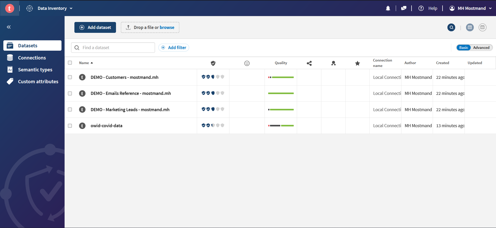
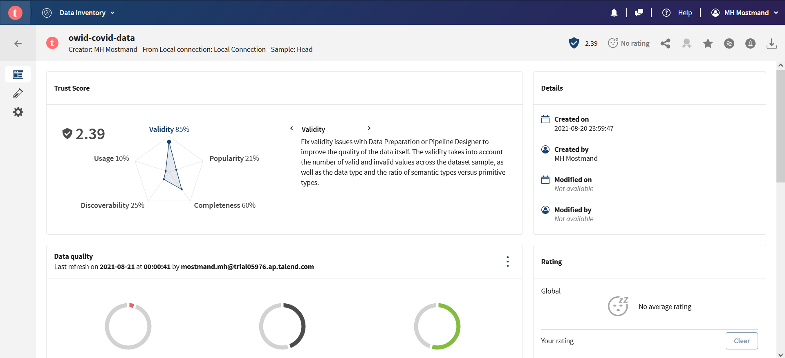
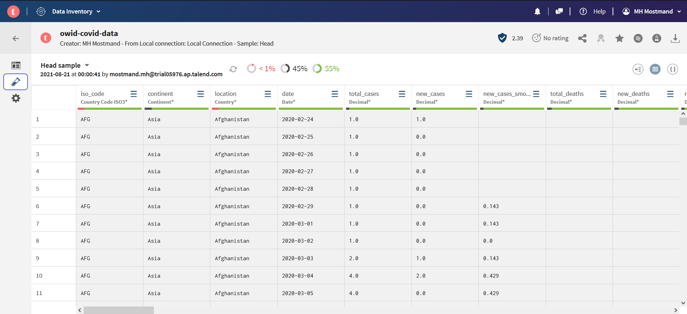
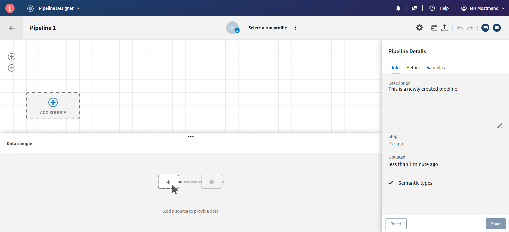
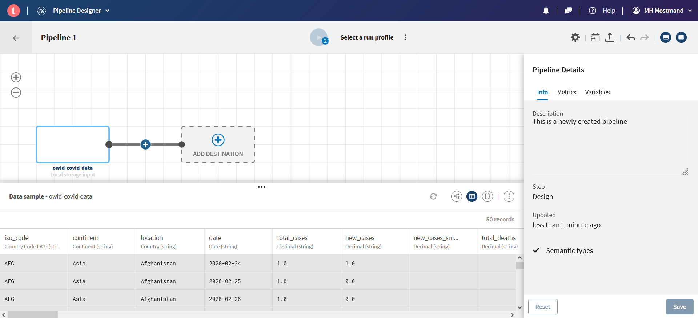
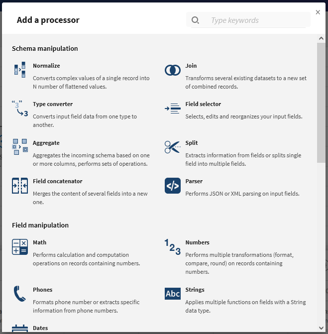
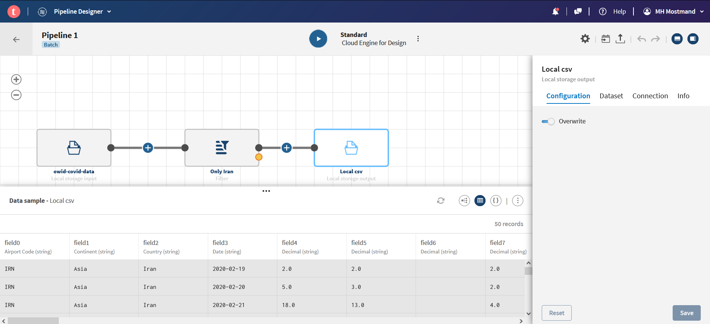

[لیست تسک‌های مرتبط با این فاز به صورت issue template](issue-template-Phase17.md)

# فاز هفده: آشنایی با ETL (Extract, Transform, Load)

## مقدمه
در دنیای واقعی، داده‌ها از منابع مختلف و با استانداردها و ساختارهای مختلف جمع‌آوری می‌شوند. هم‌چنین در بسیاری از موارد داده‌ها تمیز نیستند و باید پیش از استفاده روی آن‌ها فرآیند تمیزسازی انجام شود. حال فرض کنید می‌خواهیم داده‌های مربوط به یک موضوع را که از منابع مختلف جمع‌آوری شده‌اند و ساختارهای متفاوتی دارند مورد پردازش قرار دهیم و  به نتیجه‌ی دلخواه برسیم. برای این کار باید همه‌ی داده‌ها را تمیز کنیم و آن‌ها را به یک ساختار و استاندارد یکسان در آوریم. 

## تعریف

به فرآیند کپی داده از یک یا چندین منبع به یک سیستم مقصد که داده را به طور متفاوتی بازنمایی می‌کند ETL گفته می‌شود.

منبع: 
[ویکی‌پدیا](https://en.wikipedia.org/wiki/Extract,_transform,_load)

عبارت
ETL
متشکل از سه واژه‌ی زیر است:
- Extract
- Transform
- Load

### Data Extraction (استخراج داده)
در این مرحله داده‌ی خام از منبع‌های مختلف به یک فضای میانی کپی می‌شود. منابع مبدأ می‌توانند دارای داده‌ی ساختاریافته یا غیرساختاریافته باشند. از منابع داده می‌توان به موارد زیر اشاره کرد:

- SQL or NoSql servers
- Flat files
- Email
- Web pages
- etc.

### Data Transformation (تبدیل داده)
داده‌ی خام موجود، در فضای میانی مورد پردازش قرار می‌گیرد تا به ساختاری که برای تحلیل داده مورد نیاز است تبدیل شوند. این مرحله می‌تواند شامل کارهای زیر باشد:
- فیلتر کردن
- تمیزسازی
- حذف داده‌های تکراری
- اعتبارسنجی
- انجام محاسبات، ترجمه و یا خلاصه‌سازی داده‌ی خام که می‌تواند شامل تغییر نام ستون‌ها، تبدیل واحد‌های پول یا واحدهای اندازه‌گیری، ویرایش ستون‌های متنی یا ... باشد.
- حذف یا رمزنگاری داده‌های حساس یا محرمانه
- تبدیل ساختار داده به ساختار مقصد مثلاً تبدیل
JSON
به یک جدول یا چند جدول که می‌توان آن‌ها را
Join
کرد.

### Data Loading (بارگذاری داده)
در این مرحله داده‌ی تبدیل‌شده در مرحله‌ی قبل از فضای میانی به انباره‌ی داده‌ی مقصد منتقل می‌شود. این مرحله معمولاً غیر از بارگذاری اولیه‌ی داده، به صورت متناوب نیز اجرا می‌شود تا داده‌های جدید به انباره‌ی داده اضافه شوند. در اکثر موارد این فرآیند به طور اتوماتیک انجام می‌شود.

برای آشنایی بیش‌تر مطالعه‌ی لینک‌های زیر توصیه می‌شود:

[https://www.ibm.com/cloud/learn/etl](https://www.ibm.com/cloud/learn/etl)

[https://www.guru99.com/etl-extract-load-process.html](https://www.guru99.com/etl-extract-load-process.html)

## دست‌گرمی
برای آشنایی بیش‌تر دست‌گرمی‌ای برای شما در نظر گرفته شده است تا بتوانید کمی مزه‌ی
ETL
را بچشید.

### ثبت نام
در وب‌سایت
[Talend](https://www.talend.com)
ثبت نام کنید. برای این کار ممکن است از شما اطلاعاتی هم‌چون
business email
و شماره تلفن و نام شرکت و عنوان شغلی و ... درخواست شود. می‌توانید از ایمیل معمول خود استفاده کنید و سایر فیلدها را هم با اطلاعات
fake
پر کنید.

> :warning: سایت بدون فیلترشکن بالا می‌آید ولی خیلی از امکانات آن به درستی کار نمی‌کند پس بهتر است از همین ابتدا فیلترشکن خود را روشن نمایید!

پس از ثبت‌نام لینکی به ایمیل شما فرستاده می‌شود. از طریق آن لینک وارد اکانت خود شوید تا از 14 روز مهلت تست سایت استفاده کنید.

### ورود داده
در بخش
Data Inventory
دیتاست زیر را آپلود نمایید. این دیتاست شامل آمار مبتلایان و مرگ‌ و میر covid 19 به تفکیک کشورهاست که روزانه به‌روزرسانی می‌شود.

[دریافت دادگان](https://github.com/owid/covid-19-data/blob/master/public/data/owid-covid-data.csv)

برای ورود داده ابتدا فایل
csv
دیتاست را دانلود کنید و سپس در
Data Inventory
آپلود نمایید.

پس از این که آپلود داده به اتمام رسید می‌توانید دادگان آپلود شده‌ی خود را در لیست مشاهده کنید. روی آن کلیک کنید تا اطلاعات دادگان را مشاهده کنید.

روی آیکون لوله‌ی آزمایش که در سمت چپ در دسترس است کلیک کنید تا بتوانید نمونه‌ای از داده‌ی آپلود شده را مشاهده کنید:

### ساخت پایپلاین
وارد بخش
Pipeline Designer
شوید.

روی
Add Source
کلیک کنید و دادگان آپلود شده را انتخاب نمایید. حالا باید با صفحه‌ای شبیه تصویر زیر روبه‌رو باشید:

با کلیک بر روی دکمه‌ی به علاوه می‌توانید
processor
اضافه کنید.
Processorها
در واقع هر کدام یک عملیات را بر روی داده انجام می‌دهند.

### تعیین مقصد
مقصد داده را هم مانند مبدأ داده به صورت
Local
تعریف کنید. در این صورت پس از اجرای پایپلاین، داده با نام تعیین شده‌ی شما در
Data Inventory
قابل مشاهده خواهد بود.

### فیلتر داده‌ها
با استفاده از
Filter Processor
داده‌های مربوط به کشور ایران را فیلتر نمایید.

### اجرا
از بالای صفحه‌ی گزینه‌ی
Select a run profile
را انتخاب کنید و در منوی باز شده گزینه‌ی
standard
را انتخاب نمایید. پس از این کار دکمه‌ی اجرا در دسترس شما خواهد بود. مانند تصویر زیر:

پایپلاین را اجرا کنید و پس از اتمام نتایج آن را در
Data Inventory
مشاهده نمایید.

### تمیزسازی
مراحل زیر را برای تمیزسازی داده انجام دهید:

1. قسمت اعشاری ستون‌های
`new_cases`
و
`new_deaths`
را حذف نمایید.

2. مقادیر خالی در ستون
(NaN یا null)
را در ستون 
`new_vaccinations`
با مقدار صفر جایگزین نمایید.

3. نوع ستون
`date`
را از
string
به تایپ
Date
تبدیل کنید.

### Aggregation
جمع تعداد موارد ابتلا در هر ماه را محاسبه کنید و در ستونی به نام
`total_month_cases`
بریزید.

راهنمایی: برای این کار ممکن است لازم باشد ابتدا روی ستون تاریخ تغییراتی انجام دهید.

### Join
[دادگان موقعیت جغرافیایی کشورها](./datasets/world_country_latitude_and_longitude_values.csv)
را آپلود نمایید. سپس با استفاده از
Join
به دادگان آمار مبتلایان ستون‌های طول و عرض جغرافیایی را اضافه نمایید.

### دریافت خروجی
در نهایت جدول خروجی را در قالب یک
csv
خروجی بگیرید و دانلود نمایید و نتایج را مشاهده کنید.

در نهایت پایپلاین خود را با تیم‌های دیگر به اشتراک بگذارید و پایپلاین آن‌ها را مشاهده کنید و روش‌های مورد استفاده‌ی آن‌ها را ببینید چرا که برای انجام یک کار چندین راه وجود دارد. برای این کار می‌توانید از امکان
Export Pipeline
بهره بگیرید.

