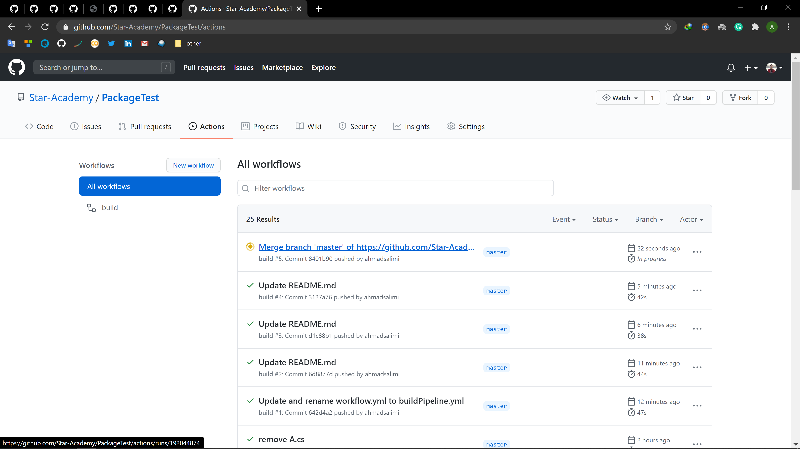
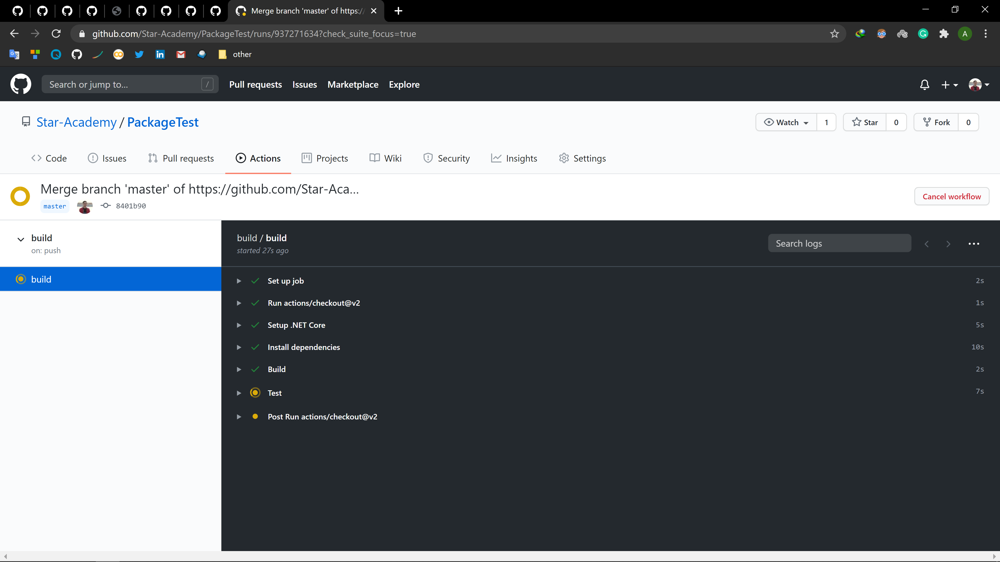
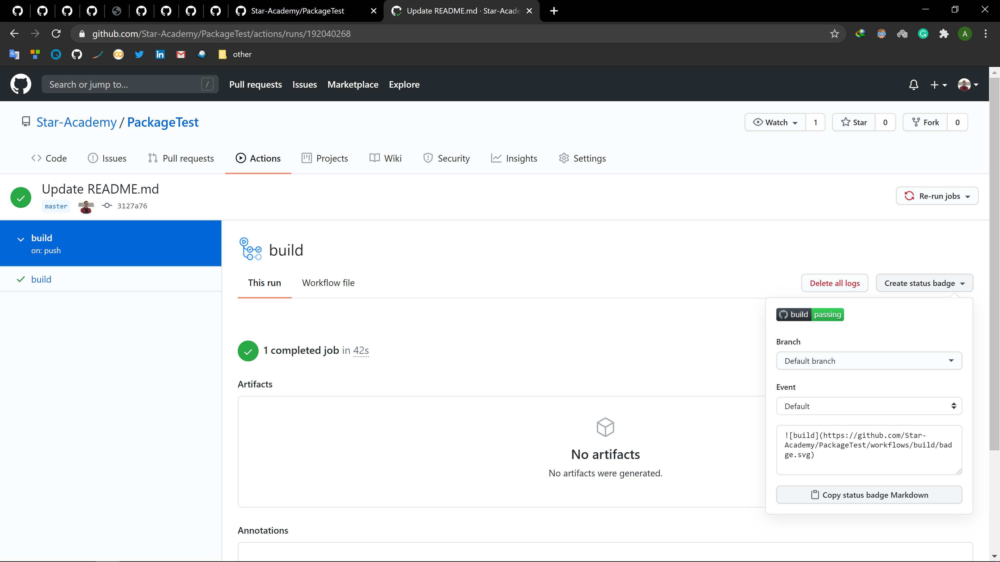
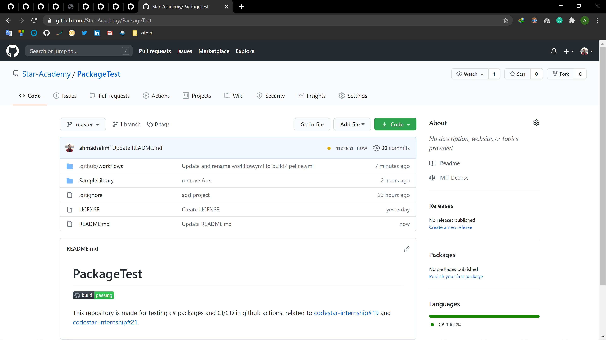
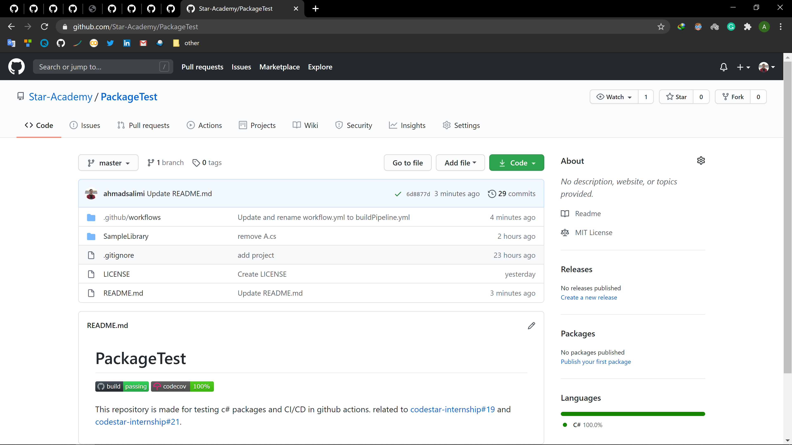

<div dir="rtl" align='right'>

# فاز شش: CI/CD

<div align='center'>

**[⚡Issues⚡](./issue-template.md)**

</div>

در این فاز با مفهوم CI/CD
و اهمیت استفاده از آن آشنا خواهید شد. همچنین پروژهٔ خود را به CI/CD
مجهز می‌کنید.

## CI/CD چیست و چرا اهمیت دارد

برای درک مفهوم CI/CD
و اهمیت آن لینک‌های زیر را مطالعه کنید.

<div dir="ltr" align='left'>

- [What is CI/CD?(redhat) video](https://www.redhat.com/en/topics/devops/what-is-ci-cd)
- [What is CI/CD?](https://medium.com/tilicholabs/what-is-ci-cd-c7c047b80e6b)
- [What’s the Point of CI Anyway?](https://medium.com/swlh/whats-the-point-of-ci-anyway-ac3f9eaa244c)
- [The Journey to CI/CD](https://medium.com/driven-by-code/the-journey-to-ci-cd-b1872927c36b)

</div>

## آشنایی با GitHub Actions و اضافه کردن CI/CD Pipeline به ریپازیتوری

یکی از ابزار CI/CD
معروف، GitHub Actions
است که به کمک آن، می‌توانیم یک Pipeline
شامل عملیات build،
اجرای unit testها
و همچنین انتشار package
و دیگر عملیاتی که در دستهٔ CI/CD
می‌گنجد را به ریپازیتوری GitHub
خود اضافه کنیم. این بخش شامل مراحل زیر است:

1. فایل `.github/workflows/buildPipeline.yml`
را در مسیر زیر در ریپازیتوری خود می‌سازیم:

1. برای pipeline
خود یک نام تعریف می‌کنیم: (به فایل `buildPipeline.yml`
اضافه کنید.)

  <div dir="ltr" align='left'>

  ```yml
  name: build
  ```

  </div>

1. مشخص می‌کنیم که pipeline
در هنگام push
و pull request
روی master
اجرا شود.

  <div dir="ltr" align='left'>

  ```yml
  on:
    push:
      branches: [ master ]
    pull_request:
      branches: [ master ]
  ```

  </div>

1. مراحل Pipeline
را به ترتیب تعریف می‌کنیم. در ابتدا مشخص می‌کنیم که pipeline
روی آخرین ورژن ubuntu
اجرا شود: (می‌توان آن را تغییر داد)

  <div dir="ltr" align='left'>

  ```yml
  jobs:
    build:
      runs-on: ubuntu-latest
  ```

  </div>

1. در این مرحله مشخص می‌کنیم که CI
از agentای
به نام `actions/checkout@v2`
استفاده کند: (برای مطالعه بیشتر [این](https://www.edwardthomson.com/blog/)
لینک را بخوانید.)

  <div dir="ltr" align="left">

  ```yml
      steps:
      - uses: actions/checkout@v3
  ```

  </div>

1. در این مرحله مشخص می‌کنیم که .Net 6.0
نصب شود.

  <div dir="ltr" align="left">

  ```yml
    - name: Setup .NET
      uses: actions/setup-dotnet@v2
      with:
        dotnet-version: 6.0.x
  ```

  </div>

1. سپس dependencyهای
 پروژه restore
 شوند:‌ (دقت کنید که به جای `<path to solution>`
 آدرس فولدر solution
 خود را مشخص کنید.)

  <div dir="ltr" align="left">

  ```yml
      - name: Install dependencies
        run: dotnet restore
        working-directory: <path to solution>
  ```

  </div>

1. solution
را build
می‌کنیم.

  <div dir="ltr" align="left">

  ```yml
      - name: Build
        run: dotnet build --configuration Release --no-restore
        working-directory: <path to solution>
  ```

  </div>

1. تست‌ها را run
می‌کنیم.

  <div dir="ltr" align="left">

  ```yml
      - name: Test
        run: dotnet test --no-restore --verbosity normal --collect:"XPlat Code Coverage"
        working-directory: <path to solution>
  ```

  </div>

  تبریک! CI
  شما آماده‌است. فایل را commit
  کرده و روی master
  پوش کنید.

  در ریپازیتوری خود وارد منوی Actions
  شوید؛ همانطور که مشاهده می‌کنید، Pipeline
  شما در حال اجرا است:

  

  آن را باز کرده و وارد بخش build
  شوید:

  

1. افزودن badge وضعیت CI به README:

  از این قسمت دکمهٔ Copy status badge Markdown
  را انتخاب کرده و متن کپی‌شده را به README
  ریپازیتوری خود اضافه کنید.

  

  می‌توانید وضعیت Pipeline
  را در هر لحظه مشاهده کنید:

  

1. افزودن مشاهده وضعیت code coverage:

  با اکانت GitHub
  خود در سایت [codecov.io](https://codecov.io)
  وارد شوید. سپس به آدرس  `https://codecov.io/gh/Star-Academy/<your-repository-name>`
  بروید.

1. بخش زیر را به فایل `buildPipeline.yml`
اضافه کنید:

  <div dir="ltr" align="left">

  ```yml
      - name: Publish code coverage reports to codecove.io
        uses: codecov/codecov-action@v1
        with:
          token: ${{ secrets.CODECOV_TOKEN }}
          files: ./**/coverage.cobertura.xml
          fail_ci_if_error: true
  ```

  </div>

1. یک‌بار دیگر صفحهٔ `https://codecov.io/gh/Star-Academy/<your-repository-name>`
  را باز کنید
  وارد بخش Setting
  شده و از سمت چپ، گزینه‌ی Badge
  را انتخاب کنید. در صفحه‌ای که باز می‌شود، Markdown
  را کپی کرده و در README
  ریپازیتوری خود قرار دهید. اکنون مشاهده خواهید کرد که در هر لحظه، وضعیت code coverage
  شما نیز نمایش داده می‌شود:

  

  تا به اینجای کار، کل فایل `buildPipeline.yml`
  باید بصورت زیر باشد:

  <div dir="ltr" align="left">

  ```yml
  name: build

  on:
    push:
      branches: [ master ]
    pull_request:
      branches: [ master ]
  
  jobs:
    build:
      runs-on: ubuntu-latest

      steps:
      - uses: actions/checkout@v3

      - name: Setup .NET
        uses: actions/setup-dotnet@v2
        with:
          dotnet-version: 6.0.x
      
      - name: Install dependencies
        run: dotnet restore
        working-directory: <path to solution>

      - name: Build
        run: dotnet build --configuration Release --no-restore
        working-directory: <path to solution>

      - name: Test
        run: dotnet test --no-restore --verbosity normal --collect:"XPlat Code Coverage"
        working-directory: <path to solution>

      - name: Publish code coverage reports to codecove.io
        uses: codecov/codecov-action@v1
        with:
          token: ${{ secrets.CODECOV_TOKEN }}
          files: ./**/coverage.cobertura.xml
          fail_ci_if_error: true
  ```

  </div>

## انتشار package در [NuGet.org](https://nuget.org)

در این مرحله، می‌خواهیم یک Pipeline
جدید بسازیم که هنگام release
یک ورژن در ریپازیتوری، پکیج را در [NuGet.org](https://nuget.org)
منتشر کند.

ابتدا باید مشخصات package
را در فایل `csproj.`
مربوط به پروژهٔ خود مشخص کنید. بدین منظور، این فایل باید به صورت زیر باشد:
(توجه کنید که در این فایل، به جای `[TeamNumber]`
شمارهٔ تیم خود و به جای `[LibraryName]`
نام پروژهٔ خود را قرار دهید. شماره تیم به این خاطر باید قرار داده شود که اگر نام پروژه دو تیم یکسان بود، publish
دچار مشکل نشود و در نهایت `PackageId`
یکتا باشد.)

<div dir="ltr" align="left">

```xml
<Project Sdk="Microsoft.NET.Sdk">

  <PropertyGroup>
      <TargetFramework>net6.0</TargetFramework>
      <PackageId>StarAcademy.Team[TeamNumber].[LibraryName]</PackageId>
      <Authors>[TeamMembers]</Authors>
      <Company>Star Academy</Company>
  </PropertyGroup>

</Project>
```

</div>

در ادامه، برای ساخت Pipline
مربوط به publish،
فایل `.github/workflows/publishPipeline.yml`
را می‌سازیم.
سپس مراحل زیر را به آن اضافه می‌کنیم:

- نام، trigger
و OS
مربوط به pipeline
را مشخص می‌کنیم.

<div dir="ltr" align="left">

```yml
name: publish

on:
  release:
    types:
      published

jobs:
  publish:
    runs-on: ubuntu-latest

```

</div>

- نصب .Net:

<div dir="ltr" align="left">

```yml
    steps:
    - uses: actions/checkout@v3

    - name: Setup .NET
      uses: actions/setup-dotnet@v2
      with:
        dotnet-version: 6.0.x
```

</div>

- گرفتن ورژن release
کنونی. توجه کنید که تگ release
بعنوان ورژن به NuGet
داده می‌شود. در نتیجه، الگوهای قابل قبول ورژن را از
[اینجا](https://docs.microsoft.com/en-us/nuget/concepts/package-versioning)
بخوانید و تگ را مطابق این الگو بزنید.
(به جای `<repository name>`
نام ریپازیتوری خود را قرار دهید.)

<div dir="ltr" align="left">

```yml
    - name: Get current release version
      id: version
      uses: pozetroninc/github-action-get-latest-release@master
      with:
        repository: Star-Academy/<repository name>
```

</div>

- build و ساخت پکیج NuGet
(به جای `<path to classlib project>`
آدرس فولدری را که فایل `csproj.`
مربوط به پروژه class library
در آن قرار دارد بنویسید.)

<div dir="ltr" align="left">

```yml
    - name: Build library and generate NuGet Package
      run: dotnet pack -c Release -o artifacts -p:PackageVersion=${{ steps.version.outputs.release }}
      working-directory: <path to classlib project>
```

</div>

- انتشار پکیج NuGet

<div dir="ltr" align="left">

```yml
    - name: Publish NuGet Package
      run: dotnet nuget push ./**/*.nupkg -k ${{ secrets.NUGET_API_KEY }} -s https://api.nuget.org/v3/index.json
```

</div>

از این پس، هر گاه در ریپازیتوری خود تگ بزنید، Pipeline
فوق trigger
می‌شود و در نتیجه پکیج شما push
می‌شود. همچنین در منوی Actions
می‌توانید وضعیت publish
را مشاهده کنید. پکیج منتشر شدهٔ خود را نیز می‌توانید در آدرس `nuget.org/packages/[PackageId]`
مشاهده کنید.

همچنین نمونه فایل‌های pipelineها
و یک پروژه class library
و xunit
نمونه، در
[این ریپازیتوری](https://github.com/Star-Academy/PackageTest)
موجود می‌باشد.

## ساخت یک Console App برای پروژه سرچ

  در این بخش، یک solution
  دیگر بسازید، و در آن با dotnet cli
  یک console app
  بسازید. در پوشه پروژه کنسول، command
  زیر را اجرا کنید تا پکیج سرچ شما به پروژه کنسول اضافه شود:

  <div dir="ltr" align="left">

  ```shell
  dotnet add package [packageId]
  ```

  </div>

  با این command،
  پکیج به پروژه شما اضافه می‌شود و می‌توانید از کلاس‌های آن استفاده کنید. همچنین اگر پکیج خود را update
  کرده باشید، با اجرای این command،
  نسخه جدید پکیج به پروژه شما اضافه می‌شود.

  حال با استفاده از پکیج کتابخانه سرچ‌تان، یک نرم‌افزار سرچ تحت کنسول پیاده‌سازی کنید.

</div>
